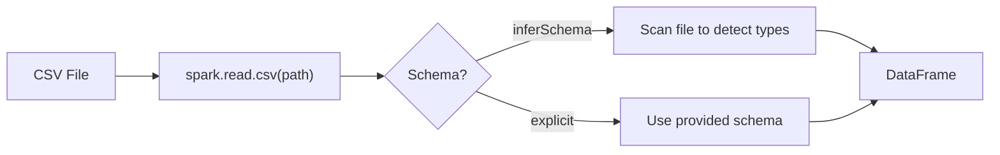

# :material-file-delimited: CSV Data Source

Spark SQL can read and write CSV files using the built-in CSV data source.
Provide an explicit schema for best performance.

### :material-sitemap: Overview



---

## :material-pin: Read CSV

```sql
CREATE OR REPLACE TEMP VIEW sales_csv
USING csv
OPTIONS (
  path 's3://data/sales/',
  header 'true',
  inferSchema 'false'
);
```

---

## :material-pin: Write CSV

```sql
CREATE TABLE sales_export
USING csv
AS SELECT * FROM sales;
```

---

## :material-magnify: Common Options

| Option | Description |
|--------|-------------|
| `header` | First row is header |
| `delimiter` | Column separator |
| `quote` | Quote character |
| `escape` | Escape character |
| `multiLine` | Allow multi-line rows |

---

## :material-brain: When to Use

| Scenario | Recommendation |
|----------|----------------|
| Lightweight export | CSV |
| Production analytics | Prefer Parquet |
| Unknown schema | Use `inferSchema` sparingly |
