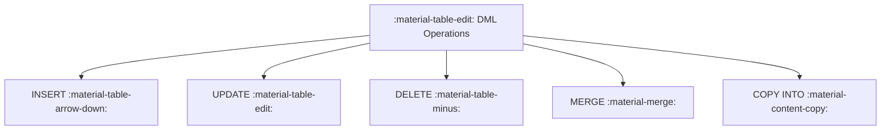

# :material-table-edit: DML — Data Manipulation Language

DML statements modify the contents of tables without changing their schema.
In Spark SQL, write support depends on the table format — Delta Lake enables
the full set of operations, while Hive/Parquet tables support only `INSERT`.

### :material-sitemap: Overview



## :material-table-edit: DML Statements

| Statement | Description | Requires Delta? |
|-----------|-------------|:---------------:|
| [INSERT](table/insert.md) | Append or overwrite rows | No |
| [UPDATE](table/update.md) | Modify existing rows in-place | Yes |
| [DELETE](table/delete.md) | Remove rows matching a condition | Yes |
| [MERGE INTO](table/merge.md) | Upsert — insert, update, or delete in a single atomic operation | Yes |
| [COPY INTO](table/copy_into.md) | Bulk-load data from external files | Yes |

## :material-magnify: Key Concepts

1. **ACID Transactions** — Delta Lake wraps every DML statement in a transaction;
   failures leave the table unchanged.
2. **Schema Enforcement** — Spark validates column types on write; mismatches raise
   `AnalysisException`.
3. **Partition Pruning on Write** — `INSERT OVERWRITE` with a partition clause
   replaces only the targeted partitions, leaving the rest intact.
4. **Optimistic Concurrency** — Delta uses optimistic concurrency control;
   concurrent writes to *different* partitions succeed, while conflicts on the
   same partition are retried or rejected.

## :material-flask-outline: Quick Example

```sql
-- Insert new rows
INSERT INTO events VALUES (1, 'click', current_timestamp());

-- Update in-place (Delta)
UPDATE events SET event_type = 'tap' WHERE id = 1;

-- Conditional upsert (Delta)
MERGE INTO target USING source ON target.id = source.id
WHEN MATCHED THEN UPDATE SET *
WHEN NOT MATCHED THEN INSERT *;
```

---

> **See also:** The DML statements above work best with Delta Lake tables,
> which provide full ACID transaction support.
