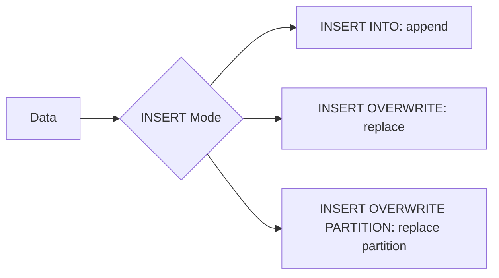

# :material-table-arrow-down: INSERT

`INSERT` adds rows to a table. Spark SQL supports appending rows, overwriting
entire tables or specific partitions, and inserting literal values.

### :material-sitemap: Overview



---

## :material-pin: Syntax

### INSERT INTO (Append)

```sql
INSERT INTO [TABLE] table_name
[PARTITION (col1 [= val1], ...)]
select_statement;
```

### INSERT OVERWRITE (Replace)

```sql
INSERT OVERWRITE [TABLE] table_name
[PARTITION (col1 [= val1], ...)]
select_statement;
```

### INSERT INTO VALUES (Literal Rows)

```sql
INSERT INTO table_name [(col1, col2, ...)]
VALUES (val1, val2, ...), (val3, val4, ...);
```

| Clause | Purpose |
|--------|---------|
| `INTO` | Appends rows to existing data |
| `OVERWRITE` | Replaces data (whole table or target partitions) |
| `PARTITION` | Targets specific partition columns |
| `VALUES` | Inserts literal rows without a SELECT |

---

## :material-magnify: Behavior

1. **Schema matching** — Column count and types of the source must match the
   target. Column names are matched by *position*, not by name.
2. **Dynamic partition overwrite** — When `spark.sql.sources.partitionOverwriteMode`
   is `dynamic`, `INSERT OVERWRITE` replaces only the partitions present in the
   source data, leaving other partitions untouched.
3. **Static partition insert** — Providing literal values in the `PARTITION`
   clause (e.g., `PARTITION (year = 2024)`) writes all rows to that partition
   regardless of row content.
4. **Auto-create partitions** — New partition directories are created
   automatically if they do not exist.
5. **Atomicity** — On Delta tables, `INSERT` is transactional. On Hive/Parquet
   tables, a failed write may leave partial files.

---

## :material-flask-outline: Practical Examples

### Append from a Query

```sql
INSERT INTO flights_archive
SELECT * FROM flights
WHERE flight_date < '2023-01-01';
```

### Overwrite a Partition

```sql
INSERT OVERWRITE TABLE events
PARTITION (event_date = '2024-03-01')
SELECT event_id, user_id, event_type
FROM staging_events
WHERE event_date = '2024-03-01';
```

### Dynamic Partition Overwrite

```sql
SET spark.sql.sources.partitionOverwriteMode = dynamic;

INSERT OVERWRITE TABLE sales
PARTITION (region)
SELECT product, amount, region
FROM daily_sales;
-- Only partitions present in daily_sales are replaced
```

### Insert Literal Rows

```sql
INSERT INTO lookup_codes (code, description)
VALUES ('A', 'Active'),
       ('I', 'Inactive'),
       ('P', 'Pending');
```

### Multi-table Insert (Hive-style)

```sql
FROM raw_events
INSERT INTO click_events
  SELECT * WHERE event_type = 'click'
INSERT INTO view_events
  SELECT * WHERE event_type = 'view';
```

---

## :material-brain: When to Use

| Scenario | Recommended Pattern |
|----------|-------------------|
| Append new records | `INSERT INTO ... SELECT` |
| Rebuild a full partition | `INSERT OVERWRITE ... PARTITION (...)` |
| Replace only touched partitions | Dynamic partition overwrite mode |
| Seed reference data | `INSERT INTO ... VALUES` |
| Split rows to multiple targets | Multi-table `FROM ... INSERT` |

---

> **Tip:** Prefer `MERGE INTO` over `INSERT` + `UPDATE` when you need
> upsert semantics on Delta tables.

---

## :material-compare: INSERT INTO vs INSERT OVERWRITE

| Aspect | `INSERT INTO` | `INSERT OVERWRITE` |
|--------|:-------------:|:------------------:|
| Effect on existing rows | Appends — existing rows untouched | Replaces — existing rows removed |
| Partition scope | All partitions | Targeted partitions (with `PARTITION` clause) |
| Dynamic partition overwrite | N/A | Replaces only partitions present in source data |
| Idempotent re-run | No — duplicates on re-run | Yes — safe to re-run with same data |
| Delta transactional | :material-check: | :material-check: |

---

## :material-database-import: Advanced Patterns

### INSERT with a CTE

```sql
WITH ranked AS (
    SELECT *,
           ROW_NUMBER() OVER (PARTITION BY customer_id ORDER BY updated_at DESC) AS rn
    FROM staging_customers
)
INSERT INTO dim_customers
SELECT customer_id, name, email, city, updated_at
FROM ranked
WHERE rn = 1;
```

### Insert into a partitioned table (static)

```sql
INSERT INTO sales PARTITION (region = 'APAC', year = 2024)
SELECT product_id, amount, sale_date
FROM staging_sales
WHERE region = 'APAC' AND YEAR(sale_date) = 2024;
```

### INSERT … SELECT with column reorder

```sql
-- Target: (id, name, ts)  Source columns in different order
INSERT INTO audit_log (id, name, ts)
SELECT event_id, event_name, occurred_at
FROM incoming_events
WHERE severity = 'HIGH';
```

### TRUNCATE TABLE (fastest full wipe)

```sql
-- Removes all rows; schema and partitions intact; resets Delta version
TRUNCATE TABLE staging_events;

-- TRUNCATE a single partition (Hive-style tables)
ALTER TABLE events DROP PARTITION (event_date = '2024-01-01');
```

!!! note "TRUNCATE vs DELETE"
    `TRUNCATE TABLE` is faster than `DELETE FROM table` (no WHERE) because it replaces the
    data files in one operation. On Delta, `TRUNCATE` resets time-travel history.

### Seed a lookup table

```sql
CREATE TABLE IF NOT EXISTS ref.status_codes (
    code        STRING NOT NULL,
    label       STRING,
    is_active   BOOLEAN DEFAULT TRUE
)
USING delta;

INSERT INTO ref.status_codes (code, label) VALUES
    ('A', 'Active'),
    ('I', 'Inactive'),
    ('P', 'Pending'),
    ('X', 'Cancelled');
```

---

## :material-speedometer: Performance Tips

| Tip | Reason |
|-----|--------|
| Use `INSERT OVERWRITE` for full-partition reloads | Avoids small-file accumulation from repeated appends |
| Set `spark.sql.sources.partitionOverwriteMode = dynamic` | Safe for multi-partition rewrites without touching other partitions |
| Coalesce source before insert | `SELECT /*+ COALESCE(8) */ ...` reduces output file count |
| Batch large inserts with CTEs or temp views | Avoids driver OOM on huge `VALUES` lists |
| Avoid `INSERT INTO ... VALUES` for bulk loads | Use `COPY INTO` or a temp view for large datasets |
