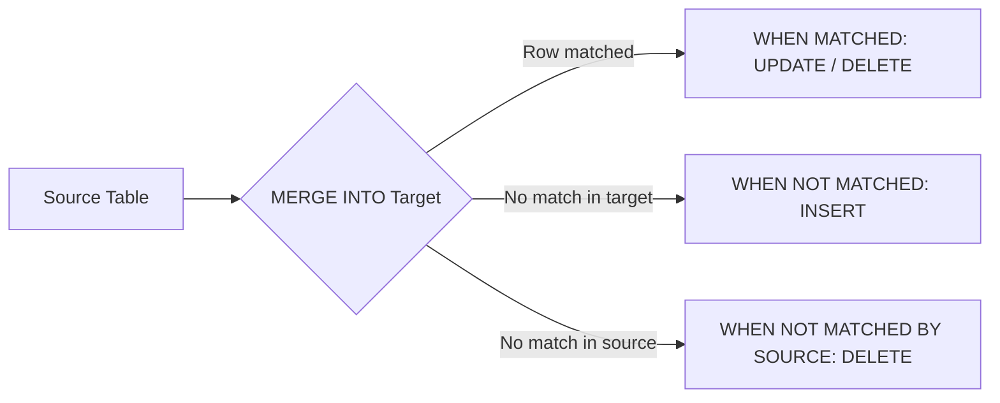

# :material-merge: MERGE INTO (Upsert)

!!! note "[Databricks] Delta Lake Required"
    `MERGE INTO` requires Delta tables. Not supported on Hive/Parquet/CSV tables.

`MERGE INTO` performs an atomic **upsert** — a single statement that can
`INSERT`, `UPDATE`, and `DELETE` rows by comparing a target table against a
source. It is the most powerful DML statement in Delta Lake.

### :material-sitemap: Overview



---

## :material-pin: Syntax

```sql
MERGE INTO target_table [AS target_alias]
USING source_table_or_query [AS source_alias]
ON merge_condition
[WHEN MATCHED [AND condition] THEN
    UPDATE SET col1 = expr1, col2 = expr2, ...]
[WHEN MATCHED [AND condition] THEN DELETE]
[WHEN NOT MATCHED [AND condition] THEN
    INSERT (col1, col2, ...) VALUES (expr1, expr2, ...)]
[WHEN NOT MATCHED BY SOURCE [AND condition] THEN
    UPDATE SET col1 = expr1, ...]
[WHEN NOT MATCHED BY SOURCE [AND condition] THEN DELETE];
```

| Clause | Purpose |
|--------|---------|
| `USING` | Source table, view, subquery, or CTE |
| `ON` | Join condition linking target and source rows |
| `WHEN MATCHED` | Action for rows that exist in **both** target and source |
| `WHEN NOT MATCHED` | Action for rows in the **source** that have no target match |
| `WHEN NOT MATCHED BY SOURCE` | Action for rows in the **target** that have no source match (Delta 2.4+) |

---

## :material-magnify: Behavior

1. **At most one match** — Each target row must match at most one source row.
   If multiple source rows match the same target row, Spark raises an error.
   Deduplicate the source first if needed.
2. **Clause ordering** — Multiple `WHEN MATCHED` or `WHEN NOT MATCHED` clauses
   are evaluated in the order they appear; the first matching clause wins.
3. **Star syntax** — `UPDATE SET *` and `INSERT *` map columns by name between
   source and target, simplifying schemas with many columns.
4. **Condition guards** — Adding `AND condition` to any clause allows branching
   logic (e.g., update if changed, delete if flagged).
5. **Atomicity** — The entire merge is a single transaction. Partial application
   is impossible.
6. **Performance** — Spark pushes the `ON` predicate into the scan. Ensure the
   merge key has good data locality (e.g., partitioned or Z-ordered) for best
   performance.

---

## :material-flask-outline: Practical Examples

### Basic Upsert

```sql
MERGE INTO customers AS t
USING daily_updates AS s
ON t.customer_id = s.customer_id
WHEN MATCHED THEN
    UPDATE SET *
WHEN NOT MATCHED THEN
    INSERT *;
```

### Conditional Update / Insert

```sql
MERGE INTO products AS t
USING new_catalog AS s
ON t.sku = s.sku
WHEN MATCHED AND s.price <> t.price THEN
    UPDATE SET t.price = s.price,
              t.updated_at = current_timestamp()
WHEN NOT MATCHED THEN
    INSERT (sku, name, price, created_at)
    VALUES (s.sku, s.name, s.price, current_timestamp());
```

### Upsert with Delete

```sql
MERGE INTO inventory AS t
USING warehouse_feed AS s
ON t.item_id = s.item_id
WHEN MATCHED AND s.quantity = 0 THEN DELETE
WHEN MATCHED THEN
    UPDATE SET t.quantity = s.quantity
WHEN NOT MATCHED THEN
    INSERT *;
```

### SCD Type 2 (Slowly Changing Dimension)

```sql
-- Step 1: Close existing current records that have changes
MERGE INTO dim_customer AS t
USING (
    SELECT * FROM staging_customer
    WHERE updated_at > (SELECT MAX(effective_from) FROM dim_customer)
) AS s
ON t.customer_id = s.customer_id AND t.is_current = true
WHEN MATCHED AND (t.name <> s.name OR t.email <> s.email) THEN
    UPDATE SET t.is_current   = false,
              t.effective_to  = current_date();

-- Step 2: Insert new current records
INSERT INTO dim_customer
SELECT customer_id, name, email,
       current_date() AS effective_from,
       NULL AS effective_to,
       true AS is_current
FROM staging_customer s
WHERE NOT EXISTS (
    SELECT 1 FROM dim_customer t
    WHERE t.customer_id = s.customer_id
      AND t.is_current = true
      AND t.name = s.name
      AND t.email = s.email
);
```

### Delete Unmatched Target Rows

```sql
MERGE INTO active_users AS t
USING current_roster AS s
ON t.user_id = s.user_id
WHEN MATCHED THEN UPDATE SET *
WHEN NOT MATCHED THEN INSERT *
WHEN NOT MATCHED BY SOURCE THEN DELETE;
-- Removes users no longer in the roster
```

### Merge from a Subquery

```sql
MERGE INTO orders AS t
USING (
    SELECT order_id, MAX(status) AS latest_status
    FROM order_events
    GROUP BY order_id
) AS s
ON t.order_id = s.order_id
WHEN MATCHED THEN
    UPDATE SET t.status = s.latest_status;
```

---

## :material-brain: When to Use

| Scenario | Pattern |
|----------|---------|
| CDC / incremental load | `MERGE ... WHEN MATCHED UPDATE WHEN NOT MATCHED INSERT` |
| Idempotent data ingestion | Merge with deduplication on business key |
| SCD Type 1 (overwrite) | `MERGE ... WHEN MATCHED UPDATE SET *` |
| SCD Type 2 (history) | Two-step: merge to close + insert new versions |
| Full sync (mirror source) | Add `WHEN NOT MATCHED BY SOURCE THEN DELETE` |
| Conditional deletes during upsert | `WHEN MATCHED AND flag = 'D' THEN DELETE` |

---

> **Tip:** Deduplicate your source before merging to avoid the
> "multiple source rows matched the same target row" error:
>
> ```sql
> USING (SELECT * FROM (
>     SELECT *, ROW_NUMBER() OVER (PARTITION BY id ORDER BY ts DESC) AS rn
>     FROM source) WHERE rn = 1
> ) AS s
> ```

---

## :material-database-arrow-right: Advanced Patterns

### Source deduplication before merge

```sql
-- Prevents "multiple source rows matched same target row" error
MERGE INTO customers AS t
USING (
    SELECT * FROM (
        SELECT *,
               ROW_NUMBER() OVER (PARTITION BY customer_id ORDER BY updated_at DESC) AS rn
        FROM staging_customers
    )
    WHERE rn = 1
) AS s
ON t.customer_id = s.customer_id
WHEN MATCHED AND t.row_hash <> s.row_hash THEN UPDATE SET *
WHEN NOT MATCHED THEN INSERT *;
```

### Conditional delete inside MERGE (CDC pattern)

```sql
-- CDC feed with op_type: 'I'=insert, 'U'=update, 'D'=delete
MERGE INTO orders AS t
USING cdc_feed AS s
ON t.order_id = s.order_id
WHEN MATCHED AND s.op_type = 'D' THEN DELETE
WHEN MATCHED AND s.op_type = 'U' THEN
    UPDATE SET
        status     = s.status,
        amount     = s.amount,
        updated_at = s.updated_at
WHEN NOT MATCHED AND s.op_type = 'I' THEN
    INSERT (order_id, customer_id, status, amount, created_at)
    VALUES (s.order_id, s.customer_id, s.status, s.amount, s.created_at);
```

### Row-hash change detection (skip unchanged rows)

```sql
MERGE INTO dim_product AS t
USING (
    SELECT *,
           md5(concat_ws('||', name, category, price, is_active)) AS row_hash
    FROM staging_products
) AS s
ON t.product_id = s.product_id
WHEN MATCHED AND t.row_hash <> s.row_hash THEN
    UPDATE SET
        name       = s.name,
        category   = s.category,
        price      = s.price,
        is_active  = s.is_active,
        row_hash   = s.row_hash,
        updated_at = current_timestamp()
WHEN NOT MATCHED THEN
    INSERT (product_id, name, category, price, is_active, row_hash, created_at)
    VALUES (s.product_id, s.name, s.category, s.price, s.is_active, s.row_hash, current_timestamp());
```

### Full-mirror sync (replace target to match source exactly)

```sql
-- After this merge, target contains exactly what source contains
MERGE INTO active_subscriptions AS t
USING current_subscriptions AS s
ON t.subscription_id = s.subscription_id
WHEN MATCHED AND (
    t.plan      <> s.plan
    OR t.status <> s.status
) THEN UPDATE SET *
WHEN NOT MATCHED THEN INSERT *
WHEN NOT MATCHED BY SOURCE THEN DELETE;
```

### Insert-only merge (idempotent new-row load)

```sql
-- Only insert rows that don't already exist; never update
MERGE INTO events AS t
USING staged_events AS s
ON t.event_id = s.event_id
WHEN NOT MATCHED THEN INSERT *;
```

### Merge with a VALUES source (small lookup updates)

```sql
MERGE INTO config AS t
USING (
    SELECT col1 AS key, col2 AS value FROM VALUES
        ('max_retries', '5'),
        ('timeout_sec', '30'),
        ('batch_size',  '1000')
    AS v(col1, col2)
) AS s
ON t.key = s.key
WHEN MATCHED THEN UPDATE SET t.value = s.value
WHEN NOT MATCHED THEN INSERT (key, value) VALUES (s.key, s.value);
```

---

## :material-speedometer: Performance Tips

| Tip | Reason |
|-----|--------|
| Partition target by merge key | Prunes files during the scan phase |
| `ZORDER BY` merge key | Row-group skipping for high-cardinality keys |
| Deduplicate source before merge | Avoids runtime error + unnecessary file rewrites |
| Use `row_hash` to skip unchanged rows | Avoids rewriting files when nothing changed |
| Filter source to only changed rows | Smaller source = fewer target partitions touched |
| Avoid `MERGE` on unpartitioned tables | Full table scan on both sides |
| Run `OPTIMIZE` after large merges | Compacts small files created by the rewrite |

!!! warning "One match per target row"
    If multiple source rows match the same target row, Spark raises
    `"MERGE_CARDINALITY_VIOLATION"`. Always deduplicate the source on the merge key first.
