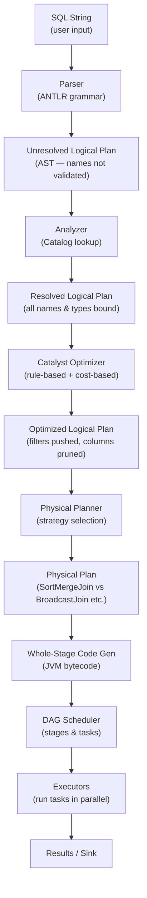

# :material-transit-connection-variant: Query Lifecycle

Every SQL string submitted to Spark travels through five deterministic stages before a
single byte of data is read. Understanding these stages makes `EXPLAIN` output readable
and reveals where optimization opportunities lie.

---

## :material-sitemap: Pipeline



---

## :material-information-outline: Stage-by-Stage Breakdown

### :material-numeric-1-circle: Parse

The ANTLR-based parser converts the SQL string into an **Abstract Syntax Tree (AST)**.
Table names, column names, and functions are recorded but **not validated** yet.

- Raises `ParseException` for syntax errors (missing commas, wrong keywords).
- Output: `Unresolved Logical Plan`.

### :material-numeric-2-circle: Analyze

The Analyzer walks the AST and resolves every name against the **Catalog**:

- Looks up table schemas, view definitions, and function signatures.
- Assigns data types to all expressions.
- Raises `AnalysisException` for unknown tables, column name typos, or type mismatches.
- Output: `Resolved Logical Plan`.

### :material-numeric-3-circle: Optimize (Catalyst)

The Catalyst Optimizer applies a set of **rule-based** and optionally **cost-based** rewrites:

| Rule family | Examples |
|-------------|---------|
| Predicate pushdown | Move `WHERE` filters as close to the scan as possible |
| Column pruning | Drop columns not referenced downstream |
| Constant folding | Replace `1 + 1` with `2` at plan time |
| Join reordering (CBO) | Reorder joins based on table statistics |
| Subquery flattening | Rewrite correlated subqueries as joins |
| Null propagation | Simplify `NULL AND TRUE` → `NULL` |

- Output: `Optimized Logical Plan`.

### :material-numeric-4-circle: Physical Planning

The Physical Planner converts each logical operator into one or more **physical strategies**:

| Logical operator | Physical strategies considered |
|-----------------|-------------------------------|
| Join | `BroadcastHashJoin`, `SortMergeJoin`, `ShuffledHashJoin` |
| Aggregate | `HashAggregate` (partial + final), `SortAggregate` |
| Sort | `Sort` (global shuffle), `TakeOrderedAndProject` (LIMIT + ORDER BY) |
| Scan | `FileScan`, `InMemoryTableScan` |

- The planner picks the lowest-cost strategy; `EXPLAIN` reveals the choice.
- Output: `Physical Plan` (SparkPlan tree).

### :material-numeric-5-circle: Code Generation

Whole-Stage Code Generation (WSCG) fuses multiple physical operators into a single
JVM method to eliminate virtual dispatch and intermediate object allocations.

- Enabled by `spark.sql.codegen.wholeStage = true` (default).
- Operators that support fusion are marked with `*` in `EXPLAIN` output.
- Operators that do **not** support fusion (e.g., Python UDFs) break the fusion chain.

### :material-numeric-6-circle: DAG Scheduling & Execution

The DAG Scheduler splits the physical plan into **stages** separated by shuffle boundaries:

- Each stage runs as a set of parallel **tasks** (one per input partition).
- Tasks run on **executors** and write shuffle output to local disk.
- Results are collected by the driver or written to a sink (Delta table, Parquet files, etc.).

---

## :material-flask-outline: Observing Each Stage

```sql
-- See the full plan at every stage
EXPLAIN EXTENDED
SELECT department, SUM(salary) AS total
FROM employees
WHERE age > 25
GROUP BY department;
```

Output sections map directly to the stages above:

```
== Parsed Logical Plan ==        ← Stage 1
== Analyzed Logical Plan ==      ← Stage 2
== Optimized Logical Plan ==     ← Stage 3
== Physical Plan ==              ← Stage 4 + 5
```

---

## :material-lightbulb-outline: Optimization Checklist

| Problem | Likely stage | Fix |
|---------|-------------|-----|
| `AnalysisException: cannot resolve column` | Analyze | Check column name spelling and table alias |
| Filter not pushed to scan | Optimize | Avoid wrapping filter column in a function |
| Wrong join strategy chosen | Physical | Use `/*+ BROADCAST(dim) */` hint or update statistics |
| Python UDF breaks code gen | Code Gen | Replace with built-in SQL functions where possible |
| Too many small tasks | DAG | Increase partition size or use `COALESCE` |
