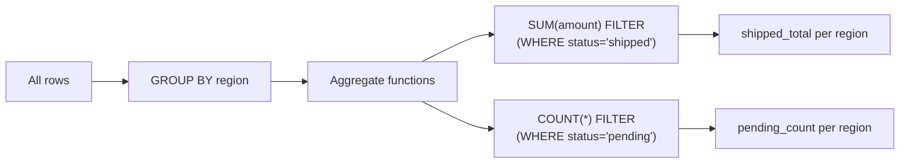

# :material-filter: Aggregate FILTER

The `FILTER` clause scopes an aggregate function to only the rows satisfying a condition, without removing those rows from the query result. Multiple `FILTER` conditions can run in a single scan pass.

---

## Setup

```sql
CREATE OR REPLACE TEMP VIEW orders AS
SELECT * FROM VALUES
  (1,  'US',   'laptop',  1200.00, 'shipped'),
  (2,  'EU',   'phone',    800.00, 'pending'),
  (3,  'US',   'tablet',   450.00, 'shipped'),
  (4,  'APAC', 'laptop',   950.00, 'cancelled'),
  (5,  'EU',   'phone',    600.00, 'shipped'),
  (6,  'US',   'laptop',  1500.00, 'pending'),
  (7,  'APAC', 'tablet',   300.00, 'shipped'),
  (8,  'EU',   'laptop',  1100.00, 'cancelled')
AS t(order_id, region, product, amount, status);
```

---

## :material-sitemap: Overview



---

## :material-pin: Syntax

```sql
<aggregate_function>(<expression>) FILTER (WHERE <condition>)
```

Example:

```sql
SELECT
    region,
    SUM(amount) FILTER (WHERE status = 'shipped')   AS shipped_total,
    SUM(amount) FILTER (WHERE status = 'pending')   AS pending_total,
    SUM(amount) FILTER (WHERE status = 'cancelled') AS cancelled_total
FROM orders
GROUP BY region;
```

---

## :material-magnify: Behavior Notes

1. **Single scan** — Multiple `FILTER` clauses on the same table run in a single pass; equivalent `CASE WHEN` expressions also run in one scan.
2. **Does not remove rows** — `FILTER` only scopes the aggregate; the group itself remains in the result even if no rows match the filter (aggregate returns NULL or 0).
3. **Works with all aggregate functions** — `SUM`, `COUNT`, `AVG`, `MAX`, `MIN`, `COUNT(DISTINCT ...)` all support the `FILTER` clause.
4. **NULL aggregate result** — If no rows satisfy the filter for a group, `SUM` returns NULL and `COUNT` returns 0.
5. **Combines with HAVING** — `FILTER` scopes the aggregate; `HAVING` then filters groups on the aggregated value.

---

## FILTER vs HAVING

| Feature | FILTER | HAVING |
|---------|--------|--------|
| Scope | Individual aggregate function | Entire group |
| Removes the group? | No | Yes |
| Supports per-function conditions | Yes | No |
| Runs after GROUP BY | Yes | Yes |
| Multiple conditions in one query | Yes — one per aggregate | One condition for the group |
| Returns NULL for empty groups | Yes | Group is excluded |

---

## FILTER vs CASE WHEN (equivalent forms)

```sql
-- Using FILTER
SELECT
    region,
    SUM(amount) FILTER (WHERE status = 'shipped') AS shipped_total
FROM orders
GROUP BY region;

-- Equivalent using CASE WHEN
SELECT
    region,
    SUM(CASE WHEN status = 'shipped' THEN amount END) AS shipped_total
FROM orders
GROUP BY region;
-- Both produce identical results; FILTER is more readable.
```

---

## :material-flask-outline: Examples

### :material-numeric-1-circle: Multiple conditional SUM per status

```sql
SELECT
    region,
    SUM(amount) FILTER (WHERE status = 'shipped')   AS shipped_total,
    SUM(amount) FILTER (WHERE status = 'pending')   AS pending_total,
    SUM(amount) FILTER (WHERE status = 'cancelled') AS cancelled_total
FROM orders
GROUP BY region;
-- Result:
-- region | shipped_total | pending_total | cancelled_total
-- -------|---------------|---------------|----------------
-- US     | 1650.00       | 1500.00       | NULL
-- EU     | 600.00        | 800.00        | 1100.00
-- APAC   | 300.00        | NULL          | 950.00
```

### :material-numeric-2-circle: COUNT(*) FILTER shipped vs cancelled per region

```sql
SELECT
    region,
    COUNT(*) FILTER (WHERE status = 'shipped')   AS shipped_count,
    COUNT(*) FILTER (WHERE status = 'cancelled') AS cancelled_count
FROM orders
GROUP BY region;
-- Result:
-- region | shipped_count | cancelled_count
-- -------|---------------|----------------
-- US     | 2             | 0
-- EU     | 1             | 1
-- APAC   | 1             | 1
```

### :material-numeric-3-circle: AVG FILTER — average amount per product for shipped orders

```sql
SELECT
    product,
    AVG(amount) FILTER (WHERE status = 'shipped') AS avg_shipped_amount
FROM orders
GROUP BY product;
-- Result:
-- product | avg_shipped_amount
-- --------|------------------
-- laptop  | 1200.00
-- phone   | 600.00
-- tablet  | 375.00
```

### :material-numeric-4-circle: COUNT(DISTINCT) FILTER — unique products per region

```sql
SELECT
    region,
    COUNT(DISTINCT product) FILTER (WHERE status = 'shipped') AS unique_shipped_products
FROM orders
GROUP BY region;
-- Result:
-- region | unique_shipped_products
-- -------|------------------------
-- US     | 2
-- EU     | 1
-- APAC   | 1
```

### :material-numeric-5-circle: FILTER combined with HAVING

```sql
SELECT
    region,
    SUM(amount) FILTER (WHERE status = 'shipped') AS shipped_total
FROM orders
GROUP BY region
HAVING SUM(amount) FILTER (WHERE status = 'shipped') > 500;
-- Result:
-- region | shipped_total
-- -------|-------------
-- US     | 1650.00
-- EU     | 600.00
```

### :material-numeric-6-circle: FILTER with IS NULL to count missing values

```sql
SELECT
    region,
    COUNT(*) FILTER (WHERE status IS NULL) AS null_status_count
FROM orders
GROUP BY region;
-- Result:
-- region | null_status_count
-- -------|------------------
-- US     | 0
-- EU     | 0
-- APAC   | 0
```

---

## :material-brain: When to Use

| Scenario | Use FILTER |
|----------|-----------|
| Multiple conditional aggregates over the same table | Yes — one scan, multiple conditions |
| Need NULL for groups with no matching rows | Yes |
| Post-aggregate group exclusion | No — use `HAVING` instead |
| Conditional aggregation, cleaner syntax than CASE WHEN | Yes |
| Combine scoped aggregate with group-level filter | Yes — `FILTER` + `HAVING` together |
