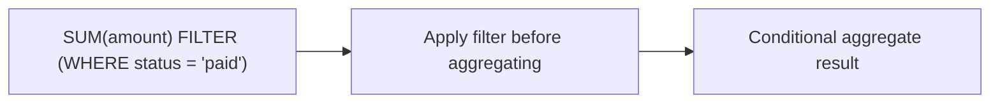

# :material-filter: Aggregate FILTER

The `FILTER` clause applies a predicate **inside** an aggregate function.
It lets you compute multiple conditional aggregates in a single pass without
writing `CASE WHEN` expressions.

### :material-sitemap: Overview



---

## 📌 Syntax

```sql
AGG(expr) FILTER (WHERE condition)
```

### Example

```sql
SELECT
  COUNT(*) AS total_orders,
  COUNT(*) FILTER (WHERE status = 'shipped') AS shipped_orders,
  SUM(amount) FILTER (WHERE status = 'cancelled') AS cancelled_amount
FROM orders;
```

---

## 🔍 Behavior

1. **Per-aggregate filtering** — The filter applies only to the specific
   aggregate function where it is defined.
2. **Does not remove rows** — Unlike `WHERE`, it does not filter rows from the
   result set; it only changes the aggregate value.
3. **Multiple filters in one query** — You can define different conditions for
   multiple aggregates in the same `SELECT`.
4. **NULL handling** — If the filter condition evaluates to NULL, that row is
   skipped for that aggregate.
5. **Aggregate-only** — `FILTER` can only be used with aggregate functions.

---

## FILTER vs HAVING

| Feature | `FILTER (WHERE ...)` | `HAVING` |
|---------|-----------------------|----------|
| Applies to | Individual aggregate | Whole grouped row |
| Timing | During aggregation | After aggregation |
| Goal | Conditional metrics | Remove groups |
| Multiple conditions | One per aggregate | One per group |

---

## FILTER vs CASE WHEN

Both patterns produce the same results, but `FILTER` is more readable and avoids
repeating the aggregate function.

```sql
SELECT
  region,
  -- CASE WHEN pattern
  SUM(CASE WHEN product = 'A' THEN sales ELSE 0 END) AS sales_a_case,
  -- FILTER pattern
  SUM(sales) FILTER (WHERE product = 'A') AS sales_a_filter
FROM transactions
GROUP BY region;
```

---

## 🧪 Practical Examples

### Multiple Conditional Metrics

```sql
SELECT
  region,
  SUM(sales) FILTER (WHERE product = 'A') AS sales_a,
  SUM(sales) FILTER (WHERE product = 'B') AS sales_b
FROM transactions
GROUP BY region;
```

### Distinct Conditional Counts

```sql
SELECT
  COUNT(DISTINCT customer_id) AS active_customers,
  COUNT(DISTINCT customer_id) FILTER (WHERE status = 'shipped') AS shipped_customers
FROM orders;
```

### Use FILTER + HAVING Together

```sql
SELECT
  region,
  SUM(sales) AS total_sales,
  SUM(sales) FILTER (WHERE product = 'A') AS sales_a
FROM transactions
GROUP BY region
HAVING SUM(sales) > 1000;
```

---

## 🧠 When to Use

| Scenario | Use |
|----------|-----|
| Multiple conditional aggregates | `FILTER` |
| Removing entire groups | `HAVING` |
| Avoiding verbose CASE WHEN | `FILTER` |

---

> **Tip:** If you need row-level filtering, use `WHERE`. `FILTER` is only for
> aggregates.
