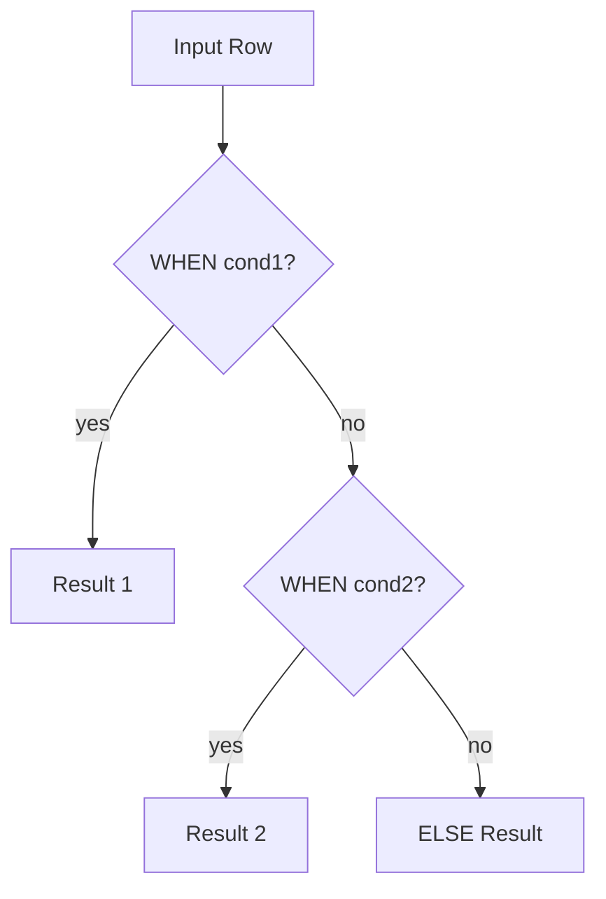

# :material-source-branch: CASE WHEN

`CASE WHEN` evaluates a list of conditions and returns the first matching result. It produces a value — it does not remove rows.

---

## Setup

```sql
CREATE OR REPLACE TEMP VIEW sales AS
SELECT * FROM VALUES
  (1, 'US',   'laptop',  1200.00, 'shipped'),
  (2, 'EU',   'phone',    800.00, 'pending'),
  (3, 'US',   'tablet',   450.00, 'shipped'),
  (4, 'APAC', 'laptop',   950.00, 'cancelled'),
  (5, 'EU',   'phone',    600.00, 'shipped'),
  (6, 'US',   'laptop',  1500.00, 'pending'),
  (7, 'APAC', 'tablet',   300.00, 'shipped'),
  (8, 'EU',   'laptop',  1100.00, NULL)
AS t(order_id, region, product, amount, status);
```

---

## :material-sitemap: Overview



---

## :material-pin: Syntax

**Searched form** — each `WHEN` evaluates an independent boolean expression:

```sql
CASE
    WHEN <condition1> THEN <result1>
    WHEN <condition2> THEN <result2>
    ELSE <default_result>
END
```

**Simple form** — compares one expression against fixed values:

```sql
CASE <expression>
    WHEN <value1> THEN <result1>
    WHEN <value2> THEN <result2>
    ELSE <default_result>
END
```

---

## :material-magnify: Behavior Notes

1. **First-match semantics** — Spark evaluates conditions top-to-bottom and returns the result of the first `WHEN` that is `TRUE`; later conditions are not evaluated.
2. **ELSE defaults to NULL** — If no condition matches and no `ELSE` clause is present, the result is `NULL`.
3. **Produces a value, not a filter** — `CASE WHEN` returns a column value; to filter rows, wrap it in a `WHERE` clause or use it in `HAVING`.
4. **NULL conditions are skipped** — A `WHEN` condition that evaluates to `NULL` (not `TRUE`) falls through to the next branch.
5. **Both forms are equivalent** — The simple form is syntactic sugar; the searched form is more flexible and supports any boolean predicate.

---

## :material-flask-outline: Examples

### :material-numeric-1-circle: Amount classification into tiers

```sql
SELECT
    order_id,
    amount,
    CASE
        WHEN amount >= 1000 THEN 'high'
        WHEN amount >= 500  THEN 'medium'
        ELSE 'low'
    END AS tier
FROM sales;
-- Result:
-- order_id | amount  | tier
-- ---------|---------|------
-- 1        | 1200.00 | high
-- 2        | 800.00  | medium
-- 3        | 450.00  | low
-- 4        | 950.00  | medium
-- 5        | 600.00  | medium
-- 6        | 1500.00 | high
-- 7        | 300.00  | low
-- 8        | 1100.00 | high
```

### :material-numeric-2-circle: Simple CASE for status label mapping

```sql
SELECT
    order_id,
    CASE status
        WHEN 'shipped'   THEN 'Delivered'
        WHEN 'pending'   THEN 'In Progress'
        WHEN 'cancelled' THEN 'Cancelled'
        ELSE 'Unknown'
    END AS status_label
FROM sales;
-- Result:
-- order_id | status_label
-- ---------|-------------
-- 1        | Delivered
-- 2        | In Progress
-- 3        | Delivered
-- 4        | Cancelled
-- 5        | Delivered
-- 6        | In Progress
-- 7        | Delivered
-- 8        | Unknown
```

### :material-numeric-3-circle: CASE in WHERE clause

```sql
SELECT order_id, region, amount
FROM sales
WHERE
    CASE
        WHEN region = 'US'   THEN amount > 1000
        WHEN region = 'EU'   THEN amount > 700
        ELSE amount > 500
    END;
-- Result:
-- order_id | region | amount
-- ---------|--------|--------
-- 1        | US     | 1200.00
-- 2        | EU     | 800.00
-- 5        | EU     | 600.00
-- 6        | US     | 1500.00
-- 8        | EU     | 1100.00
```

### :material-numeric-4-circle: Nested CASE — status-aware tier

```sql
SELECT
    order_id,
    status,
    amount,
    CASE
        WHEN status = 'cancelled' THEN 'n/a'
        ELSE
            CASE
                WHEN amount >= 1000 THEN 'high'
                WHEN amount >= 500  THEN 'medium'
                ELSE 'low'
            END
    END AS effective_tier
FROM sales;
-- Result:
-- order_id | status    | amount  | effective_tier
-- ---------|-----------|---------|---------------
-- 1        | shipped   | 1200.00 | high
-- 2        | pending   | 800.00  | medium
-- 3        | shipped   | 450.00  | low
-- 4        | cancelled | 950.00  | n/a
-- 5        | shipped   | 600.00  | medium
-- 6        | pending   | 1500.00 | high
-- 7        | shipped   | 300.00  | low
-- 8        | NULL      | 1100.00 | high
```

### :material-numeric-5-circle: CASE in HAVING to filter groups by derived label

```sql
SELECT
    region,
    SUM(amount) AS total,
    CASE
        WHEN SUM(amount) >= 3000 THEN 'high'
        WHEN SUM(amount) >= 1500 THEN 'medium'
        ELSE 'low'
    END AS revenue_band
FROM sales
GROUP BY region
HAVING
    CASE
        WHEN SUM(amount) >= 3000 THEN 'high'
        WHEN SUM(amount) >= 1500 THEN 'medium'
        ELSE 'low'
    END = 'high';
-- Result:
-- region | total   | revenue_band
-- -------|---------|-------------
-- US     | 3150.00 | high
```

---

## :material-brain: When to Use

| Scenario | Use CASE WHEN |
|----------|---------------|
| Derive a bucketed / labelled column | Yes — searched form |
| Map fixed values to labels | Yes — simple form |
| Region-specific threshold in `WHERE` | Yes — returns boolean |
| Post-aggregate conditional filter | Yes — in `HAVING` |
| Per-group conditional aggregation | Prefer `FILTER` clause instead |
