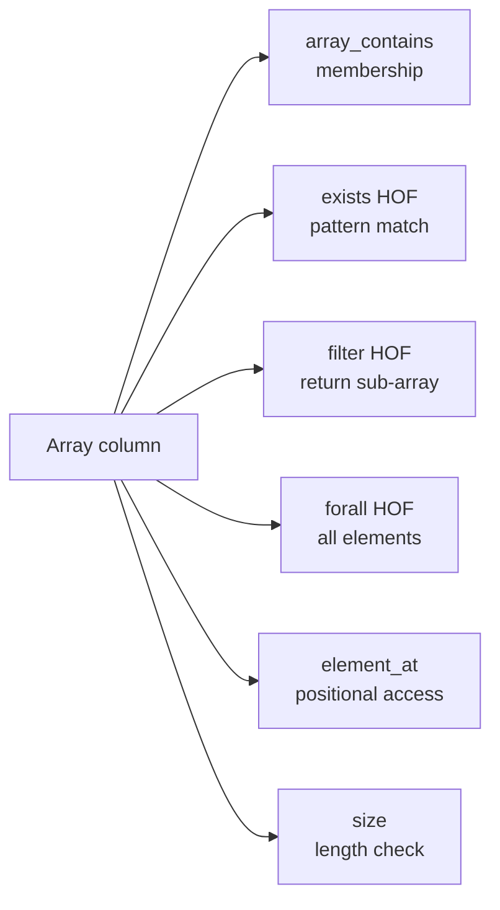

# :material-code-array: Array Filters

Spark SQL provides higher-order functions (HOFs) and built-in functions for filtering and interrogating array columns.

---

## Setup

```sql
CREATE OR REPLACE TEMP VIEW events AS
SELECT * FROM VALUES
  (1, 101, ARRAY('priority', 'alert', 'billing'), ARRAY(90, 85, 78)),
  (2, 102, ARRAY('info', 'billing'),               ARRAY(60, 55)),
  (3, 103, ARRAY('priority', 'support'),           ARRAY(95, 88)),
  (4, 104, ARRAY('alert'),                         ARRAY(40)),
  (5, 105, NULL,                                   ARRAY(70, 65)),
  (6, 106, ARRAY('info', 'priority', 'support'),   NULL)
AS t(event_id, user_id, tags, scores);
```

---

## :material-sitemap: Overview



---

## Array Functions Reference

| Function | Description |
|----------|-------------|
| `array_contains(arr, val)` | Returns TRUE if `val` is in the array |
| `exists(arr, x -> condition)` | TRUE if any element satisfies the lambda |
| `filter(arr, x -> condition)` | Returns sub-array of matching elements |
| `size(arr)` | Returns the number of elements (-1 for NULL in some modes) |
| `element_at(arr, pos)` | Returns element at 1-based position |
| `array_position(arr, val)` | Returns 1-based index of first occurrence |
| `forall(arr, x -> condition)` | TRUE if all elements satisfy the lambda |

---

## :material-magnify: Behavior Notes

1. **1-based indexing** — `element_at` and `array_position` use 1-based indexes; position 0 raises an error.
2. **array_contains with NULL** — `array_contains(arr, NULL)` returns NULL (not TRUE/FALSE); use `exists` with a null-safe lambda instead.
3. **HOFs are not pushed down** — `exists` and `filter` HOFs are evaluated by Spark in memory; they cannot be pushed to Parquet or Delta scans.
4. **filter HOF returns an array** — The `filter` HOF returns a new array; wrap with `size(filter(...)) > 0` to use as a row predicate.
5. **forall on empty array** — `forall(ARRAY(), x -> condition)` returns TRUE (vacuous truth).

---

## :material-flask-outline: Examples

### :material-numeric-1-circle: array_contains membership check

```sql
SELECT event_id, user_id, tags
FROM events
WHERE array_contains(tags, 'priority');
-- Result:
-- event_id | user_id | tags
-- ---------|---------|----------------------------
-- 1        | 101     | [priority, alert, billing]
-- 3        | 103     | [priority, support]
-- 6        | 106     | [info, priority, support]
```

### :material-numeric-2-circle: exists for pattern match

```sql
SELECT event_id, tags
FROM events
WHERE exists(tags, t -> t LIKE '%bill%');
-- Result:
-- event_id | tags
-- ---------|----------------------------
-- 1        | [priority, alert, billing]
-- 2        | [info, billing]
```

### :material-numeric-3-circle: filter HOF to get sub-array, then check size

```sql
SELECT
    event_id,
    filter(tags, t -> t IN ('priority', 'alert')) AS critical_tags,
    size(filter(tags, t -> t IN ('priority', 'alert'))) AS critical_count
FROM events
WHERE size(filter(tags, t -> t IN ('priority', 'alert'))) > 0;
-- Result:
-- event_id | critical_tags      | critical_count
-- ---------|--------------------|---------------
-- 1        | [priority, alert]  | 2
-- 3        | [priority]         | 1
-- 4        | [alert]            | 1
-- 6        | [priority]         | 1
```

### :material-numeric-4-circle: element_at position-based access

```sql
SELECT event_id, element_at(scores, 1) AS top_score
FROM events
WHERE element_at(scores, 1) >= 80;
-- Result:
-- event_id | top_score
-- ---------|----------
-- 1        | 90
-- 3        | 95
```

### :material-numeric-5-circle: forall — all elements satisfy condition

```sql
SELECT event_id, scores
FROM events
WHERE forall(scores, s -> s >= 60);
-- Result:
-- event_id | scores
-- ---------|----------
-- 1        | [90, 85, 78]
-- 2        | [60, 55]   -- 55 < 60, excluded
-- 3        | [95, 88]
```

### :material-numeric-6-circle: Filter on array length

```sql
SELECT event_id, tags, size(tags) AS tag_count
FROM events
WHERE size(tags) >= 2;
-- Result:
-- event_id | tags                        | tag_count
-- ---------|-----------------------------|----------
-- 1        | [priority, alert, billing]  | 3
-- 2        | [info, billing]             | 2
-- 3        | [priority, support]         | 2
-- 6        | [info, priority, support]   | 3
```

---

## :material-brain: When to Use

| Scenario | Recommended |
|----------|-------------|
| Check if a specific value is in an array | `array_contains` |
| Check if any element matches a pattern | `exists` HOF with lambda |
| Extract matching sub-array | `filter` HOF |
| Access element at a known position | `element_at` |
| Verify all elements meet a condition | `forall` HOF |
| Filter rows by array length | `size(arr) >= N` in `WHERE` |

---

## :material-set-merge: Set Operations on Arrays

```sql
-- Keep only tags that appear in both arrays
SELECT id, array_intersect(tags_a, tags_b) AS common_tags
FROM tag_pairs
WHERE size(array_intersect(tags_a, tags_b)) > 0;

-- Tags in A but not in B
SELECT id, array_except(tags_a, tags_b) AS unique_to_a
FROM tag_pairs;

-- Merge two arrays (union semantics, distinct values)
SELECT id, array_union(tags_a, tags_b) AS all_tags
FROM tag_pairs;
```

---

## :material-transform: transform HOF

`transform(arr, x -> expr)` maps each element through an expression, returning a new array.

```sql
-- Normalise all tags to uppercase
SELECT event_id, transform(tags, t -> UPPER(t)) AS upper_tags
FROM events;

-- Score each tag: priority=3, alert=2, others=1
SELECT event_id,
       transform(tags, t ->
           CASE t WHEN 'priority' THEN 3 WHEN 'alert' THEN 2 ELSE 1 END
       ) AS tag_scores
FROM events;
```

---

## :material-calculator: aggregate HOF (fold / reduce)

`aggregate(arr, start, (acc, x) -> merge, [finish])` performs a fold over array elements.

```sql
-- Sum all scores in the scores array
SELECT event_id, aggregate(scores, 0, (acc, s) -> acc + s) AS total_score
FROM events;

-- Product of all scores
SELECT event_id, aggregate(scores, 1, (acc, s) -> acc * s) AS score_product
FROM events;

-- Concatenate tags with a comma separator
SELECT event_id,
       aggregate(tags, '', (acc, t) -> CASE WHEN acc = '' THEN t ELSE acc || ',' || t END) AS csv_tags
FROM events;
```

---

## :material-layers-triple: flatten for Nested Arrays

```sql
CREATE OR REPLACE TEMP VIEW nested AS
SELECT * FROM VALUES
  (1, ARRAY(ARRAY(1,2), ARRAY(3,4))),
  (2, ARRAY(ARRAY(5,6), ARRAY(7,8,9)))
AS t(id, matrix);

-- Flatten one level: array<array<int>> → array<int>
SELECT id, flatten(matrix) AS flat
FROM nested;
-- id | flat
-- ---|----------
-- 1  | [1,2,3,4]
-- 2  | [5,6,7,8,9]
```

---

## :material-sort: sort_array and Combined HOF Patterns

```sql
-- Sort scores descending and keep top-2 (array slice)
SELECT event_id,
       slice(sort_array(scores, false), 1, 2) AS top2_scores
FROM events
WHERE size(scores) >= 2;

-- Keep tags that start with 'p', then sort alphabetically
SELECT event_id,
       sort_array(filter(tags, t -> t LIKE 'p%')) AS sorted_p_tags
FROM events;
```
