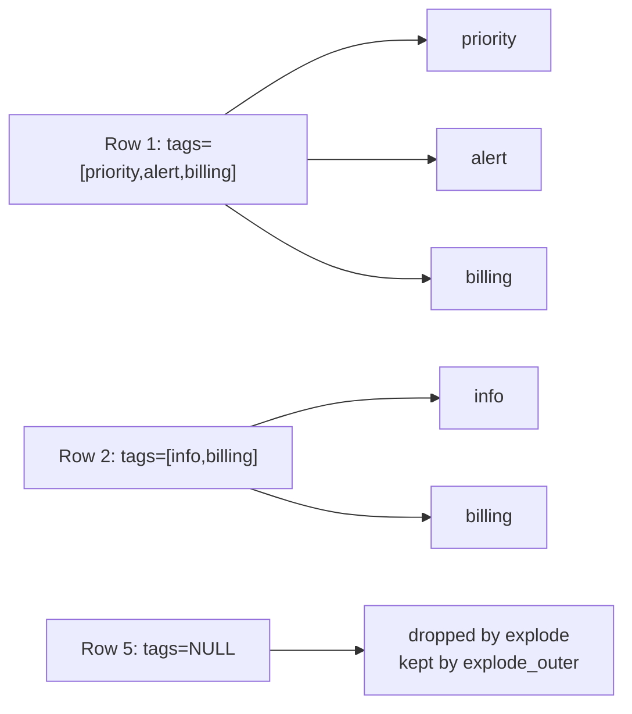

# :material-table-eye: LATERAL VIEW

`LATERAL VIEW` pairs with `explode` (and related generators) to expand array or map columns into multiple rows, one row per element.

---

## Setup

```sql
CREATE OR REPLACE TEMP VIEW events AS
SELECT * FROM VALUES
  (1, 101, ARRAY('priority', 'alert', 'billing')),
  (2, 102, ARRAY('info', 'billing')),
  (3, 103, ARRAY('priority', 'support')),
  (4, 104, ARRAY('alert')),
  (5, 105, NULL)
AS t(event_id, user_id, tags);
```

---

## :material-sitemap: Overview



---

## :material-magnify: Behavior Notes

1. **Row multiplication** — Each element in the array produces a separate output row; a row with a 3-element array becomes 3 rows.
2. **explode drops NULLs** — Rows where the array is NULL are silently dropped from the result.
3. **explode_outer keeps NULLs** — `LATERAL VIEW OUTER explode(arr)` preserves rows with NULL arrays, emitting a single NULL element row.
4. **Multiple LATERAL VIEW clauses** — Each additional `LATERAL VIEW` applies a cartesian product with the previous result; use carefully to avoid row explosion.
5. **posexplode** — `posexplode(arr)` emits `(pos, col)` pairs where `pos` is the 0-based position of each element.

---

## :material-flask-outline: Examples

### :material-numeric-1-circle: Explode tags and filter by specific value

```sql
SELECT event_id, user_id, tag
FROM events
LATERAL VIEW explode(tags) AS tag
WHERE tag = 'priority';
-- Result:
-- event_id | user_id | tag
-- ---------|---------|--------
-- 1        | 101     | priority
-- 3        | 103     | priority
```

### :material-numeric-2-circle: explode_outer to preserve NULL rows

```sql
SELECT event_id, user_id, tag
FROM events
LATERAL VIEW OUTER explode(tags) AS tag;
-- Result:
-- event_id | user_id | tag
-- ---------|---------|--------
-- 1        | 101     | priority
-- 1        | 101     | alert
-- 1        | 101     | billing
-- 2        | 102     | info
-- 2        | 102     | billing
-- 3        | 103     | priority
-- 3        | 103     | support
-- 4        | 104     | alert
-- 5        | 105     | NULL
```

### :material-numeric-3-circle: posexplode with position index

```sql
SELECT event_id, pos, tag
FROM events
LATERAL VIEW posexplode(tags) AS pos, tag;
-- Result:
-- event_id | pos | tag
-- ---------|-----|--------
-- 1        | 0   | priority
-- 1        | 1   | alert
-- 1        | 2   | billing
-- 2        | 0   | info
-- 2        | 1   | billing
-- 3        | 0   | priority
-- 3        | 1   | support
-- 4        | 0   | alert
```

### :material-numeric-4-circle: Explode and count tag occurrences

```sql
SELECT tag, COUNT(*) AS occurrences
FROM events
LATERAL VIEW explode(tags) AS tag
GROUP BY tag
ORDER BY occurrences DESC;
-- Result:
-- tag      | occurrences
-- ---------|------------
-- priority | 3
-- billing  | 2
-- alert    | 2
-- info     | 2
-- support  | 2
```

### :material-numeric-5-circle: Filter rows where a specific tag appears (using LATERAL VIEW)

```sql
SELECT DISTINCT event_id, user_id
FROM events
LATERAL VIEW explode(tags) AS tag
WHERE tag = 'billing';
-- Result:
-- event_id | user_id
-- ---------|--------
-- 1        | 101
-- 2        | 102
```

---

## :material-brain: When to Use

| Scenario | Recommended |
|----------|-------------|
| Flatten an array into rows for aggregation | `LATERAL VIEW explode` |
| Preserve rows where the array is NULL | `LATERAL VIEW OUTER explode` |
| Access element position alongside value | `posexplode` |
| Count or rank array element frequencies | `LATERAL VIEW explode` + `GROUP BY` |
| Membership check without flattening | Prefer `array_contains` — avoids row explosion |

---

## :material-table-key: Explode a Map Column

```sql
CREATE OR REPLACE TEMP VIEW order_attrs AS
SELECT * FROM VALUES
  (1, MAP('priority', 'high', 'region', 'US', 'promo', 'true')),
  (2, MAP('priority', 'low',  'region', 'EU'))
AS t(order_id, attributes);

-- Explode map → (key, value) rows
SELECT order_id, attr_key, attr_val
FROM order_attrs
LATERAL VIEW explode(attributes) AS attr_key, attr_val;
-- order_id | attr_key | attr_val
-- ---------|----------|----------
-- 1        | priority | high
-- 1        | region   | US
-- 1        | promo    | true
-- 2        | priority | low
-- 2        | region   | EU

-- Filter to specific keys after explode
SELECT order_id, attr_val AS priority
FROM order_attrs
LATERAL VIEW explode(attributes) AS attr_key, attr_val
WHERE attr_key = 'priority';
```

---

## :material-table-plus: Multiple LATERAL VIEW Clauses

Each additional `LATERAL VIEW` applies a Cartesian product with the previous result.
Use carefully — a 3-element array × 2-element array → 6 rows per original row.

```sql
CREATE OR REPLACE TEMP VIEW multi AS
SELECT * FROM VALUES
  (1, ARRAY('a', 'b'), ARRAY(1, 2))
AS t(id, letters, numbers);

SELECT id, letter, number
FROM multi
LATERAL VIEW explode(letters) AS letter
LATERAL VIEW explode(numbers) AS number;
-- id | letter | number
-- ---|--------|-------
-- 1  | a      | 1
-- 1  | a      | 2
-- 1  | b      | 1
-- 1  | b      | 2
```

---

## :material-table-row: inline() — Expand an Array of Structs

`inline(array<struct>)` expands each struct element into a separate row with named columns.

```sql
CREATE OR REPLACE TEMP VIEW invoices AS
SELECT * FROM VALUES
  (1, ARRAY(STRUCT(101, 'widget', 9.99), STRUCT(102, 'gadget', 49.99))),
  (2, ARRAY(STRUCT(201, 'thing',  1.00)))
AS t(invoice_id, line_items);

SELECT invoice_id, item_id, item_name, price
FROM invoices
LATERAL VIEW inline(line_items) AS item_id, item_name, price
WHERE price > 5.00;
-- invoice_id | item_id | item_name | price
-- -----------|---------|-----------|------
-- 1          | 101     | widget    | 9.99
-- 1          | 102     | gadget    | 49.99
```

---

## :material-stack-overflow: stack() — Generate Multiple Rows from Scalars

`stack(n, col1, col2, ...)` generates `n` rows by distributing `2n` column arguments.

```sql
SELECT metric_name, metric_value
FROM (SELECT 1) t
LATERAL VIEW stack(3,
    'min_score',   42,
    'max_score',   99,
    'avg_score',   71
) AS metric_name, metric_value;
-- metric_name | metric_value
-- ------------|-------------
-- min_score   | 42
-- max_score   | 99
-- avg_score   | 71
```

---

## :material-compare: LATERAL VIEW vs Higher-Order Functions

| Scenario | Prefer | Why |
|----------|--------|-----|
| Flatten array for aggregation (COUNT, SUM) | `LATERAL VIEW explode` | Produces rows for GROUP BY |
| Check membership without flattening | `array_contains` / `exists` HOF | No row explosion |
| Expand map to key-value rows | `LATERAL VIEW explode(map)` | HOF cannot do this easily |
| Expand array-of-structs to named columns | `LATERAL VIEW inline` | Cleaner than transform + explode |
| Generate synthetic rows from scalars | `LATERAL VIEW stack` | No source data needed |
