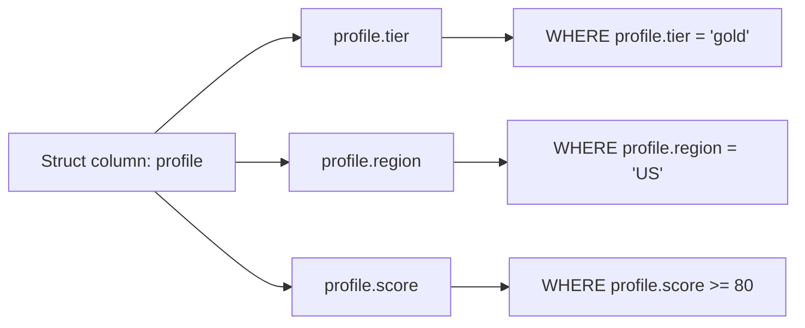

# :material-code-braces: Struct Filters

Struct columns store named, typed fields. Access individual fields with dot notation (`column.field`) and filter on them like any scalar column.

---

## Setup

```sql
CREATE OR REPLACE TEMP VIEW customers AS
SELECT * FROM VALUES
  (1, 'Alice', STRUCT('gold',   'US',   95)),
  (2, 'Bob',   STRUCT('silver', 'EU',   72)),
  (3, 'Carol', STRUCT('bronze', 'US',   45)),
  (4, 'Dave',  STRUCT('gold',   'APAC', 88)),
  (5, 'Eve',   NULL)
AS t(id, name, profile);
-- profile fields: tier (STRING), region (STRING), score (INT)
```

---

## :material-sitemap: Overview



---

## :material-magnify: Behavior Notes

1. **Dot notation** — Access struct fields with `column.field`; nested structs chain: `a.b.c`.
2. **NULL struct propagation** — If the struct column itself is NULL, all field accesses return NULL; comparisons yield UNKNOWN and the row is excluded by `WHERE`.
3. **NULL guard pattern** — Use `profile IS NOT NULL AND profile.score >= 80` to safely filter when the struct may be NULL.
4. **Pushdown support** — Catalyst can push predicates on struct fields down to Parquet and Delta scans when the field name resolves correctly.

---

## :material-flask-outline: Examples

### :material-numeric-1-circle: Basic nested field filter

```sql
SELECT id, name, profile.tier AS tier
FROM customers
WHERE profile.tier = 'gold';
-- Result:
-- id | name  | tier
-- ---|-------|-----
-- 1  | Alice | gold
-- 4  | Dave  | gold
```

### :material-numeric-2-circle: Multiple nested field conditions

```sql
SELECT id, name, profile.tier AS tier, profile.score AS score
FROM customers
WHERE profile.tier = 'gold' AND profile.score >= 90;
-- Result:
-- id | name  | tier | score
-- ---|-------|------|------
-- 1  | Alice | gold | 95
```

### :material-numeric-3-circle: NULL struct guard

```sql
SELECT id, name
FROM customers
WHERE profile IS NOT NULL AND profile.score < 50;
-- Result:
-- id | name
-- ---|-----
-- 3  | Carol
```

### :material-numeric-4-circle: Mix nested and top-level columns in filter

```sql
SELECT id, name, profile.region AS region, profile.score AS score
FROM customers
WHERE profile.region = 'US' AND profile.score > 50 AND name != 'Carol';
-- Result:
-- id | name  | region | score
-- ---|-------|--------|------
-- 1  | Alice | US     | 95
```

### :material-numeric-5-circle: Struct field pushdown — EXPLAIN note

```sql
EXPLAIN FORMATTED
SELECT id, name
FROM customers
WHERE profile.tier = 'gold';
-- Result (excerpt):
-- PushedFilters: [IsNotNull(profile), EqualTo(profile.tier,gold)]
-- Struct field predicates are pushed to the scan layer when the source supports it.
```

---

## :material-brain: When to Use

| Scenario | Recommended |
|----------|-------------|
| Filter on a single nested field | `WHERE struct_col.field = value` |
| Combine multiple nested field predicates | `AND` / `OR` with dot-notation fields |
| Safely filter when struct may be NULL | `struct_col IS NOT NULL AND struct_col.field = value` |
| Deep nesting | Chain dot notation: `a.b.c = value` |
