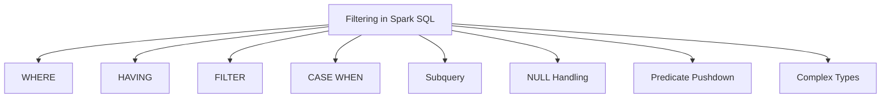
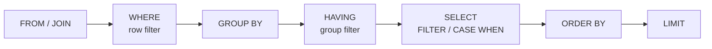

# :material-filter: Filtering Data in Spark SQL

Filter clauses control which rows enter aggregations, projections, and result sets.

---

## :material-sitemap: Overview



### SQL Execution Order



---

## Core Filtering Clauses

| Clause | Scope | Removes rows? | Typical use |
|--------|-------|---------------|-------------|
| `WHERE` | Before aggregation | Yes | Row-level predicate |
| `HAVING` | After aggregation | Yes | Post-aggregate predicate |
| `QUALIFY` | After window functions | Yes | Window function result filter |
| `FILTER` | Inside aggregate function | No (scopes aggregation) | Conditional aggregation |
| `CASE WHEN` | Expression level | No | Value derivation / conditional logic |
| Subquery (`IN`, `EXISTS`) | Correlated or scalar | Yes | Set membership, existence checks |
| `IS NULL / IS NOT NULL` | Any position | Yes (when in WHERE) | NULL-safe filtering |
| Complex type (`array_contains`, HOF) | Column expression | Yes (when in WHERE) | Array, map, struct predicates |

---

## :material-magnify: Behavior Notes

1. **Predicate pushdown** — Catalyst pushes `WHERE` predicates into file scans (Parquet, Delta), reading only matching row groups.
2. **Partition pruning** — Filtering on partition columns skips entire directories; always filter on partition columns first.
3. **NULL three-valued logic** — `NULL = NULL` evaluates to `UNKNOWN`, not `TRUE`; use `IS NULL` or `<=>` for NULL-safe comparisons.
4. **UDFs block pushdown** — Wrapping a column in a UDF (`my_udf(col) = 1`) prevents Catalyst from pushing the predicate to the scan layer.
5. **Order of operations** — `WHERE` runs before `GROUP BY`; `HAVING` runs after. Putting selective predicates in `WHERE` reduces the rows reaching the aggregation stage.

---

## :material-flask-outline: Quick Examples

```sql
-- 1. WHERE row filter
SELECT order_id, amount
FROM orders
WHERE region = 'US' AND amount > 500;
-- Result:
-- order_id | amount
-- ---------|-------
-- 1        | 1200.00
-- 6        | 1500.00
```

```sql
-- 2. HAVING post-aggregate filter
SELECT region, SUM(amount) AS total
FROM orders
GROUP BY region
HAVING SUM(amount) > 1000;
-- Result:
-- region | total
-- -------|-------
-- US     | 3150.00
-- EU     | 2500.00
```

```sql
-- 3. FILTER conditional aggregate
SELECT
    region,
    SUM(amount) FILTER (WHERE status = 'shipped') AS shipped_total
FROM orders
GROUP BY region;
-- Result:
-- region | shipped_total
-- -------|-------------
-- US     | 1650.00
-- EU     | 600.00
-- APAC   | 300.00
```

```sql
-- 4. CASE WHEN value derivation
SELECT order_id,
    CASE
        WHEN amount >= 1000 THEN 'high'
        WHEN amount >= 500  THEN 'medium'
        ELSE 'low'
    END AS tier
FROM orders;
-- Result:
-- order_id | tier
-- ---------|------
-- 1        | high
-- 2        | medium
-- 3        | low
```

```sql
-- 5. EXISTS subquery
SELECT c.name
FROM customers AS c
WHERE EXISTS (
    SELECT 1 FROM orders AS o
    WHERE o.customer_id = c.id
);
-- Result:
-- name
-- -----
-- Alice
-- Bob
-- Carol
-- Dave
```

---

## Quick Reference: WHERE vs HAVING vs FILTER vs CASE WHEN

| Feature | WHERE | HAVING | FILTER | CASE WHEN |
|---------|-------|--------|--------|-----------|
| Applies to | Individual rows | Aggregated groups | Aggregate inputs | Any expression |
| Runs after | FROM / JOIN | GROUP BY | Within SELECT | Within SELECT |
| Removes rows? | Yes | Yes | No | No |
| Use case | Row predicate | Group predicate | Conditional aggregation | Conditional value |

---

## :material-brain: When to Use

| Scenario | Recommended |
|----------|-------------|
| Filter rows before aggregation | `WHERE` |
| Filter groups after aggregation | `HAVING` |
| Compute multiple conditional aggregates in one pass | `FILTER` |
| Derive a value based on conditions | `CASE WHEN` |
| Check membership in a result set | `IN` / `EXISTS` subquery |
| Handle NULLs safely | `IS NULL`, `COALESCE`, `<=>` |
| Filter on array/map/struct columns | HOFs (`array_contains`, `exists`) |

---

## Related Guides

- [Aggregate FILTER](agg_filter/index.md)
- [CASE WHEN](case_when.md)
- [NULL Filter](null_filter.md)
- [Predicate Pushdown](pp.md)
- [Subquery Filter](sub-query.md)
- [Array Filters](complex/array.md)
- [Map Filters](complex/map.md)
- [Struct Filters](complex/struct.md)
- [LATERAL VIEW](complex/lateral_view.md)

---

## :material-filter-check: QUALIFY — Filter Window Function Results

`QUALIFY` filters rows based on window function output — no subquery needed.

```sql
-- Keep only the most recent order per customer (QUALIFY replaces a subquery wrapper)
SELECT customer_id, order_id, order_date, amount
FROM orders
QUALIFY ROW_NUMBER() OVER (PARTITION BY customer_id ORDER BY order_date DESC) = 1;

-- Top-3 products by revenue per category
SELECT category, product_id, revenue
FROM products
QUALIFY RANK() OVER (PARTITION BY category ORDER BY revenue DESC) <= 3;
```

!!! note "QUALIFY vs subquery"
    `QUALIFY` avoids wrapping the entire query in a subquery just to filter on a window rank.
    It is equivalent to:
    ```sql
    SELECT * FROM (
        SELECT *, ROW_NUMBER() OVER (...) AS rn FROM orders
    ) WHERE rn = 1
    ```

---

## :material-speedometer: Performance Checklist

| Check | Action |
|-------|--------|
| Filter on partition columns? | Move to `WHERE` — enables directory-level pruning |
| Using a UDF in `WHERE`? | Push scalar predicates outside the UDF; consider rewriting as SQL |
| Dynamic partition pruning active? | Confirm join + `WHERE` on dimension table; check `EXPLAIN FORMATTED` |
| `NOT IN` with subquery? | Replace with `NOT EXISTS` to avoid NULL trap and improve plan |
| HOF in `WHERE` (e.g. `exists()`)? | Cannot be pushed down — pre-filter with cheaper predicates first |
