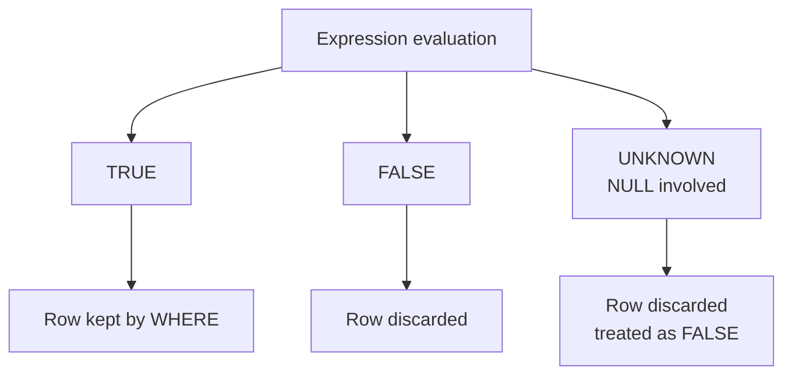

# :material-null: NULL Handling in Filters

NULL represents an absent or unknown value. Spark SQL uses three-valued logic — `TRUE`, `FALSE`, and `UNKNOWN` — which makes NULL handling critical in filter expressions.

---

## Setup

```sql
CREATE OR REPLACE TEMP VIEW users AS
SELECT * FROM VALUES
  (1, 'Alice', 'US',   85),
  (2, 'Bob',   NULL,   92),
  (3, 'Carol', 'EU',   NULL),
  (4, 'Dave',  NULL,   NULL)
AS t(id, name, region, score);
```

---

## :material-sitemap: Overview



---

## Three-Valued Logic Truth Table

| Expression | Result |
|-----------|--------|
| `NULL = NULL` | UNKNOWN |
| `NULL = 'US'` | UNKNOWN |
| `NULL IS NULL` | TRUE |
| `NULL IS NOT NULL` | FALSE |
| `1 = 1` | TRUE |
| `NULL <=> NULL` | TRUE |
| `NULL <=> 'US'` | FALSE |

---

## AND / OR with NULL

| A | B | A AND B | A OR B |
|---|---|---------|--------|
| TRUE | NULL | UNKNOWN | TRUE |
| FALSE | NULL | FALSE | UNKNOWN |
| NULL | NULL | UNKNOWN | UNKNOWN |

---

## :material-magnify: Behavior Notes

1. **Three-valued logic** — Any comparison involving NULL produces UNKNOWN, not TRUE or FALSE; `WHERE` discards UNKNOWN rows.
2. **WHERE keeps only TRUE** — Rows where the predicate evaluates to FALSE or UNKNOWN are excluded from results.
3. **COALESCE for defaults** — `COALESCE(col, default)` replaces NULL with a fallback value, enabling comparisons that would otherwise produce UNKNOWN.
4. **NOT IN NULL pitfall** — `col NOT IN (subquery)` returns no rows when the subquery contains even one NULL; prefer `NOT EXISTS` instead.
5. **Null-safe equality** — The `<=>` operator returns TRUE when both sides are NULL and FALSE when only one side is NULL, unlike `=`.

---

## :material-flask-outline: Examples

### :material-numeric-1-circle: IS NULL / IS NOT NULL on score

```sql
SELECT id, name, score
FROM users
WHERE score IS NULL;
-- Result:
-- id | name  | score
-- ---|-------|------
-- 3  | Carol | NULL
-- 4  | Dave  | NULL

SELECT id, name, score
FROM users
WHERE score IS NOT NULL;
-- Result:
-- id | name  | score
-- ---|-------|------
-- 1  | Alice | 85
-- 2  | Bob   | 92
```

### :material-numeric-2-circle: Null-safe equality with <=>

```sql
SELECT id, name, region
FROM users
WHERE region <=> NULL;
-- Result:
-- id | name | region
-- ---|------|-------
-- 2  | Bob  | NULL
-- 4  | Dave | NULL
```

### :material-numeric-3-circle: COALESCE in WHERE

```sql
SELECT id, name, COALESCE(region, 'UNKNOWN') AS region
FROM users
WHERE COALESCE(region, 'UNKNOWN') = 'UNKNOWN';
-- Result:
-- id | name | region
-- ---|------|-------
-- 2  | Bob  | UNKNOWN
-- 4  | Dave | UNKNOWN
```

### :material-numeric-4-circle: NOT IN vs NOT EXISTS NULL pitfall

```sql
-- Dangerous: returns 0 rows because subquery contains NULL region
SELECT id, name
FROM users
WHERE region NOT IN (SELECT region FROM users WHERE id = 3);
-- Result: (no rows — NULL in subquery poisons NOT IN)

-- Safe: NOT EXISTS handles NULLs correctly
SELECT u.id, u.name
FROM users AS u
WHERE NOT EXISTS (
    SELECT 1
    FROM users AS u2
    WHERE u2.id = 3 AND u2.region = u.region
);
-- Result:
-- id | name
-- ---|-----
-- 2  | Bob
-- 4  | Dave
```

### :material-numeric-5-circle: NULLS FIRST / NULLS LAST in ORDER BY

```sql
SELECT id, name, score
FROM users
ORDER BY score ASC NULLS LAST;
-- Result:
-- id | name  | score
-- ---|-------|------
-- 1  | Alice | 85
-- 2  | Bob   | 92
-- 3  | Carol | NULL
-- 4  | Dave  | NULL

SELECT id, name, score
FROM users
ORDER BY score ASC NULLS FIRST;
-- Result:
-- id | name  | score
-- ---|-------|------
-- 3  | Carol | NULL
-- 4  | Dave  | NULL
-- 1  | Alice | 85
-- 2  | Bob   | 92
```

---

## :material-brain: When to Use

| Scenario | Recommended |
|----------|-------------|
| Filter only rows where column is absent | `IS NULL` |
| Exclude rows with missing values | `IS NOT NULL` |
| Compare two columns that may both be NULL | `<=>` null-safe equality |
| Replace NULL with a default for comparison | `COALESCE(col, default)` |
| Exclude rows absent from a subquery with NULLs | `NOT EXISTS` (not `NOT IN`) |
