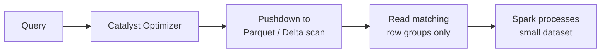
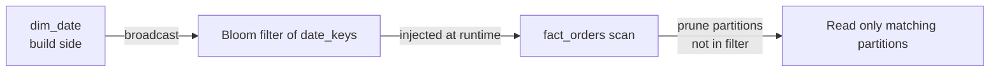

# :material-lightning-bolt: Predicate Pushdown

Predicate pushdown is a Catalyst optimizer technique that moves filter predicates as close to the data source as possible, minimising the bytes read from storage.

---

## :material-sitemap: Overview

### With Pushdown



### Without Pushdown


---

## :material-pin: What Enables Pushdown

Predicates using the following operators on plain column references are pushed down:

| Operator / Pattern | Example |
|-------------------|---------|
| Equality | `region = 'US'` |
| Comparison | `amount > 500`, `amount <= 1000` |
| Not equal | `status != 'cancelled'` |
| BETWEEN | `amount BETWEEN 100 AND 500` |
| IN (literal list) | `region IN ('US', 'EU')` |
| IS NULL | `region IS NULL` |
| IS NOT NULL | `score IS NOT NULL` |
| AND / OR combinations | `region = 'US' AND amount > 500` |
| Partition column filter | `year = 2024 AND month = 1` |

---

## :material-pin: What Blocks Pushdown

| Pattern | Why it blocks |
|---------|--------------|
| UDFs — `my_udf(col) = 1` | Catalyst cannot introspect UDF logic |
| Expression on column — `col + 1 > 5` | Column is wrapped; pushdown needs bare reference |
| `CAST(col AS ...)` on the left — `CAST(amount AS INT) > 500` | Wrapped expression |
| Non-deterministic functions — `RAND() < 0.5` | Varies per row; cannot be pushed |
| Python UDFs (PySpark) | Opaque to JVM Catalyst |

---

## :material-flask-outline: Examples

### :material-numeric-1-circle: Verify pushdown with EXPLAIN FORMATTED

```sql
EXPLAIN FORMATTED
SELECT order_id, amount
FROM orders
WHERE region = 'US' AND amount > 500;
-- Result (excerpt from plan output):
-- == Physical Plan ==
-- ...
-- PushedFilters: [IsNotNull(region), IsNotNull(amount),
--                EqualTo(region,US), GreaterThan(amount,500.0)]
-- ...
```

### :material-numeric-2-circle: UDF blocks pushdown

```sql
-- Define a simple UDF
CREATE OR REPLACE TEMPORARY FUNCTION is_us(r STRING) RETURNS BOOLEAN
RETURN r = 'US';

EXPLAIN FORMATTED
SELECT order_id FROM orders WHERE is_us(region);
-- Result (excerpt):
-- PushedFilters: []   -- empty: UDF blocked pushdown
```

### :material-numeric-3-circle: Expression on column blocks pushdown

```sql
EXPLAIN FORMATTED
SELECT order_id FROM orders WHERE amount * 1.1 > 1000;
-- Result (excerpt):
-- PushedFilters: []   -- empty: expression on column blocked pushdown

-- Rewrite as bare column reference to enable pushdown:
EXPLAIN FORMATTED
SELECT order_id FROM orders WHERE amount > 909.09;
-- Result (excerpt):
-- PushedFilters: [GreaterThan(amount,909.09)]
```

---

## Delta-Specific Optimisations

Delta Lake extends pushdown with file-level statistics (min/max per column) and Z-ORDER clustering:

```sql
-- Cluster the table by frequently filtered columns
OPTIMIZE orders ZORDER BY (region, status);

-- Spark now reads only Delta files whose region/status stats match the filter
SELECT order_id, amount
FROM orders
WHERE region = 'US' AND status = 'shipped';
```

Z-ORDER is most effective when filtering on two or three high-cardinality columns together.

---

## Configuration Reference

| Configuration key | Default | Effect |
|-------------------|---------|--------|
| `spark.sql.parquet.filterPushdown` | `true` | Push predicates into Parquet row-group filters |
| `spark.sql.orc.filterPushdown` | `true` | Push predicates into ORC stripe filters |
| `spark.sql.optimizer.dynamicPartitionPruning.enabled` | `true` | Prune partitions at runtime using broadcast join results |

---

## :material-brain: When to Use

| Scenario | Recommendation |
|----------|---------------|
| Querying large Parquet / Delta tables | Always filter on bare column references |
| Partition columns available | Filter on partition columns first |
| Frequently filtered columns | Apply `OPTIMIZE ... ZORDER BY` on Delta |
| UDF required in filter | Push additional bare-column predicates alongside the UDF |
| Checking if pushdown is active | Use `EXPLAIN FORMATTED` and inspect `PushedFilters` |

---

## :material-folder-multiple: Partition Pruning

Partition pruning is separate from row-group pushdown — it skips entire **directories**
on storage rather than row groups within a file.

```sql
-- Table partitioned by (year, month)
-- Spark reads ONLY the year=2024/month=6/ directory
SELECT order_id, amount
FROM orders
WHERE year = 2024 AND month = 6;
```

!!! tip "Always filter on partition columns first"
    Partition pruning eliminates I/O at the directory level — far cheaper than Parquet
    row-group filtering. Add partition column predicates even when other filters are present.

```sql
-- Good: partition prune first, then row-group filter
SELECT * FROM events
WHERE event_date = '2024-06-01'   -- partition prune
  AND event_type = 'click';       -- row-group filter within the partition

-- Bad: year() function prevents partition pruning
SELECT * FROM events WHERE YEAR(event_date) = 2024;
-- Fix: use a range predicate
SELECT * FROM events WHERE event_date >= '2024-01-01' AND event_date < '2025-01-01';
```

---

## :material-lightning-bolt-circle: Dynamic Partition Pruning (DPP)

DPP prunes partitions at **runtime** using values discovered during a broadcast join.
Enabled by default in Spark 3.x (`spark.sql.optimizer.dynamicPartitionPruning.enabled = true`).



```sql
-- DPP fires when joining a large partitioned fact table
-- against a small dimension table filtered by a predicate
SELECT f.order_id, f.amount, d.quarter
FROM fact_orders f
JOIN dim_date d ON f.order_date = d.date_key
WHERE d.year = 2024 AND d.quarter = 'Q2';
-- Spark broadcasts dim_date, then prunes fact_orders partitions at runtime
```

**Verify DPP in EXPLAIN:**

```sql
EXPLAIN FORMATTED
SELECT f.order_id, d.quarter
FROM fact_orders f
JOIN dim_date d ON f.order_date = d.date_key
WHERE d.year = 2024;
-- Look for: DynamicPruningExpression in the scan node
```

---

## :material-magnify-expand: Reading EXPLAIN FORMATTED Output

| Section | What to look for |
|---------|-----------------|
| `PushedFilters` | Predicates pushed to storage scan |
| `PartitionFilters` | Partition pruning predicates |
| `DataFilters` | Row-level filters applied after read |
| `DynamicPruningExpression` | Runtime DPP filter injected |
| `ReadSchema` | Columns actually read (column pruning) |
| `BatchScan` vs `FileScan` | Vectorised vs row-based read |

```sql
EXPLAIN FORMATTED
SELECT order_id, amount
FROM orders
WHERE region = 'US' AND order_date = '2024-06-01' AND amount > 100;
-- Expected:
-- PartitionFilters: [order_date = '2024-06-01']      -- directory skip
-- PushedFilters: [EqualTo(region,US), GreaterThan(amount,100.0)]  -- row-group skip
-- ReadSchema: struct<order_id:int, amount:decimal>   -- only 2 cols read
```

---

## :material-speedometer: Performance Checklist

| Check | Command |
|-------|---------|
| Are predicates pushed? | `EXPLAIN FORMATTED` → `PushedFilters` not empty |
| Is partition pruning active? | `EXPLAIN FORMATTED` → `PartitionFilters` not empty |
| Is DPP firing? | `EXPLAIN FORMATTED` → `DynamicPruningExpression` present |
| Are only needed columns read? | `EXPLAIN FORMATTED` → `ReadSchema` matches `SELECT` list |
| Is Z-ORDER effective? | Check `numFilesSkipped` in `DESCRIBE HISTORY` after OPTIMIZE |
