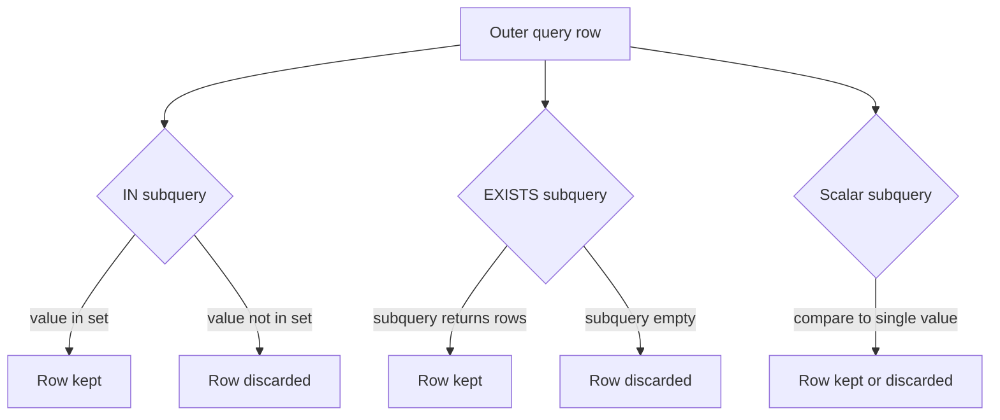

# :material-filter-outline: Subquery Filters

Subquery filters let you restrict rows based on the results of a nested query — using set membership (`IN`), existence checks (`EXISTS`), or scalar comparisons.

---

## Setup

```sql
CREATE OR REPLACE TEMP VIEW customers AS
SELECT * FROM VALUES
  (1, 'Alice', 'US'),
  (2, 'Bob',   'EU'),
  (3, 'Carol', 'US'),
  (4, 'Dave',  'APAC'),
  (5, 'Eve',   'EU')
AS t(id, name, country);

CREATE OR REPLACE TEMP VIEW orders AS
SELECT * FROM VALUES
  (101, 1,  250.00, 'shipped'),
  (102, 2,  180.00, 'pending'),
  (103, 1,  430.00, 'shipped'),
  (104, 3,  120.00, 'cancelled'),
  (105, 4,  560.00, 'shipped'),
  (106, 2,  200.00, 'shipped'),
  (107, 99, 300.00, 'pending'),
  (108, 3,  150.00, 'shipped')
AS t(order_id, customer_id, amount, status);
```

---

## :material-sitemap: Overview



---

## :material-magnify: Behavior Notes

1. **IN vs EXISTS performance** — `EXISTS` stops scanning the subquery as soon as one match is found (short-circuits); `IN` materialises the full set. Use `EXISTS` for large inner tables.
2. **NOT IN NULL danger** — If the subquery for `NOT IN` returns any NULL value, the entire outer query returns zero rows due to three-valued logic. Use `NOT EXISTS` instead.
3. **Correlated subqueries** — A correlated subquery references columns from the outer query. Catalyst may de-correlate it into a join for efficiency.
4. **Scalar subqueries** — Must return exactly one row and one column; if they return more than one row, Spark raises a runtime error.
5. **Semi-join rewrite** — Catalyst rewrites `IN` / `EXISTS` as left semi-joins and `NOT IN` / `NOT EXISTS` as left anti-joins internally.

---

## :material-flask-outline: Examples

### :material-numeric-1-circle: IN — orders from US customers

```sql
SELECT order_id, customer_id, amount
FROM orders
WHERE customer_id IN (
    SELECT id FROM customers WHERE country = 'US'
);
-- Result:
-- order_id | customer_id | amount
-- ---------|-------------|-------
-- 101      | 1           | 250.00
-- 103      | 1           | 430.00
-- 104      | 3           | 120.00
-- 108      | 3           | 150.00
```

### :material-numeric-2-circle: NOT IN — dangerous with NULLs

```sql
-- Suppose customers had a NULL id; NOT IN returns 0 rows
SELECT order_id, customer_id
FROM orders
WHERE customer_id NOT IN (
    SELECT id FROM customers WHERE country = 'EU'
    UNION ALL SELECT NULL
);
-- Result: (no rows — NULL poisons NOT IN)
```

### :material-numeric-3-circle: EXISTS — orders where customer exists

```sql
SELECT o.order_id, o.customer_id, o.amount
FROM orders AS o
WHERE EXISTS (
    SELECT 1 FROM customers AS c WHERE c.id = o.customer_id
);
-- Result:
-- order_id | customer_id | amount
-- ---------|-------------|-------
-- 101      | 1           | 250.00
-- 102      | 2           | 180.00
-- 103      | 1           | 430.00
-- 104      | 3           | 120.00
-- 105      | 4           | 560.00
-- 106      | 2           | 200.00
-- 108      | 3           | 150.00
```

### :material-numeric-4-circle: NOT EXISTS — customers with no orders

```sql
SELECT c.id, c.name, c.country
FROM customers AS c
WHERE NOT EXISTS (
    SELECT 1 FROM orders AS o WHERE o.customer_id = c.id
);
-- Result:
-- id | name | country
-- ---|------|--------
-- 5  | Eve  | EU
```

### :material-numeric-5-circle: Correlated subquery — orders above customer average

```sql
SELECT o.order_id, o.customer_id, o.amount
FROM orders AS o
WHERE o.amount > (
    SELECT AVG(o2.amount)
    FROM orders AS o2
    WHERE o2.customer_id = o.customer_id
);
-- Result:
-- order_id | customer_id | amount
-- ---------|-------------|-------
-- 103      | 1           | 430.00
-- 106      | 2           | 200.00
-- 105      | 4           | 560.00
-- 108      | 3           | 150.00
```

### :material-numeric-6-circle: Scalar subquery — orders above overall average

```sql
SELECT order_id, customer_id, amount
FROM orders
WHERE amount > (SELECT AVG(amount) FROM orders);
-- Result:
-- order_id | customer_id | amount
-- ---------|-------------|-------
-- 103      | 1           | 430.00
-- 105      | 4           | 560.00
-- 107      | 99          | 300.00
```

---

## :material-brain: When to Use

| Scenario | Recommended |
|----------|-------------|
| Filter rows that appear in another table | `IN` or `EXISTS` (prefer `EXISTS` for large sets) |
| Filter rows that do not appear in another table | `NOT EXISTS` (avoid `NOT IN` when NULLs possible) |
| Apply a per-row threshold based on a group average | Correlated subquery |
| Compare against a single computed value | Scalar subquery |
| High-performance semi-join | `EXISTS` — Catalyst rewrites to left semi-join |
| Anti-join with NULL-safe semantics | `NOT EXISTS` |
