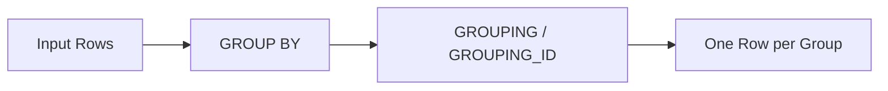

# :material-sigma: grouping / grouping_id

`GROUPING` and `GROUPING_ID` identify which columns are aggregated in `CUBE`, `ROLLUP`,
and `GROUPING SETS` queries, distinguishing actual NULLs from aggregation-level NULLs.

### :material-sitemap: Overview



## :material-pin: Syntax

```sql
GROUPING(column)
GROUPING_ID([column1, column2, ...])
```

- `GROUPING(col)`: Returns `1` if `col` is aggregated (NULL due to rollup), `0` if it's a real group value
- `GROUPING_ID()`: Returns a bitmask integer representing which columns are aggregated

## :material-magnify: Behavior

1. `GROUPING(col)` returns `1` when the column is at a super-aggregate level (i.e., the NULL represents "all values").
2. `GROUPING_ID()` encodes the grouping state of multiple columns into a single integer using binary representation.
3. These functions are **only valid** inside `GROUP BY CUBE`, `ROLLUP`, or `GROUPING SETS`.

## :material-flask-outline: Practical Examples

### GROUPING — Identify Super-Aggregate Rows

```sql
SELECT
  name,
  GROUPING(name) AS is_total,
  SUM(age) AS total_age
FROM VALUES (2, 'Alice'), (5, 'Bob') AS people(age, name)
GROUP BY CUBE(name);
```

| name | is_total | total_age |
|------|----------|-----------|
| Alice | 0 | 2 |
| Bob | 0 | 5 |
| NULL | 1 | 7 |

The row with `is_total=1` is the grand total (NULL means "all names").

### GROUPING_ID — Multi-Column Bitmask

```sql
SELECT
  name,
  height,
  GROUPING_ID(name, height) AS grp_id,
  SUM(age) AS total_age
FROM VALUES (2, 'Alice', 165), (5, 'Bob', 180) AS people(age, name, height)
GROUP BY CUBE(name, height);
```

| name | height | grp_id | total_age | Meaning |
|------|--------|--------|-----------|---------|
| Alice | 165 | 0 | 2 | Group by both |
| Bob | 180 | 0 | 5 | Group by both |
| NULL | 165 | 2 | 2 | Group by height only |
| NULL | 180 | 2 | 5 | Group by height only |
| Alice | NULL | 1 | 2 | Group by name only |
| Bob | NULL | 1 | 5 | Group by name only |
| NULL | NULL | 3 | 7 | Grand total |

### Use GROUPING to Label Totals

```sql
SELECT
  CASE WHEN GROUPING(department) = 1 THEN 'ALL' ELSE department END AS department,
  CASE WHEN GROUPING(role) = 1 THEN 'ALL' ELSE role END AS role,
  COUNT(*) AS headcount,
  AVG(salary) AS avg_salary
FROM VALUES
  ('Engineering', 'Senior', 120000),
  ('Engineering', 'Junior', 80000),
  ('Sales', 'Senior', 100000),
  ('Sales', 'Junior', 70000)
AS employees(department, role, salary)
GROUP BY CUBE(department, role);
```

## :material-brain: GROUPING_ID Bitmask Reference

| GROUPING_ID(A, B) | A grouped? | B grouped? | Level |
|--------------------|-----------|-----------|-------|
| 0 | No | No | Group by A, B |
| 1 | No | Yes | Group by A only |
| 2 | Yes | No | Group by B only |
| 3 | Yes | Yes | Grand total |
