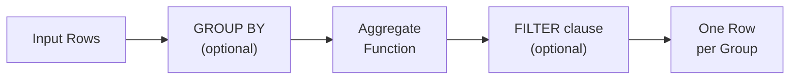

# :material-sigma: Aggregate Functions

Aggregate functions compute a **single result from a group of rows**.
They are used in `GROUP BY` queries, as window functions with `OVER (...)`,
and with the `FILTER` clause for conditional aggregation.

---

## :material-sitemap: Processing Flow



---

## :material-compare: Function Categories

| Category | Key Functions | Description |
|----------|--------------|-------------|
| **Simple** | `SUM`, `AVG`, `MIN`, `MAX`, `MEAN` | Numeric aggregation |
| **Count** | `COUNT`, `COUNT_IF`, `APPROX_COUNT_DISTINCT` | Row and distinct counting |
| **First / Last** | `FIRST`, `LAST`, `FIRST_VALUE`, `LAST_VALUE` | Positional value retrieval |
| **Boolean** | `EVERY`, `BOOL_AND`, `SOME`, `BOOL_OR`, `ANY` | Boolean aggregation |
| **Array** | `ARRAY_AGG`, `COLLECT_LIST`, `COLLECT_SET` | Collect values into arrays |
| **Map** | `MAP_FROM_ENTRIES`, `MAP_FROM_ARRAYS` | Aggregate into maps |
| **Group identity** | `GROUPING`, `GROUPING_ID` | Identify levels in ROLLUP/CUBE |
| **Statistics** | `STDDEV`, `VARIANCE`, `CORR`, `PERCENTILE`, `MEDIAN` | Statistical measures |
| **String** | `CONCAT_WS` + `COLLECT_LIST` | String concatenation across rows |

---

## :material-flask-outline: Core Examples

```sql
-- Simple aggregates
SELECT
    COUNT(*)                        AS total_rows,
    COUNT(email)                    AS non_null_emails,
    SUM(salary)                     AS payroll,
    AVG(salary)                     AS mean_salary,
    MIN(hire_date)                  AS earliest_hire,
    MAX(salary)                     AS top_salary
FROM employees;

-- Grouped
SELECT department, ROUND(AVG(salary), 2) AS avg_salary
FROM employees
GROUP BY department
ORDER BY avg_salary DESC;

-- Conditional aggregation with FILTER
SELECT
    department,
    COUNT(*) FILTER (WHERE salary > 100000) AS high_earners,
    SUM(salary) FILTER (WHERE status = 'active') AS active_payroll
FROM employees
GROUP BY department;

-- Collect values into array / set
SELECT department,
    COLLECT_LIST(name)       AS all_names,       -- with duplicates
    COLLECT_SET(job_title)   AS unique_titles,   -- distinct only
    SORT_ARRAY(COLLECT_LIST(name)) AS sorted_names
FROM employees
GROUP BY department;

-- Statistical aggregates
SELECT
    STDDEV(salary)                  AS salary_stddev,
    VARIANCE(salary)                AS salary_variance,
    PERCENTILE(salary, 0.5)         AS median_salary,
    PERCENTILE(salary, ARRAY(0.25, 0.75)) AS quartiles,
    CORR(years_exp, salary)         AS exp_salary_correlation
FROM employees;

-- Approximate distinct count (faster for very large groups)
SELECT department, APPROX_COUNT_DISTINCT(user_id) AS approx_users
FROM events
GROUP BY department;
```

---

## :material-filter: FILTER Clause

```sql
-- Multiple conditional aggregates in one pass over the table
SELECT
    region,
    SUM(amount)                                   AS total_revenue,
    SUM(amount) FILTER (WHERE channel = 'web')    AS web_revenue,
    SUM(amount) FILTER (WHERE channel = 'mobile') AS mobile_revenue,
    COUNT(*) FILTER (WHERE status = 'returned')   AS returns,
    ROUND(
        COUNT(*) FILTER (WHERE status = 'returned') * 100.0
        / NULLIF(COUNT(*), 0), 2
    )                                             AS return_rate_pct
FROM orders
GROUP BY region;
```

---

## :material-magnify: Behavior Notes

1. **NULLs ignored** — all aggregate functions (except `COUNT(*)`) skip NULL values.
2. **`COUNT(*)` vs `COUNT(col)`** — `COUNT(*)` counts every row; `COUNT(col)` counts non-NULL values only.
3. **Non-deterministic order** — `COLLECT_LIST` and `COLLECT_SET` produce non-deterministic ordering after a shuffle; use `SORT_ARRAY` to enforce order.
4. **Window functions** — any aggregate can be used as a window function by adding `OVER (PARTITION BY ... ORDER BY ...)`.
5. **FILTER is a single-pass optimisation** — multiple `AGG FILTER (WHERE ...)` in the same `SELECT` scan the table once.

---

## :material-book-open-variant: In This Section

| Page | Contents |
|------|----------|
| [Simple](simple.md) | `SUM`, `AVG`, `MIN`, `MAX`, `MEAN` |
| [Count](count.md) | `COUNT`, `COUNT_IF`, `APPROX_COUNT_DISTINCT` |
| [First / Last](first.md) | `FIRST`, `LAST`, ignoreNulls |
| [Every / Some](every.md) | `EVERY`, `BOOL_AND`, `SOME`, `BOOL_OR` |
| [Array](array.md) | `COLLECT_LIST`, `COLLECT_SET`, `ARRAY_AGG` |
| [List](list.md) | `COLLECT_LIST` patterns |
| [Set](set.md) | `COLLECT_SET` patterns |
| [Map](map.md) | `MAP_FROM_ENTRIES`, `MAP_FROM_ARRAYS` |
| [Group](group.md) | `GROUPING`, `GROUPING_ID` for ROLLUP/CUBE |
| [Statistics](stats.md) | `STDDEV`, `VARIANCE`, `CORR`, `PERCENTILE`, `MEDIAN` |
| [Strings](strings.md) | `CONCAT_WS` + `COLLECT_LIST` string aggregation |
