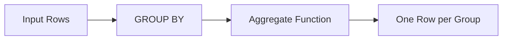

# :material-sigma: Aggregate Functions

Aggregate functions perform calculations across a set of rows and return a single result.
They are commonly used with `GROUP BY` clauses or as window functions with `OVER`.

### :material-sitemap: Overview



## :material-pin: Function Categories

| Category | Functions | Description |
|----------|-----------|-------------|
| **Simple** | `MIN`, `MAX`, `SUM`, `AVG`, `MEAN` | Basic numeric aggregations |
| **Count** | `COUNT`, `COUNT_IF`, `APPROX_COUNT_DISTINCT` | Row and distinct counting |
| **First/Last** | `FIRST`, `LAST`, `FIRST_VALUE`, `LAST_VALUE` | Positional value retrieval |
| **Every** | `EVERY`, `BOOL_AND`, `SOME`, `BOOL_OR` | Boolean aggregations |
| **Array** | `ARRAY_AGG` | Collect values into an array (SQL standard) |
| **List** | `COLLECT_LIST` | Collect values preserving duplicates |
| **Set** | `COLLECT_SET` | Collect distinct values |
| **Map** | `MAP_FROM_ENTRIES`, `MAP_FROM_ARRAYS` | Aggregate into map structures |
| **Group** | `GROUPING`, `GROUPING_ID` | Identify aggregation levels in CUBE/ROLLUP |
| **Stats** | `STDDEV`, `VARIANCE`, `CORR`, `COVAR_*`, `PERCENTILE` | Statistical aggregations |
| **Strings** | `CONCAT_WS` + `COLLECT_LIST` | String concatenation across rows |

## :material-flask-outline: Quick Examples

```sql
-- Simple aggregates
SELECT COUNT(*), SUM(salary), AVG(salary), MIN(salary), MAX(salary)
FROM employees;

-- Grouped aggregation
SELECT department, AVG(salary) AS avg_salary
FROM employees
GROUP BY department;

-- Collection aggregates
SELECT department, COLLECT_LIST(name) AS members
FROM employees
GROUP BY department;

-- Boolean aggregate
SELECT EVERY(salary > 0) AS all_positive FROM employees;
```

## :material-magnify: Behavior Notes

1. Most aggregate functions **ignore NULLs** (except `COUNT(*)`).
2. `COUNT(*)` counts all rows; `COUNT(col)` counts non-NULL values only.
3. Collection functions (`COLLECT_LIST`, `COLLECT_SET`) have **non-deterministic ordering** after shuffle.
4. Use `OVER (...)` to apply aggregates as **window functions** without reducing rows.