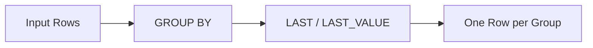

# :material-sigma: last / last_value

`last` returns the last value in a group. When used with `ORDER BY` in window functions,
it returns the last value in the ordered frame.

### :material-sitemap: Overview



## :material-pin: Syntax

```sql
last(expr[, ignoreNulls])
last_value(expr[, ignoreNulls])
```

- `expr`: The column or expression to evaluate
- `ignoreNulls`: When `true`, skips NULL values (default: `false`)
- Returns: Same type as `expr`

## :material-magnify: Behavior

1. Returns the last value encountered in the group.
2. Result is **non-deterministic** without an explicit `ORDER BY` (row order depends on shuffle).
3. When `ignoreNulls = true`, the last non-NULL value is returned.
4. `last` and `last_value` are aliases.

## :material-flask-outline: Practical Examples

### Basic Usage

```sql
SELECT last(col) FROM VALUES (10), (5), (20) AS tab(col);
-- Result: 20
```

### NULL Handling

```sql
-- Default: returns NULL if last value is NULL
SELECT last(col) FROM VALUES (10), (5), (NULL) AS tab(col);
-- Result: null

-- ignoreNulls = true: skips NULLs
SELECT last(col, true) FROM VALUES (10), (5), (NULL) AS tab(col);
-- Result: 5
```

### last_value (Alias)

```sql
SELECT last_value(col) FROM VALUES (10), (5), (20) AS tab(col);
-- Result: 20

SELECT last_value(col, true) FROM VALUES (10), (5), (NULL) AS tab(col);
-- Result: 5
```

### Window Function Usage

```sql
CREATE OR REPLACE TEMP VIEW events AS
SELECT * FROM VALUES
  ('Alice', '2024-01-01', 100),
  ('Alice', '2024-01-02', NULL),
  ('Alice', '2024-01-03', 300),
  ('Bob',   '2024-01-01', 200)
AS events(user_name, event_date, amount);

-- Last non-null amount per user (ordered by date)
SELECT
  user_name,
  event_date,
  amount,
  LAST_VALUE(amount, true) OVER (
    PARTITION BY user_name ORDER BY event_date
    ROWS BETWEEN UNBOUNDED PRECEDING AND CURRENT ROW
  ) AS last_known_amount
FROM events;
```

## :material-brain: first vs last

| Function | Returns | ignoreNulls |
|----------|---------|------------|
| `first(col)` | First value in group | Optional |
| `last(col)` | Last value in group | Optional |
| `first(col, true)` | First non-NULL value | Yes |
| `last(col, true)` | Last non-NULL value | Yes |
