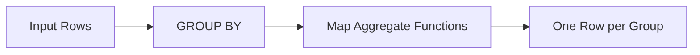

# :material-sigma: Map Aggregate Functions

Map aggregate functions create key-value map structures from grouped data.

### :material-sitemap: Overview



## 📌 Functions

| Function | Description | Returns |
|----------|-------------|---------|
| `MAP_FROM_ENTRIES(array)` | Create map from array of key-value structs | `MAP<K,V>` |
| `MAP_FROM_ARRAYS(keys, values)` | Create map from two arrays | `MAP<K,V>` |
| `MAP(key1, val1, ...)` | Create map from literal key-value pairs | `MAP<K,V>` |

## 📌 Syntax

```sql
-- Literal map creation
MAP(key1, value1, key2, value2, ..., keyN, valueN)

-- From two arrays
MAP_FROM_ARRAYS(array_of_keys, array_of_values)

-- From array of structs
MAP_FROM_ENTRIES(array_of_entries)
```

## 🔍 Behavior

1. `MAP()` requires an **even number** of arguments (key-value pairs).
2. Keys must be of the same type; values must be of the same type.
3. Duplicate keys are allowed — the **last value wins**.
4. NULL keys are not allowed; NULL values are permitted.

## 🧪 Practical Examples

### Static Map Creation

```sql
SELECT map('a', 1, 'b', 2, 'c', 3) AS my_map;
-- Result: {a -> 1, b -> 2, c -> 3}
```

### Map from Two Arrays

```sql
SELECT map_from_arrays(array('x', 'y', 'z'), array(10, 20, 30)) AS my_map;
-- Result: {x -> 10, y -> 20, z -> 30}
```

### Map from Array of Structs

```sql
SELECT map_from_entries(array(struct('a', 1), struct('b', 2))) AS my_map;
-- Result: {a -> 1, b -> 2}
```

### Aggregate into Map (Collect Pattern)

```sql
CREATE OR REPLACE TEMP VIEW config AS
SELECT * FROM VALUES
  ('app', 'timeout', '30'),
  ('app', 'retries', '3'),
  ('db',  'pool_size', '10'),
  ('db',  'timeout', '60')
AS config(service, key, value);

-- Create a config map per service
SELECT
  service,
  map_from_entries(collect_list(struct(key, value))) AS settings
FROM config
GROUP BY service;
```

| service | settings |
|---------|----------|
| app | {timeout -> 30, retries -> 3} |
| db | {pool_size -> 10, timeout -> 60} |

### Access Map Values

```sql
SELECT
  map('name', 'Alice', 'role', 'engineer')['name'] AS name,
  map('name', 'Alice', 'role', 'engineer')['role'] AS role;
-- name='Alice', role='engineer'
```

## 🧠 When to Use

| Scenario | Approach |
|----------|----------|
| Create static lookup | `MAP('key1', val1, ...)` |
| Pivot key-value rows into a map | `MAP_FROM_ENTRIES(COLLECT_LIST(STRUCT(k, v)))` |
| Combine two parallel arrays | `MAP_FROM_ARRAYS(keys_array, values_array)` |
| Dynamic configuration objects | Aggregate + `MAP_FROM_ENTRIES` |
