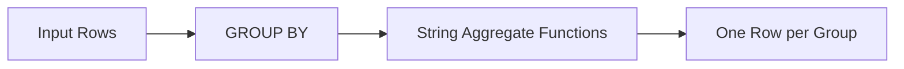

# :material-sigma: String Aggregate Functions

String aggregate functions combine string values across rows within a group.

### :material-sitemap: Overview



## 📌 Functions

| Function | Description |
|----------|-------------|
| `CONCAT_WS(sep, col)` | Concatenate grouped values with a separator |
| `COLLECT_LIST(col)` | Collect values into a list (preserves duplicates), then use `ARRAY_JOIN` |
| `LISTAGG` pattern | Simulate `LISTAGG` using `CONCAT_WS` + `COLLECT_LIST` |

## 🧪 Practical Examples

### Concatenate Strings per Group

```sql
CREATE OR REPLACE TEMP VIEW employees AS
SELECT * FROM VALUES
  ('Engineering', 'Alice'),
  ('Engineering', 'Bob'),
  ('Sales', 'Charlie'),
  ('Sales', 'Diana'),
  ('Sales', 'Eve')
AS employees(department, name);

-- Aggregate names into a comma-separated string per department
SELECT
  department,
  CONCAT_WS(', ', COLLECT_LIST(name)) AS team_members
FROM employees
GROUP BY department;
```

| department | team_members |
|------------|--------------|
| Engineering | Alice, Bob |
| Sales | Charlie, Diana, Eve |

### Sorted String Aggregation

```sql
-- Sort names before aggregation using SORT_ARRAY
SELECT
  department,
  CONCAT_WS(', ', SORT_ARRAY(COLLECT_LIST(name))) AS sorted_members
FROM employees
GROUP BY department;
```

### Distinct String Aggregation

```sql
CREATE OR REPLACE TEMP VIEW tags AS
SELECT * FROM VALUES
  (1, 'spark'), (1, 'sql'), (1, 'spark'),
  (2, 'python'), (2, 'spark')
AS tags(id, tag);

SELECT
  id,
  CONCAT_WS(', ', COLLECT_SET(tag)) AS unique_tags
FROM tags
GROUP BY id;
```

## 🧠 When to Use

| Scenario | Pattern |
|----------|---------|
| Comma-separated list per group | `CONCAT_WS(', ', COLLECT_LIST(col))` |
| Deduplicated list | `CONCAT_WS(', ', COLLECT_SET(col))` |
| Sorted list | `CONCAT_WS(', ', SORT_ARRAY(COLLECT_LIST(col)))` |
| Count + list | Combine `COUNT(col)` with string aggregation |
