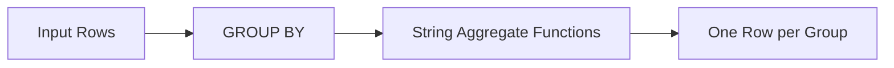

# :material-sigma: String Aggregate Functions

String aggregate functions combine string values across rows within a group.

### :material-sitemap: Overview



## :material-pin: Functions

| Function | Description |
|----------|-------------|
| `CONCAT_WS(sep, col)` | Concatenate grouped values with a separator |
| `COLLECT_LIST(col)` | Collect values into a list (preserves duplicates), then use `ARRAY_JOIN` |
| `LISTAGG` pattern | Simulate `LISTAGG` using `CONCAT_WS` + `COLLECT_LIST` |

## :material-flask-outline: Practical Examples

### Concatenate Strings per Group

```sql
CREATE OR REPLACE TEMP VIEW employees AS
SELECT * FROM VALUES
  ('Engineering', 'Alice'),
  ('Engineering', 'Bob'),
  ('Sales', 'Charlie'),
  ('Sales', 'Diana'),
  ('Sales', 'Eve')
AS employees(department, name);

-- Aggregate names into a comma-separated string per department
SELECT
  department,
  CONCAT_WS(', ', COLLECT_LIST(name)) AS team_members
FROM employees
GROUP BY department;
```

| department | team_members |
|------------|--------------|
| Engineering | Alice, Bob |
| Sales | Charlie, Diana, Eve |

### Sorted String Aggregation

```sql
-- Sort names before aggregation using SORT_ARRAY
SELECT
  department,
  CONCAT_WS(', ', SORT_ARRAY(COLLECT_LIST(name))) AS sorted_members
FROM employees
GROUP BY department;
```

### Distinct String Aggregation

```sql
CREATE OR REPLACE TEMP VIEW tags AS
SELECT * FROM VALUES
  (1, 'spark'), (1, 'sql'), (1, 'spark'),
  (2, 'python'), (2, 'spark')
AS tags(id, tag);

SELECT
  id,
  CONCAT_WS(', ', COLLECT_SET(tag)) AS unique_tags
FROM tags
GROUP BY id;
```

## :material-brain: When to Use

| Scenario | Pattern |
|----------|---------|
| Comma-separated list per group | `CONCAT_WS(', ', COLLECT_LIST(col))` |
| Deduplicated list | `CONCAT_WS(', ', COLLECT_SET(col))` |
| Sorted list | `CONCAT_WS(', ', SORT_ARRAY(COLLECT_LIST(col)))` |
| Count + list | Combine `COUNT(col)` with string aggregation |

---

## :material-filter: Conditional String Aggregation with FILTER

```sql
-- Separate names by status in a single pass
SELECT
    department,
    CONCAT_WS(', ', COLLECT_LIST(name) FILTER (WHERE status = 'active'))  AS active_members,
    CONCAT_WS(', ', COLLECT_LIST(name) FILTER (WHERE status = 'inactive')) AS inactive_members
FROM employees
GROUP BY department;
```

---

## :material-sort-descending: Top-N Names per Group

```sql
-- Keep only the top 3 earners' names per department
SELECT
    department,
    CONCAT_WS(', ',
        SLICE(
            COLLECT_LIST(name),   -- non-deterministic order, use window + sort first
            1, 3
        )
    ) AS top3_names
FROM (
    SELECT name, department,
           ROW_NUMBER() OVER (PARTITION BY department ORDER BY salary DESC) AS rn
    FROM employees
) t
WHERE rn <= 3
GROUP BY department;
```

---

## :material-compare-horizontal: Ordered Aggregation Pattern

`COLLECT_LIST` order is non-deterministic after a shuffle. For a deterministic order:

```sql
-- Deterministic: sort inside SELECT, then aggregate
SELECT
    department,
    CONCAT_WS(' > ',
        COLLECT_LIST(name)
    ) AS name_chain
FROM (
    SELECT name, department
    FROM employees
    ORDER BY salary DESC   -- drive order before aggregate
)
GROUP BY department;
```

!!! warning "ORDER BY inside subquery"
    Spark may re-order rows during shuffle. For guaranteed order use
    `SORT_ARRAY(COLLECT_LIST(...))` or aggregate on a window-function rank column.

---

## :material-table: String Aggregation Quick Reference

| Goal | Pattern |
|------|---------|
| Comma-separated list | `CONCAT_WS(', ', COLLECT_LIST(col))` |
| Deduplicated list | `CONCAT_WS(', ', SORT_ARRAY(COLLECT_SET(col)))` |
| Sorted list | `CONCAT_WS(', ', SORT_ARRAY(COLLECT_LIST(col)))` |
| Filtered list | `CONCAT_WS(', ', COLLECT_LIST(col) FILTER (WHERE cond))` |
| Top-N list | subquery rank + `COLLECT_LIST` |
| Count + list | `CONCAT(CAST(COUNT(col) AS STRING), ': ', CONCAT_WS(', ', COLLECT_LIST(col)))` |
