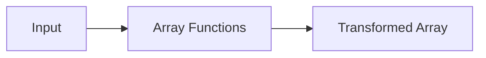

# :material-format-list-bulleted: Array Functions

Comprehensive reference for Spark SQL functions that **create, query, and transform arrays**.

### :material-sitemap: Overview



## :material-pin: Creating Arrays

### ARRAY — Build from Expressions

```sql
SELECT ARRAY(1, 2, 3);
-- Result: [1, 2, 3]
```

### ARRAY_AGG / COLLECT_LIST — Aggregate Rows into an Array

```sql
SELECT ARRAY_AGG(col) FROM VALUES (1), (2), (1) AS tab(col);
-- Result: [1, 2, 1]
```

### ARRAY_REPEAT — Repeat an Element

```sql
SELECT ARRAY_REPEAT('x', 3);
-- Result: [x, x, x]
```

### SEQUENCE — Generate a Range

```sql
SELECT SEQUENCE(1, 5);
-- Result: [1, 2, 3, 4, 5]

SELECT SEQUENCE(DATE '2024-01-01', DATE '2024-01-03');
-- Result: [2024-01-01, 2024-01-02, 2024-01-03]
```

---

## :material-pin: Adding & Removing Elements

### ARRAY_APPEND — Add to End

```sql
SELECT ARRAY_APPEND(ARRAY(1, 2, 3), 4);
-- Result: [1, 2, 3, 4]
```

### ARRAY_PREPEND — Add to Beginning

```sql
SELECT ARRAY_PREPEND(ARRAY(2, 3, 4), 1);
-- Result: [1, 2, 3, 4]
```

### ARRAY_INSERT — Insert at Position (1-based)

```sql
SELECT ARRAY_INSERT(ARRAY(1, 2, 3, 4), 2, 99);
-- Result: [1, 99, 2, 3, 4]

-- Negative index: insert relative to end
SELECT ARRAY_INSERT(ARRAY(1, 2, 3), -1, 99);
-- Result: [1, 2, 3, 99]
```

### ARRAY_REMOVE — Remove All Matching Elements

```sql
SELECT ARRAY_REMOVE(ARRAY(1, 2, 3, 2), 2);
-- Result: [1, 3]
```

### ARRAY_COMPACT — Remove NULLs

```sql
SELECT ARRAY_COMPACT(ARRAY(1, NULL, 2, NULL, 3));
-- Result: [1, 2, 3]
```

---

## :material-pin: Querying & Searching

### ARRAY_CONTAINS — Check Membership

```sql
SELECT ARRAY_CONTAINS(ARRAY(1, 2, 3), 2);
-- Result: true
```

### ARRAY_POSITION — Find Index (1-based)

```sql
SELECT ARRAY_POSITION(ARRAY(10, 20, 30, 20), 20);
-- Result: 2  (first occurrence)
```

### ELEMENT_AT — Get by Index (1-based)

```sql
SELECT ELEMENT_AT(ARRAY(10, 20, 30), 2);
-- Result: 20
```

### GET — Get by Index (0-based, NULL-safe)

```sql
SELECT GET(ARRAY(10, 20, 30), 0);
-- Result: 10

SELECT GET(ARRAY(10, 20, 30), 5);
-- Result: NULL  (out of bounds)
```

### ELT — Get N-th Argument

```sql
SELECT ELT(2, 'scala', 'java', 'python');
-- Result: java
```

### ARRAY_SIZE / SIZE — Count Elements

```sql
SELECT ARRAY_SIZE(ARRAY('a', 'b', 'c'));
-- Result: 3

-- ARRAY_SIZE returns NULL for NULL input; SIZE returns -1
SELECT ARRAY_SIZE(NULL), SIZE(NULL);
-- Result: NULL, -1
```

### ARRAY_MAX / ARRAY_MIN — Extremes

```sql
SELECT ARRAY_MAX(ARRAY(1, 20, NULL, 3));
-- Result: 20  (NULLs skipped)

SELECT ARRAY_MIN(ARRAY(1, 20, NULL, 3));
-- Result: 1
```

---

## :material-pin: Set Operations

### ARRAY_DISTINCT — Remove Duplicates

```sql
SELECT ARRAY_DISTINCT(ARRAY(1, 2, 3, NULL, 3));
-- Result: [1, 2, 3, NULL]
```

### ARRAY_UNION — Union (no duplicates)

```sql
SELECT ARRAY_UNION(ARRAY(1, 2, 3), ARRAY(2, 3, 4));
-- Result: [1, 2, 3, 4]
```

### ARRAY_INTERSECT — Intersection

```sql
SELECT ARRAY_INTERSECT(ARRAY(1, 2, 3), ARRAY(2, 3, 5));
-- Result: [2, 3]
```

### ARRAY_EXCEPT — Difference

```sql
SELECT ARRAY_EXCEPT(ARRAY(1, 2, 3), ARRAY(1, 3, 5));
-- Result: [2]
```

### ARRAYS_OVERLAP — Check for Common Elements

```sql
SELECT ARRAYS_OVERLAP(ARRAY(1, 2, 3), ARRAY(3, 4, 5));
-- Result: true
```

---

## :material-pin: Sorting & Transforming

### SORT_ARRAY / ARRAY_SORT — Sort Elements

```sql
-- Default ascending
SELECT SORT_ARRAY(ARRAY(5, 3, 1, 4, 2));
-- Result: [1, 2, 3, 4, 5]

-- Descending
SELECT SORT_ARRAY(ARRAY(5, 3, 1), FALSE);
-- Result: [5, 3, 1]

-- Custom comparator
SELECT ARRAY_SORT(ARRAY(5, 1, 3), (l, r) ->
  CASE WHEN l < r THEN -1 WHEN l > r THEN 1 ELSE 0 END
);
-- Result: [1, 3, 5]
```

### FLATTEN — Collapse Nested Arrays

```sql
SELECT FLATTEN(ARRAY(ARRAY(1, 2), ARRAY(3, 4)));
-- Result: [1, 2, 3, 4]
```

### ARRAYS_ZIP — Merge Arrays into Structs

```sql
SELECT ARRAYS_ZIP(ARRAY(1, 2, 3), ARRAY('a', 'b', 'c'));
-- Result: [{1, a}, {2, b}, {3, c}]

SELECT ARRAYS_ZIP(ARRAY(1, 2), ARRAY('a', 'b'), ARRAY(true, false));
-- Result: [{1, a, true}, {2, b, false}]
```

### ARRAY_JOIN — Concatenate as String

```sql
SELECT ARRAY_JOIN(ARRAY('hello', 'world'), ' ');
-- Result: 'hello world'

-- With NULL replacement
SELECT ARRAY_JOIN(ARRAY('hello', NULL, 'world'), ' ', '?');
-- Result: 'hello ? world'

-- Without NULL replacement (NULLs filtered)
SELECT ARRAY_JOIN(ARRAY('hello', NULL, 'world'), ' ');
-- Result: 'hello world'
```

---

## :material-pin: Higher-Order Array Functions

### FILTER — Keep Matching Elements

```sql
SELECT FILTER(ARRAY(1, 2, 3, 4, 5), x -> x % 2 = 0);
-- Result: [2, 4]

-- With index
SELECT FILTER(ARRAY(0, 2, 3), (x, i) -> x > i);
-- Result: [2, 3]
```

### FORALL — Check All Elements

```sql
SELECT FORALL(ARRAY(2, 4, 8), x -> x % 2 = 0);
-- Result: true
```

> See [Higher-Order Functions](../hof/index.md) for full coverage of `TRANSFORM`, `FILTER`,
> `EXISTS`, `AGGREGATE`, `FORALL`, and `ZIP_WITH`.

---

## :material-brain: When to Use

| Scenario | Function(s) |
|----------|------------|
| Build arrays from expressions or rows | `ARRAY`, `COLLECT_LIST`, `ARRAY_REPEAT` |
| Add / remove elements | `ARRAY_APPEND`, `ARRAY_PREPEND`, `ARRAY_INSERT`, `ARRAY_REMOVE` |
| Search / check membership | `ARRAY_CONTAINS`, `ARRAY_POSITION`, `ELEMENT_AT`, `GET` |
| Set operations across two arrays | `ARRAY_UNION`, `ARRAY_INTERSECT`, `ARRAY_EXCEPT` |
| Sort, flatten, or join elements | `SORT_ARRAY`, `FLATTEN`, `ARRAY_JOIN` |
| Transform elements with lambdas | `FILTER`, `TRANSFORM`, `AGGREGATE` (see HOF section) |
