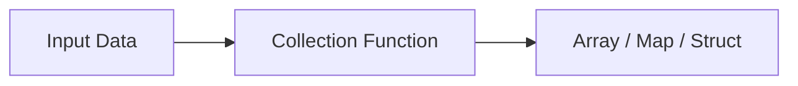

# :material-format-list-bulleted: Collection Functions

Collection functions create, access, and manipulate complex data types — **arrays**, **maps**,
and **structs** — which are the building blocks of nested and semi-structured data in Spark SQL.

### :material-sitemap: Overview



## :material-pin: Function Reference

### Array Functions

| Function | Description |
|----------|-------------|
| `ARRAY(expr, …)` | Create an array from expressions |
| `ARRAY_APPEND(array, elem)` | Append element to end |
| `ARRAY_COMPACT(array)` | Remove NULLs |
| `ARRAY_CONTAINS(array, val)` | Check if value exists |
| `ARRAY_DISTINCT(array)` | Remove duplicates |
| `ARRAY_EXCEPT(a1, a2)` | Elements in a1 but not a2 |
| `ARRAY_INSERT(array, pos, val)` | Insert at position (1-based) |
| `ARRAY_INTERSECT(a1, a2)` | Common elements |
| `ARRAY_JOIN(array, delim)` | Concatenate as string |
| `ARRAY_MAX(array)` / `ARRAY_MIN(array)` | Max / min element |
| `ARRAY_POSITION(array, elem)` | 1-based index of element |
| `ARRAY_PREPEND(array, elem)` | Add element at beginning |
| `ARRAY_REMOVE(array, elem)` | Remove all matching elements |
| `ARRAY_REPEAT(elem, count)` | Repeat element N times |
| `ARRAY_SIZE(array)` | Number of elements (NULL-safe) |
| `ARRAY_SORT(array [, func])` | Sort with optional comparator |
| `ARRAY_UNION(a1, a2)` | Union without duplicates |
| `ARRAYS_OVERLAP(a1, a2)` | Check for common elements |
| `ARRAYS_ZIP(a1, a2, …)` | Merge arrays into array of structs |
| `FLATTEN(arrayOfArrays)` | Flatten nested arrays |
| `ELEMENT_AT(array, idx)` | Get element by index |
| `GET(array, idx)` | Get element (0-based, NULL-safe) |
| `SEQUENCE(start, stop [, step])` | Generate a range array |
| `SORT_ARRAY(array [, asc])` | Sort ascending or descending |

### Map Functions

| Function | Description |
|----------|-------------|
| `MAP(k1, v1, …)` | Create a map |
| `MAP_CONCAT(map1, map2, …)` | Merge maps (later wins) |
| `MAP_CONTAINS_KEY(map, key)` | Check if key exists |
| `MAP_ENTRIES(map)` | Array of `(key, value)` structs |
| `MAP_FROM_ARRAYS(keys, vals)` | Build map from two arrays |
| `MAP_FROM_ENTRIES(array)` | Build map from array of structs |
| `MAP_KEYS(map)` | Array of keys |
| `MAP_VALUES(map)` | Array of values |
| `MAP_ZIP_WITH(m1, m2, func)` | Merge maps with per-key lambda |
| `ELEMENT_AT(map, key)` | Get value by key |

### Struct Functions

| Function | Description |
|----------|-------------|
| `NAMED_STRUCT(n1, v1, …)` | Create a named struct |
| `STRUCT(v1, v2, …)` | Create a struct (auto-named `col1`, `col2`) |
| `col.field` | Access struct field (dot notation) |

### Aggregation Functions

| Function | Description |
|----------|-------------|
| `COLLECT_LIST(expr)` | Aggregate into array (with duplicates) |
| `COLLECT_SET(expr)` | Aggregate into array (distinct) |
| `ARRAY_AGG(expr)` | Alias for `COLLECT_LIST` |

## :material-brain: Choosing the Right Type

| Need | Type | Why |
|------|------|-----|
| Ordered list of values | `ARRAY` | Supports indexing, sorting, and element operations |
| Key-value lookup | `MAP` | O(1) access by key, natural for configs / metadata |
| Fixed named fields | `STRUCT` | Schema-enforced, dot-notation access |
| Aggregate rows into a collection | `COLLECT_LIST` / `COLLECT_SET` | Turn grouped rows into arrays |

---

## :material-compare-horizontal: Array vs Map vs Struct — When to Use Which

| Need | Best type | Reason |
|------|-----------|--------|
| Ordered list of same-type values | `ARRAY` | Indexing, sorting, HOFs |
| Key → value lookup | `MAP` | O(1) by key, dynamic keys |
| Fixed, named heterogeneous fields | `STRUCT` | Schema-enforced, dot notation |
| Aggregate rows into a list | `COLLECT_LIST` / `COLLECT_SET` | Row-to-array aggregation |
| Metadata / config blob with unknown keys | `MAP<STRING,STRING>` | Flexible, parse-on-use |

---

## :material-speedometer: Performance Tips

1. **`SIZE(arr)` is NULL-safe** — returns `-1` for NULL arrays in older modes; use `COALESCE(SIZE(arr), 0)` to be safe.
2. **`ARRAY_CONTAINS` is pushed to scans** — unlike HOFs, it can be evaluated at the Parquet/Delta row-group level.
3. **`FLATTEN` vs multiple `EXPLODE`** — `FLATTEN` collapses one nesting level in-place; chained `EXPLODE` creates a Cartesian product.
4. **`SEQUENCE` for date ranges** — `SEQUENCE(start_date, end_date, INTERVAL 1 DAY)` generates a date array, useful for gap-fill with `LATERAL VIEW EXPLODE`.

```sql
-- Generate a calendar date array then expand to rows
SELECT exploded_date
FROM (SELECT SEQUENCE(DATE '2024-01-01', DATE '2024-01-07', INTERVAL 1 DAY) AS dates) t
LATERAL VIEW EXPLODE(dates) AS exploded_date;
```
