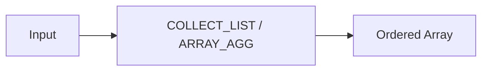

# :material-format-list-bulleted: List Functions

List functions create and work with ordered collections (arrays) in Spark SQL.
The primary list aggregation functions are `COLLECT_LIST` and `ARRAY_AGG`.

### :material-sitemap: Overview



## 📌 Syntax

### COLLECT_LIST

```sql
COLLECT_LIST(expr)
```

### ARRAY_AGG (alias)

```sql
ARRAY_AGG(expr)
```

Both aggregate all non-NULL values from a group into an ordered array.

## 🔍 Behavior

1. Aggregates all non-NULL values from the group into an array.
2. Duplicate values are **preserved** (use `COLLECT_SET` for distinct).
3. Order depends on row order, which is **non-deterministic after a shuffle**.
4. Returns an empty array if all values are NULL.
5. Returns `array<T>` where `T` matches the type of `expr`.

## 🧪 Practical Examples

### 🧱 1. Basic Collection

```sql
SELECT COLLECT_LIST(col) FROM VALUES (1), (2), (1) AS tab(col);
-- Result: [1, 2, 1]
```

### 🧱 2. Grouped Collection

```sql
CREATE OR REPLACE TEMP VIEW purchases AS
SELECT * FROM VALUES
  ('Alice', 'laptop'), ('Alice', 'mouse'), ('Alice', 'laptop'),
  ('Bob', 'keyboard'), ('Bob', 'monitor')
AS purchases(customer, product);

SELECT customer, COLLECT_LIST(product) AS all_purchases
FROM purchases
GROUP BY customer;
-- Alice → [laptop, mouse, laptop], Bob → [keyboard, monitor]
```

### 🧱 3. Sorted List

```sql
SELECT SORT_ARRAY(COLLECT_LIST(col)) AS sorted
FROM VALUES (3), (1), (4), (1), (5) AS tab(col);
-- Result: [1, 1, 3, 4, 5]
```

### 🧱 4. Convert to Comma-Separated String

```sql
SELECT CONCAT_WS(', ', COLLECT_LIST(col)) AS csv
FROM VALUES ('a'), ('b'), ('c') AS tab(col);
-- Result: 'a, b, c'
```

### 🧱 5. Collect with Ordering (Window Function)

```sql
CREATE OR REPLACE TEMP VIEW events AS
SELECT * FROM VALUES
  ('Alice', 1, 'login'), ('Alice', 2, 'click'), ('Alice', 3, 'logout'),
  ('Bob', 1, 'login'), ('Bob', 2, 'purchase')
AS events(user_id, seq, action);

SELECT user_id,
       COLLECT_LIST(action) OVER (
         PARTITION BY user_id ORDER BY seq
         ROWS BETWEEN UNBOUNDED PRECEDING AND UNBOUNDED FOLLOWING
       ) AS action_sequence
FROM events;
-- Alice → [login, click, logout], Bob → [login, purchase]
```

### 🧱 6. Collect Structs

```sql
SELECT customer,
       COLLECT_LIST(NAMED_STRUCT('product', product, 'amount', amount)) AS orders
FROM VALUES
  ('Alice', 'book', 25), ('Alice', 'pen', 5),
  ('Bob', 'laptop', 999)
AS orders(customer, product, amount)
GROUP BY customer;
```

## 🧠 COLLECT_LIST vs COLLECT_SET

| Feature | `COLLECT_LIST` | `COLLECT_SET` |
|---------|---------------|--------------|
| Duplicates | Preserved | Removed |
| NULLs | Excluded | Excluded |
| Ordering | Non-deterministic | Non-deterministic |
| Use case | All values needed | Distinct values only |

> **Tip:** For deterministic ordering, use `COLLECT_LIST` inside a window function with
> `ORDER BY`, or `SORT_ARRAY(COLLECT_LIST(...))` after aggregation.
