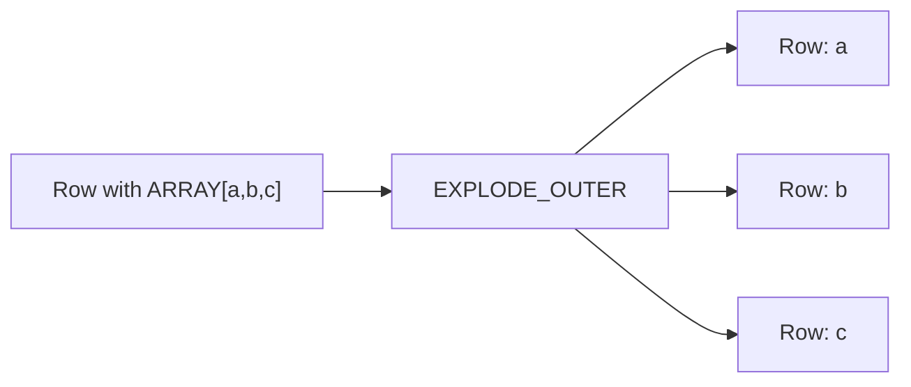

# :material-expand-all: Explode Outer

`EXPLODE_OUTER()` works identically to `EXPLODE()` but **preserves rows** where the array or map
is `NULL` or empty — filling the generated columns with `NULL` instead of dropping the row.

### :material-sitemap: Overview



## 📌 Syntax

```sql
SELECT EXPLODE_OUTER(array_or_map);
```

### With LATERAL VIEW

```sql
SELECT t.*, element
FROM your_table t
LATERAL VIEW EXPLODE_OUTER(array_column) AS element;
```

### For Maps

```sql
SELECT t.*, key, value
FROM your_table t
LATERAL VIEW EXPLODE_OUTER(map_column) AS key, value;
```

## 🔍 Behavior

1. Produces one row per array element or map entry — identical to `EXPLODE`.
2. When the array/map is **empty** → outputs one row with `NULL` in generated columns.
3. When the array/map is **NULL** → outputs one row with `NULL` in generated columns.
4. All other columns from the original row are preserved in both cases.
5. Equivalent to `LATERAL VIEW OUTER EXPLODE(...)`.

## 🧪 Practical Examples

### 🧱 1. Side-by-Side: EXPLODE vs EXPLODE_OUTER

```sql
CREATE OR REPLACE TEMP VIEW sample AS
SELECT * FROM VALUES
  (1, ARRAY('A', 'B')),
  (2, ARRAY()),
  (3, NULL)
AS sample(id, arr);

-- EXPLODE: drops rows 2 and 3
SELECT id, val FROM sample LATERAL VIEW EXPLODE(arr) AS val;
-- (1, A), (1, B)

-- EXPLODE_OUTER: keeps all rows
SELECT id, val FROM sample LATERAL VIEW EXPLODE_OUTER(arr) AS val;
-- (1, A), (1, B), (2, NULL), (3, NULL)
```

### 🧱 2. Array of Structs — Safe Flattening

```sql
CREATE OR REPLACE TEMP VIEW orders AS
SELECT * FROM VALUES
  (1001, ARRAY(NAMED_STRUCT('product', 'pen', 'qty', 3))),
  (1002, ARRAY()),
  (1003, NULL)
AS orders(order_id, items);

SELECT order_id, item.product, item.qty
FROM orders
LATERAL VIEW EXPLODE_OUTER(items) AS item;
-- (1001, pen, 3), (1002, NULL, NULL), (1003, NULL, NULL)
```

### 🗺️ 3. Map with Missing Entries

```sql
CREATE OR REPLACE TEMP VIEW inventory AS
SELECT * FROM VALUES
  (1, MAP('apple', 10, 'banana', 5)),
  (2, MAP()),
  (3, NULL)
AS inventory(id, stock);

SELECT id, fruit, quantity
FROM inventory
LATERAL VIEW EXPLODE_OUTER(stock) AS fruit, quantity;
-- (1, apple, 10), (1, banana, 5), (2, NULL, NULL), (3, NULL, NULL)
```

### 🧱 4. SEQUENCE with Fallback for Empty Ranges

```sql
CREATE OR REPLACE TEMP VIEW ranges AS
SELECT * FROM VALUES
  (1, SEQUENCE(1, 3)),
  (2, ARRAY()),
  (3, NULL)
AS ranges(id, numbers);

SELECT id, num
FROM ranges
LATERAL VIEW EXPLODE_OUTER(numbers) AS num;
-- (1, 1), (1, 2), (1, 3), (2, NULL), (3, NULL)
```

### 🧱 5. COALESCE for Default Values

```sql
SELECT id,
       COALESCE(val, 'no data') AS safe_val
FROM sample
LATERAL VIEW EXPLODE_OUTER(arr) AS val;
-- (1, A), (1, B), (2, no data), (3, no data)
```

## 🧠 When to Use

| Scenario | Why `EXPLODE_OUTER`? |
|----------|---------------------|
| Preserve all original rows | Empty/NULL arrays don't silently drop rows |
| Optional or sparse array fields | Survey answers, IoT readings, nested JSON |
| Outer-join-like semantics | Base rows stay intact regardless of array content |
| Data quality auditing | Easily spot which rows had missing/empty arrays |
| Safe default values | Combine with `COALESCE` to fill NULLs |

> **Tip:** Use `EXPLODE_OUTER` as your **default** choice when you're unsure whether arrays
> might be empty or NULL — it's safer than `EXPLODE` and you can always filter NULLs later.
