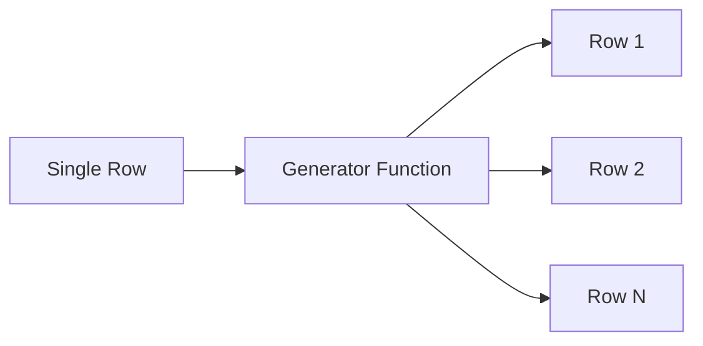

# :material-expand-all: Generator Functions

Generator (table-valued) functions produce **multiple output rows** from a single input row.
They are the primary tool for flattening arrays, maps, and structs in Spark SQL.

### :material-sitemap: Overview



## 📌 Available Functions

| Function | Input | Output Columns | NULL/Empty Handling |
|----------|-------|---------------|---------------------|
| `EXPLODE(expr)` | `array<T>` / `map<K,V>` | `col` or `key, value` | Drops row |
| `EXPLODE_OUTER(expr)` | `array<T>` / `map<K,V>` | `col` or `key, value` | Keeps row (NULLs) |
| `INLINE(expr)` | `array<struct>` | One column per struct field | Drops row |
| `INLINE_OUTER(expr)` | `array<struct>` | One column per struct field | Keeps row (NULLs) |
| `POSEXPLODE(expr)` | `array<T>` / `map<K,V>` | `pos, col` or `pos, key, value` | Drops row |
| `POSEXPLODE_OUTER(expr)` | `array<T>` / `map<K,V>` | `pos, col` or `pos, key, value` | Keeps row (NULLs) |
| `STACK(n, expr1, …, exprk)` | Scalar values | `col0, col1, …` | N/A |

## 🔍 Usage Patterns

### Direct SELECT

```sql
SELECT EXPLODE(ARRAY(1, 2, 3));
```

### LATERAL VIEW (attach to existing table)

```sql
SELECT t.*, col
FROM my_table t
LATERAL VIEW EXPLODE(t.array_col) AS col;
```

### LATERAL VIEW OUTER (preserve NULL/empty rows)

```sql
SELECT t.*, col
FROM my_table t
LATERAL VIEW OUTER EXPLODE(t.array_col) AS col;
```

## 🧪 Quick Examples

```sql
-- Explode an array
SELECT EXPLODE(ARRAY(10, 20, 30));
-- 10, 20, 30 (3 rows)

-- Explode a map
SELECT EXPLODE(MAP('a', 1, 'b', 2));
-- (a, 1), (b, 2) (2 rows)

-- Inline an array of structs
SELECT INLINE(ARRAY(STRUCT(1, 'a'), STRUCT(2, 'b')));
-- (1, a), (2, b)

-- Posexplode with index
SELECT POSEXPLODE(ARRAY('x', 'y', 'z'));
-- (0, x), (1, y), (2, z)

-- Stack: unpivot columns into rows
SELECT STACK(2, 'math', 95, 'science', 88);
-- (math, 95), (science, 88)
```

## 🧠 Choosing the Right Generator

| Need | Function | Why |
|------|----------|-----|
| Flatten array/map → rows | `EXPLODE` | Simplest row expansion |
| Flatten but keep NULL/empty rows | `EXPLODE_OUTER` | Preserves all original rows |
| Flatten array of structs → columns | `INLINE` | Multi-column expansion |
| Track element position/index | `POSEXPLODE` | Adds zero-based `pos` column |
| Unpivot wide columns → tall rows | `STACK` | Converts columns to name-value rows |
