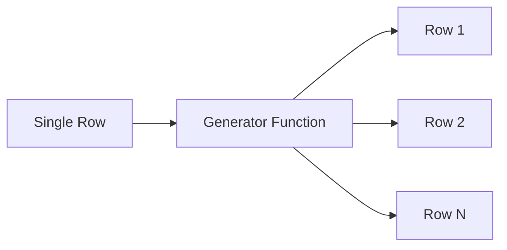

# :material-expand-all: Generator Functions

Generator (table-valued) functions produce **multiple output rows** from a single input row.
They are the primary tool for flattening arrays, maps, and structs in Spark SQL.

### :material-sitemap: Overview



## :material-pin: Available Functions

| Function | Input | Output Columns | NULL/Empty Handling |
|----------|-------|---------------|---------------------|
| `EXPLODE(expr)` | `array<T>` / `map<K,V>` | `col` or `key, value` | Drops row |
| `EXPLODE_OUTER(expr)` | `array<T>` / `map<K,V>` | `col` or `key, value` | Keeps row (NULLs) |
| `INLINE(expr)` | `array<struct>` | One column per struct field | Drops row |
| `INLINE_OUTER(expr)` | `array<struct>` | One column per struct field | Keeps row (NULLs) |
| `POSEXPLODE(expr)` | `array<T>` / `map<K,V>` | `pos, col` or `pos, key, value` | Drops row |
| `POSEXPLODE_OUTER(expr)` | `array<T>` / `map<K,V>` | `pos, col` or `pos, key, value` | Keeps row (NULLs) |
| `STACK(n, expr1, …, exprk)` | Scalar values | `col0, col1, …` | N/A |

## :material-magnify: Usage Patterns

### Direct SELECT

```sql
SELECT EXPLODE(ARRAY(1, 2, 3));
```

### LATERAL VIEW (attach to existing table)

```sql
SELECT t.*, col
FROM my_table t
LATERAL VIEW EXPLODE(t.array_col) AS col;
```

### LATERAL VIEW OUTER (preserve NULL/empty rows)

```sql
SELECT t.*, col
FROM my_table t
LATERAL VIEW OUTER EXPLODE(t.array_col) AS col;
```

## :material-flask-outline: Quick Examples

```sql
-- Explode an array
SELECT EXPLODE(ARRAY(10, 20, 30));
-- 10, 20, 30 (3 rows)

-- Explode a map
SELECT EXPLODE(MAP('a', 1, 'b', 2));
-- (a, 1), (b, 2) (2 rows)

-- Inline an array of structs
SELECT INLINE(ARRAY(STRUCT(1, 'a'), STRUCT(2, 'b')));
-- (1, a), (2, b)

-- Posexplode with index
SELECT POSEXPLODE(ARRAY('x', 'y', 'z'));
-- (0, x), (1, y), (2, z)

-- Stack: unpivot columns into rows
SELECT STACK(2, 'math', 95, 'science', 88);
-- (math, 95), (science, 88)
```

## :material-brain: Choosing the Right Generator

| Need | Function | Why |
|------|----------|-----|
| Flatten array/map → rows | `EXPLODE` | Simplest row expansion |
| Flatten but keep NULL/empty rows | `EXPLODE_OUTER` | Preserves all original rows |
| Flatten array of structs → columns | `INLINE` | Multi-column expansion |
| Track element position/index | `POSEXPLODE` | Adds zero-based `pos` column |
| Unpivot wide columns → tall rows | `STACK` | Converts columns to name-value rows |

---

## :material-compare: LATERAL VIEW vs SELECT generator

Generator functions can be called two ways:

```sql
-- Direct SELECT (no FROM table)
SELECT EXPLODE(ARRAY(1, 2, 3)) AS val;
-- val: 1, 2, 3

-- LATERAL VIEW (attach to a table)
SELECT t.id, val
FROM my_table t
LATERAL VIEW EXPLODE(t.items) AS val;
```

`LATERAL VIEW` is necessary when you want to expand a column from an existing table.
Direct `SELECT` is useful for generating test data.

---

## :material-table-multiple: Multiple LATERAL VIEW Clauses

Each additional `LATERAL VIEW` applies a **Cartesian product** with the previous expansion — be careful with the resulting row count.

```sql
-- 3-element array × 2-element array = 6 rows per original row
SELECT id, letter, number
FROM test_data
LATERAL VIEW EXPLODE(letters) AS letter
LATERAL VIEW EXPLODE(numbers) AS number;
```

---

## :material-compare-horizontal: Generator vs HOF

| Need | Prefer | Why |
|------|--------|-----|
| Aggregate by element value | `LATERAL VIEW EXPLODE` + `GROUP BY` | HOFs cannot GROUP BY elements |
| Check membership without flattening | `array_contains` / `EXISTS` HOF | No row explosion |
| Expand map to key-value pairs | `LATERAL VIEW EXPLODE(map)` | HOFs can't produce rows |
| Expand array-of-structs to columns | `LATERAL VIEW INLINE` | Cleaner than `TRANSFORM` |
| Generate synthetic rows from scalars | `LATERAL VIEW STACK` | No table source needed |
| Filter/transform while staying nested | HOF (`FILTER`, `TRANSFORM`) | Avoids row multiplication |

---

## :material-speedometer: Performance Tips

1. **OUTER variants preserve row counts** — use `EXPLODE_OUTER` / `POSEXPLODE_OUTER` to avoid silently dropping rows with NULL/empty arrays.
2. **Multiple LATERAL VIEW can explode row count** — always check `EXPLAIN` or row counts after chained `LATERAL VIEW`.
3. **DISTINCT after EXPLODE** — if you just need membership, `array_contains` is cheaper than `EXPLODE` + `DISTINCT`.
4. **INLINE for struct arrays** — more efficient than `EXPLODE` + dot-notation column access.
