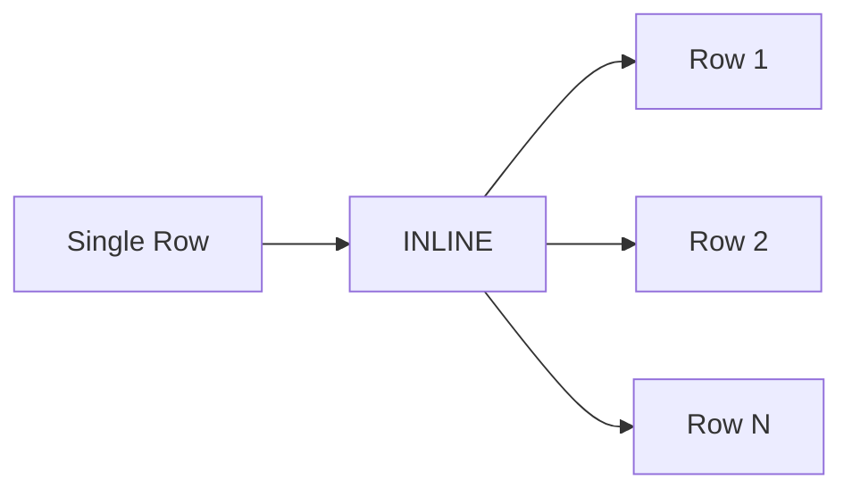

# :material-expand-all: Inline

`INLINE()` flattens an **array of structs** into multiple rows **and** multiple columns —
each struct field becomes a separate output column. It is the struct-aware alternative to `EXPLODE`.

### :material-sitemap: Overview



## :material-pin: Syntax

### Direct

```sql
SELECT INLINE(array_of_structs);
```

### With LATERAL VIEW

```sql
SELECT t.*, col1, col2
FROM your_table t
LATERAL VIEW INLINE(struct_array_column) AS col1, col2;
```

### INLINE_OUTER (preserve NULL/empty)

```sql
SELECT t.*, col1, col2
FROM your_table t
LATERAL VIEW INLINE_OUTER(struct_array_column) AS col1, col2;
```

## :material-magnify: Behavior

1. Each struct in the array produces one output row.
2. Each field of the struct becomes a separate column (named `col1`, `col2`, … by default).
3. Override column names with `AS name1, name2, …` in the LATERAL VIEW clause.
4. `INLINE` **drops rows** where the array is `NULL` or empty.
5. `INLINE_OUTER` **preserves rows** with `NULL`s in generated columns for empty/NULL arrays.

### INLINE vs EXPLODE for Structs

| Approach | Result |
|----------|--------|
| `EXPLODE(array_of_structs)` | One column containing the whole struct → access fields via `item.field` |
| `INLINE(array_of_structs)` | Multiple columns, one per struct field → fields are top-level columns |

## :material-flask-outline: Practical Examples

### :material-toy-brick: 1. Flatten Order Line Items

```sql
CREATE OR REPLACE TEMP VIEW orders AS
SELECT * FROM VALUES
  (1001, ARRAY(NAMED_STRUCT('product', 'book', 'qty', 2),
               NAMED_STRUCT('product', 'pen', 'qty', 5))),
  (1002, ARRAY(NAMED_STRUCT('product', 'notebook', 'qty', 1)))
AS orders(order_id, items);

SELECT order_id, product, qty
FROM orders
LATERAL VIEW INLINE(items) AS product, qty;
-- (1001, book, 2), (1001, pen, 5), (1002, notebook, 1)
```

### :material-toy-brick: 2. INLINE_OUTER — Keep Rows with Empty Arrays

```sql
CREATE OR REPLACE TEMP VIEW orders_sparse AS
SELECT * FROM VALUES
  (1, ARRAY(NAMED_STRUCT('product', 'pen', 'qty', 3))),
  (2, ARRAY()),
  (3, NULL)
AS orders_sparse(order_id, items);

SELECT order_id, product, qty
FROM orders_sparse
LATERAL VIEW INLINE_OUTER(items) AS product, qty;
-- (1, pen, 3), (2, NULL, NULL), (3, NULL, NULL)
```

### :material-toy-brick: 3. Direct SELECT (No Table)

```sql
SELECT INLINE(ARRAY(STRUCT(1, 'a'), STRUCT(2, 'b')));
-- (1, a), (2, b)
```

### :material-toy-brick: 4. Flatten Employee Skills

```sql
CREATE OR REPLACE TEMP VIEW employees AS
SELECT * FROM VALUES
  ('Alice', ARRAY(
    NAMED_STRUCT('skill', 'Python', 'level', 'expert'),
    NAMED_STRUCT('skill', 'SQL', 'level', 'advanced')
  )),
  ('Bob', ARRAY(
    NAMED_STRUCT('skill', 'Java', 'level', 'intermediate')
  ))
AS employees(name, skills);

SELECT name, skill, level
FROM employees
LATERAL VIEW INLINE(skills) AS skill, level;
-- (Alice, Python, expert), (Alice, SQL, advanced), (Bob, Java, intermediate)
```

### :material-toy-brick: 5. Aggregate After Inline

```sql
-- Count total items per order
SELECT order_id, SUM(qty) AS total_qty
FROM orders
LATERAL VIEW INLINE(items) AS product, qty
GROUP BY order_id;
-- (1001, 7), (1002, 1)
```

### :material-toy-brick: 6. Combine with FILTER HOF

```sql
-- Inline only high-quantity items
SELECT order_id, product, qty
FROM orders
LATERAL VIEW INLINE(
  FILTER(items, x -> x.qty >= 3)
) AS product, qty;
-- (1001, pen, 5)
```

## :material-brain: When to Use

| Scenario | Why `INLINE`? |
|----------|--------------|
| Flatten array of structs into columns | Each struct field becomes a top-level column |
| Cleaner than `EXPLODE` for structs | No `item.field` dot notation needed |
| Preserve empty/NULL rows | Use `INLINE_OUTER` variant |
| Aggregate struct field values | `SUM`, `COUNT`, `AVG` directly on inlined columns |
| Chain with HOFs | `INLINE(FILTER(array, ...))` for selective flattening |

> **Tip:** Use `INLINE` when your struct has multiple fields you need as separate columns.
> Use `EXPLODE` when you want the struct as a single nested column.
