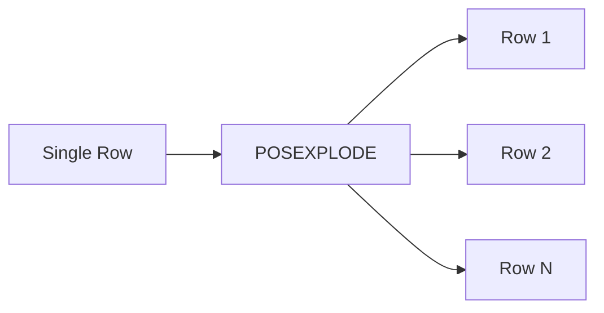

# :material-expand-all: Posexplode

`POSEXPLODE()` works like `EXPLODE()` but adds a **zero-based position column** alongside each
element — essential when array order matters.

### :material-sitemap: Overview



## 📌 Syntax

```sql
SELECT POSEXPLODE(array_or_map);
```

### With LATERAL VIEW

```sql
SELECT t.*, pos, element
FROM your_table t
LATERAL VIEW POSEXPLODE(array_column) AS pos, element;
```

### For Maps

```sql
SELECT t.*, pos, key, value
FROM your_table t
LATERAL VIEW POSEXPLODE(map_column) AS pos, key, value;
```

## 🔍 Behavior

1. Produces one row per array element or map entry — identical to `EXPLODE`.
2. Adds a `pos` column containing the zero-based index of each element.
3. **Drops rows** where the array/map is `NULL` or empty — use `POSEXPLODE_OUTER` to retain them.
4. Default column names: `pos`, `col` (array) or `pos`, `key`, `value` (map).

## 🧪 Practical Examples

### 🧱 1. Explode Array with Position

```sql
CREATE OR REPLACE TEMP VIEW people AS
SELECT * FROM VALUES
  (1, ARRAY('Alice', 'Bob', 'Charlie')),
  (2, ARRAY('Diana', 'Eve'))
AS people(id, names);

SELECT id, pos, name
FROM people
LATERAL VIEW POSEXPLODE(names) AS pos, name;
-- (1, 0, Alice), (1, 1, Bob), (1, 2, Charlie), (2, 0, Diana), (2, 1, Eve)
```

### 🧱 2. Array of Structs with Index

```sql
CREATE OR REPLACE TEMP VIEW orders AS
SELECT * FROM VALUES
  (1001, ARRAY(NAMED_STRUCT('product', 'book', 'qty', 2),
               NAMED_STRUCT('product', 'pen', 'qty', 5)))
AS orders(order_id, products);

SELECT order_id, pos AS line_num, item.product, item.qty
FROM orders
LATERAL VIEW POSEXPLODE(products) AS pos, item;
-- (1001, 0, book, 2), (1001, 1, pen, 5)
```

### 🧱 3. Generate Dynamic Labels from Index

```sql
CREATE OR REPLACE TEMP VIEW survey AS
SELECT * FROM VALUES
  (101, ARRAY('A', 'B', 'C'))
AS survey(user_id, answers);

SELECT user_id, CONCAT('Q', CAST(pos + 1 AS STRING)) AS question, answer
FROM survey
LATERAL VIEW POSEXPLODE(answers) AS pos, answer;
-- (101, Q1, A), (101, Q2, B), (101, Q3, C)
```

### 🧱 4. Generate Date Sequences

```sql
SELECT DATE_ADD(DATE '2024-01-01', pos) AS date
FROM (
  SELECT POSEXPLODE(SEQUENCE(1, 5)) AS (pos, val)
) t;
-- 2024-01-01, 2024-01-02, 2024-01-03, 2024-01-04, 2024-01-05
```

### 🧱 5. Compare EXPLODE vs POSEXPLODE

```sql
-- EXPLODE: value only
SELECT val FROM (SELECT 1) LATERAL VIEW EXPLODE(ARRAY('x', 'y')) AS val;
-- (x), (y)

-- POSEXPLODE: position + value
SELECT pos, val FROM (SELECT 1) LATERAL VIEW POSEXPLODE(ARRAY('x', 'y')) AS pos, val;
-- (0, x), (1, y)
```

### 🧱 6. Rank Array Elements by Position

```sql
CREATE OR REPLACE TEMP VIEW preferences AS
SELECT * FROM VALUES
  ('user1', ARRAY('Python', 'SQL', 'Java'))
AS preferences(user_id, languages);

SELECT user_id,
       pos + 1 AS rank,
       language
FROM preferences
LATERAL VIEW POSEXPLODE(languages) AS pos, language;
-- (user1, 1, Python), (user1, 2, SQL), (user1, 3, Java)
```

## 🧠 When to Use

| Scenario | Why `POSEXPLODE`? |
|----------|------------------|
| Track element order/position | Zero-based `pos` column for array index |
| Generate dynamic labels (Q1, Q2…) | Use `pos` to build sequential identifiers |
| Date/number sequence generation | Combine with `SEQUENCE()` for calendar logic |
| Rank or prioritize array elements | Position reflects original insertion order |
| Debugging array contents | See exact index of each element |

> **Tip:** If your arrays might be `NULL` or empty, use `POSEXPLODE_OUTER` to keep all rows.
