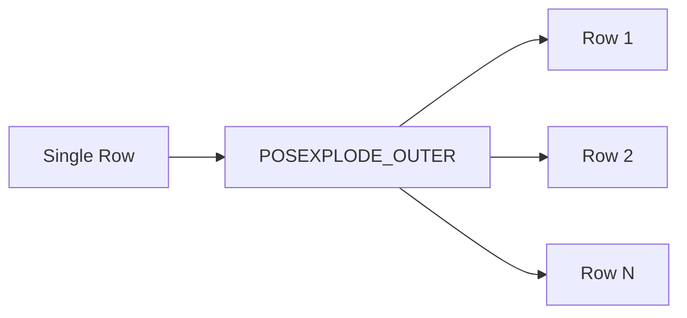

# :material-expand-all: Posexplode Outer

`POSEXPLODE_OUTER()` combines the position-tracking of `POSEXPLODE` with the row-preserving
behavior of `EXPLODE_OUTER` — it adds a zero-based index **and** retains rows where the
array/map is `NULL` or empty.

### :material-sitemap: Overview



## :material-pin: Syntax

```sql
SELECT POSEXPLODE_OUTER(array_or_map);
```

### With LATERAL VIEW

```sql
SELECT t.*, pos, element
FROM your_table t
LATERAL VIEW POSEXPLODE_OUTER(array_column) AS pos, element;
```

## :material-magnify: Behavior

1. Produces one row per element with a zero-based `pos` column — like `POSEXPLODE`.
2. When the array/map is **empty** → one row with `pos = NULL`, `element = NULL`.
3. When the array/map is **NULL** → one row with `pos = NULL`, `element = NULL`.
4. All other columns from the original row are preserved.

## :material-flask-outline: Practical Examples

### :material-toy-brick: 1. Side-by-Side: POSEXPLODE vs POSEXPLODE_OUTER

```sql
CREATE OR REPLACE TEMP VIEW demo AS
SELECT * FROM VALUES
  (1, ARRAY('A', 'B')),
  (2, ARRAY()),
  (3, NULL)
AS demo(id, arr);

-- POSEXPLODE: drops rows 2 and 3
SELECT id, pos, val
FROM demo
LATERAL VIEW POSEXPLODE(arr) AS pos, val;
-- (1, 0, A), (1, 1, B)

-- POSEXPLODE_OUTER: keeps all rows
SELECT id, pos, val
FROM demo
LATERAL VIEW POSEXPLODE_OUTER(arr) AS pos, val;
-- (1, 0, A), (1, 1, B), (2, NULL, NULL), (3, NULL, NULL)
```

### :material-toy-brick: 2. Array of Structs — Safe Flattening with Index

```sql
CREATE OR REPLACE TEMP VIEW orders AS
SELECT * FROM VALUES
  (101, ARRAY(NAMED_STRUCT('item', 'book', 'qty', 2))),
  (102, ARRAY()),
  (103, NULL)
AS orders(order_id, products);

SELECT order_id, pos, p.item, p.qty
FROM orders
LATERAL VIEW POSEXPLODE_OUTER(products) AS pos, p;
-- (101, 0, book, 2), (102, NULL, NULL, NULL), (103, NULL, NULL, NULL)
```

### :material-toy-brick: 3. Label Array Entries Safely

```sql
CREATE OR REPLACE TEMP VIEW students AS
SELECT * FROM VALUES
  (1, ARRAY('Math', 'Physics')),
  (2, NULL)
AS students(id, subjects);

SELECT id,
       CASE WHEN pos IS NOT NULL
            THEN CONCAT('Subject_', CAST(pos + 1 AS STRING))
            ELSE 'N/A'
       END AS label,
       COALESCE(subject, 'none') AS subject
FROM students
LATERAL VIEW POSEXPLODE_OUTER(subjects) AS pos, subject;
-- (1, Subject_1, Math), (1, Subject_2, Physics), (2, N/A, none)
```

### :material-toy-brick: 4. Audit Missing Data

```sql
CREATE OR REPLACE TEMP VIEW sensor_log AS
SELECT * FROM VALUES
  ('dev01', ARRAY(22.5, 45.0)),
  ('dev02', ARRAY()),
  ('dev03', NULL)
AS sensor_log(device_id, readings);

SELECT device_id,
       pos IS NULL AS missing_readings,
       pos,
       reading
FROM sensor_log
LATERAL VIEW POSEXPLODE_OUTER(readings) AS pos, reading;
-- dev01 has readings at pos 0,1; dev02 and dev03 flagged as missing
```

## :material-brain: When to Use

| Scenario | Why `POSEXPLODE_OUTER`? |
|----------|------------------------|
| Position tracking + NULL safety | Combines benefits of both variants |
| Sparse or optional array columns | Rows with empty/NULL arrays are preserved |
| Reporting and visualization | Consistent row count regardless of array content |
| Labeling with safe defaults | Use `CASE WHEN pos IS NOT NULL` for conditional labels |
| Data quality auditing | Flag rows with `pos IS NULL` as missing data |

> **Tip:** `POSEXPLODE_OUTER` is the safest generator — use it when you need both the index
> and guaranteed row preservation.
