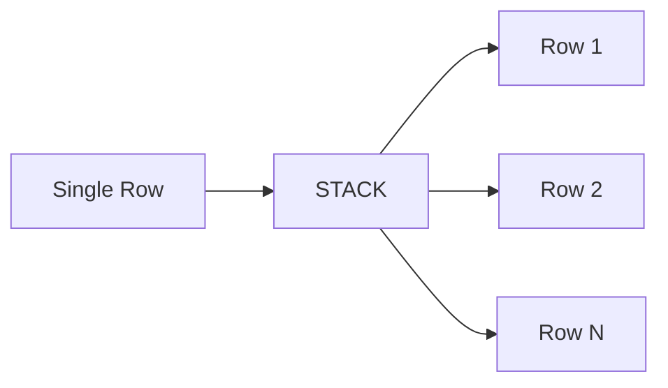

# :material-expand-all: Stack

`STACK()` converts **columns into rows** — it splits a flat list of expressions into `n` rows,
each with a fixed number of columns. It is Spark SQL's primary tool for **unpivoting** wide
data into a tall format.

### :material-sitemap: Overview



## 📌 Syntax

```sql
STACK(n, expr1, expr2, ..., exprK)
```

### Parameters

| Parameter | Description |
|-----------|-------------|
| `n` | Number of output rows to generate |
| `expr1…exprK` | Values to distribute across the rows (row-major order) |

The total number of expressions `K` must be divisible by the number of output columns.
Output columns = `K / n`.

### With LATERAL VIEW

```sql
SELECT t.*, col0, col1
FROM your_table t
LATERAL VIEW STACK(n, expr1, expr2, ...) AS col0, col1;
```

## 🔍 Behavior

1. Distributes `K` expressions across `n` rows in **row-major** order.
2. Each row gets `K / n` columns (named `col0`, `col1`, … by default).
3. Override column names with `AS name1, name2, …`.
4. Expressions can reference table columns — enabling unpivoting of existing data.
5. Can be used standalone (without a table) to generate literal rows.

## 🧪 Practical Examples

### 🧱 1. Unpivot Subject Scores

```sql
CREATE OR REPLACE TEMP VIEW scores AS
SELECT * FROM VALUES
  (1, 85, 90, 78),
  (2, 88, 76, 92)
AS scores(student_id, math, science, history);

SELECT student_id, subject, score
FROM scores
LATERAL VIEW STACK(3,
  'math', math,
  'science', science,
  'history', history
) AS subject, score;
-- (1, math, 85), (1, science, 90), (1, history, 78),
-- (2, math, 88), (2, science, 76), (2, history, 92)
```

### 🧱 2. Generate Static Rows (No Table)

```sql
SELECT label, value
FROM (SELECT 1) AS dummy
LATERAL VIEW STACK(3,
  'A', 100,
  'B', 200,
  'C', 300
) AS label, value;
-- (A, 100), (B, 200), (C, 300)
```

### 🧱 3. Unpivot Feature Flags

```sql
CREATE OR REPLACE TEMP VIEW features AS
SELECT 101 AS id, TRUE AS feature_a, FALSE AS feature_b, TRUE AS feature_c;

SELECT id, feature_name, is_enabled
FROM features
LATERAL VIEW STACK(3,
  'feature_a', feature_a,
  'feature_b', feature_b,
  'feature_c', feature_c
) AS feature_name, is_enabled;
-- (101, feature_a, true), (101, feature_b, false), (101, feature_c, true)
```

### 🧱 4. Create Metric Summary

```sql
CREATE OR REPLACE TEMP VIEW summary AS
SELECT 'Product A' AS name, 1200 AS sales, 300 AS profit;

SELECT name, metric, value
FROM summary
LATERAL VIEW STACK(2,
  'sales', sales,
  'profit', profit
) AS metric, value;
-- (Product A, sales, 1200), (Product A, profit, 300)
```

### 🧱 5. Unpivot Monthly Revenue

```sql
CREATE OR REPLACE TEMP VIEW revenue AS
SELECT * FROM VALUES
  ('East', 100, 150, 200),
  ('West', 300, 250, 180)
AS revenue(region, jan, feb, mar);

SELECT region, month, amount
FROM revenue
LATERAL VIEW STACK(3,
  'Jan', jan,
  'Feb', feb,
  'Mar', mar
) AS month, amount;
-- (East, Jan, 100), (East, Feb, 150), (East, Mar, 200),
-- (West, Jan, 300), (West, Feb, 250), (West, Mar, 180)
```

### 🧱 6. Quick Lookup Table

```sql
SELECT code, description
FROM (SELECT 1) AS dummy
LATERAL VIEW STACK(4,
  'NEW', 'New Order',
  'SHP', 'Shipped',
  'DLV', 'Delivered',
  'RET', 'Returned'
) AS code, description;
```

## 🧠 When to Use

| Scenario | Why `STACK`? |
|----------|-------------|
| Unpivot wide columns → tall rows | Convert `col1, col2, col3` into `name, value` pairs |
| Generate small reference tables | Inline lookup data without CREATE TABLE |
| Feature flag / config reporting | Turn boolean columns into a name+value list |
| Metric summaries | Label and stack KPIs for dashboards |
| Monthly/quarterly pivot reversal | Convert month columns into a single `month, value` column |

> **Tip:** `STACK` is the inverse of `PIVOT` — use it whenever you need to convert
> a wide row into multiple tall rows for analysis or visualization.
