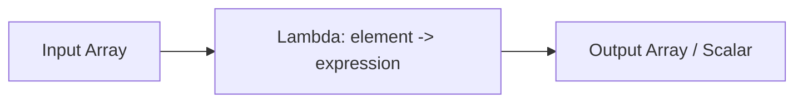

# :material-lambda: Array HOFs — ZIP_WITH & FORALL

Additional higher-order functions that operate on arrays: `ZIP_WITH` merges two arrays
element-wise, and `FORALL` validates that every element satisfies a condition.

### :material-sitemap: Overview



---

## :material-code-braces: ZIP_WITH

### 📌 Syntax

```sql
ZIP_WITH(array1, array2, (left, right) -> expression)
```

| Parameter | Description |
|-----------|-------------|
| `array1` | First input array |
| `array2` | Second input array |
| `(left, right)` | Lambda parameters for corresponding elements |
| `expression` | Logic to combine each pair of elements |

### 🔍 Behavior

1. Pairs elements from `array1` and `array2` by index position.
2. Applies the lambda to each `(left, right)` pair to produce a result element.
3. If arrays differ in length, the shorter one is padded with `NULL`.
4. Returns an array with the same length as the longer input.
5. Returns `NULL` if either input array is `NULL`.

### 🧪 Practical Examples

#### 🧱 1. Element-Wise Addition

```sql
SELECT ZIP_WITH(ARRAY(1, 2, 3), ARRAY(10, 20, 30), (x, y) -> x + y) AS sums;
-- Result: [11, 22, 33]
```

#### 🧱 2. Combine Names and Scores into Labels

```sql
SELECT ZIP_WITH(
  ARRAY('Alice', 'Bob', 'Charlie'),
  ARRAY(95, 82, 91),
  (name, score) -> CONCAT(name, ': ', CAST(score AS STRING))
) AS labels;
-- Result: ['Alice: 95', 'Bob: 82', 'Charlie: 91']
```

#### 🧱 3. Unequal-Length Arrays (NULL Padding)

```sql
SELECT ZIP_WITH(ARRAY(1, 2), ARRAY(10, 20, 30), (x, y) -> x + y) AS sums;
-- Result: [11, 22, NULL]  (x is NULL for the third pair)
```

#### 🧱 4. Build Structs from Parallel Arrays

```sql
SELECT ZIP_WITH(
  ARRAY('env', 'version', 'owner'),
  ARRAY('prod', '1.2', 'teamA'),
  (k, v) -> NAMED_STRUCT('key', k, 'value', v)
) AS config;
-- Result: [{key: env, value: prod}, {key: version, value: 1.2}, {key: owner, value: teamA}]
```

---

## :material-code-braces: FORALL

### 📌 Syntax

```sql
FORALL(array, element -> condition)
```

| Parameter | Description |
|-----------|-------------|
| `array` | The array to validate |
| `element` | Variable representing each element |
| `condition` | Boolean expression that must hold for every element |

### 🔍 Behavior

1. Returns `TRUE` only if **every** element satisfies the condition.
2. Returns `FALSE` if any element fails the condition.
3. Returns `TRUE` for an empty array (vacuously true).
4. Returns `NULL` if the input array is `NULL`.

### 🧪 Practical Examples

#### 🧱 1. Check All Positive

```sql
SELECT FORALL(ARRAY(1, 2, 3, 4), x -> x > 0) AS all_positive;
-- Result: true
```

#### 🧱 2. Check All Non-Null

```sql
SELECT FORALL(ARRAY(1, NULL, 3), x -> x IS NOT NULL) AS all_non_null;
-- Result: false
```

#### 🧱 3. Validate String Lengths

```sql
SELECT FORALL(ARRAY('ab', 'cd', 'ef'), x -> LENGTH(x) = 2) AS all_two_chars;
-- Result: true
```

#### 🧱 4. Validate Struct Fields

```sql
SELECT FORALL(
  ARRAY(
    NAMED_STRUCT('name', 'Alice', 'age', 25),
    NAMED_STRUCT('name', 'Bob', 'age', 30)
  ),
  s -> s.age >= 18
) AS all_adults;
-- Result: true
```

#### 🧱 5. Data Quality Check on a Column

```sql
CREATE OR REPLACE TEMP VIEW orders AS
SELECT * FROM VALUES
  (1, ARRAY(10.0, 25.0, 5.0)),
  (2, ARRAY(8.0, -1.0, 15.0))
AS orders(order_id, line_amounts);

SELECT order_id,
       FORALL(line_amounts, x -> x > 0) AS all_amounts_valid
FROM orders;
-- order_id=1 → true, order_id=2 → false
```

---

## 🧠 When to Use

| Function | Use Case | Returns |
|----------|----------|---------|
| `ZIP_WITH` | Merge parallel arrays element-wise | `array<R>` |
| `ZIP_WITH` | Compute deltas between two numeric arrays | `array<numeric>` |
| `ZIP_WITH` | Build key-value structs from separate key/value arrays | `array<struct>` |
| `FORALL` | Validate all elements meet a quality rule | `boolean` |
| `FORALL` | Data quality checks on array columns | `boolean` |
| `FORALL` | Guard conditions before further processing | `boolean` |

> **Tip:** `FORALL` is the complement of `EXISTS` — use `EXISTS` to check *any* match,
> and `FORALL` to check *all* match.