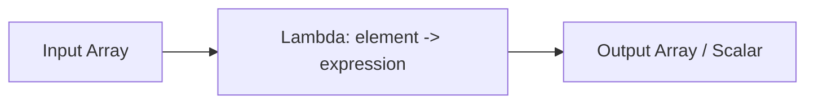

# :material-lambda: Exists

The `EXISTS()` higher-order function checks whether **at least one element** in an array
satisfies a given condition, returning a boolean.

### :material-sitemap: Overview



## :material-pin: Syntax

```sql
EXISTS(array, element -> condition)
```

| Parameter | Description |
|-----------|-------------|
| `array` | The array to search |
| `element` | Variable representing each element during iteration |
| `condition` | Boolean expression evaluated for each element |

## :material-magnify: Behavior

1. Returns `TRUE` if **any** element satisfies the condition (short-circuits on first match).
2. Returns `FALSE` if no element satisfies the condition.
3. Returns `TRUE` for an empty array (vacuously — no failing element exists).
4. Returns `NULL` if the input array is `NULL`.

## :material-flask-outline: Practical Examples

### :material-toy-brick: 1. Check for Any Even Number

```sql
SELECT EXISTS(ARRAY(1, 2, 3, 4, 5), x -> x % 2 = 0) AS has_even;
-- Result: true
```

### :material-toy-brick: 2. Check for Values Above a Threshold

```sql
SELECT EXISTS(ARRAY(1, 2, 3, 4, 5), x -> x > 3) AS has_gt_three;
-- Result: true
```

### :material-toy-brick: 3. Detect NULL Elements

```sql
SELECT EXISTS(ARRAY(1, NULL, 3, NULL, 5), x -> x IS NULL) AS has_null;
-- Result: true
```

### :material-toy-brick: 4. Search Inside Nested Arrays

```sql
SELECT EXISTS(
  ARRAY(ARRAY(1, 2), ARRAY(), ARRAY(3, 4)),
  a -> EXISTS(a, x -> x = 3)
) AS has_nested_three;
-- Result: true
```

### :material-toy-brick: 5. Check String Lengths

```sql
SELECT EXISTS(
  ARRAY('apple', 'cat', 'banana', 'dog'),
  x -> LENGTH(x) > 5
) AS has_long_string;
-- Result: true  (banana has 6 characters)
```

### :material-toy-brick: 6. Check Struct Fields

```sql
SELECT EXISTS(
  ARRAY(
    NAMED_STRUCT('name', 'Alice', 'age', 25),
    NAMED_STRUCT('name', 'Bob', 'age', 30)
  ),
  s -> s.age > 28
) AS has_senior;
-- Result: true
```

### :material-toy-brick: 7. Data Quality — Flag Rows with Invalid Entries

```sql
CREATE OR REPLACE TEMP VIEW sensor_data AS
SELECT * FROM VALUES
  ('device_1', ARRAY(22.0, 45.0, -1.0)),
  ('device_2', ARRAY(30.0, 50.0, 60.0))
AS sensor_data(device_id, readings);

SELECT device_id,
       EXISTS(readings, x -> x < 0) AS has_invalid_reading
FROM sensor_data;
-- device_1 → true, device_2 → false
```

### :material-toy-brick: 8. Combine with Other HOFs

```sql
-- Filter rows, then check existence
SELECT EXISTS(
  FILTER(ARRAY(1, 2, 3, 4, 5), x -> x % 2 = 0),
  x -> x > 3
) AS even_gt_three;
-- Result: true  (4 is even and > 3)
```

## :material-brain: When to Use

| Scenario | Why `EXISTS`? |
|----------|--------------|
| Check if any array element meets a rule | Boolean check without exploding |
| Data quality validation | Flag rows with invalid/outlier values |
| Conditional branching in queries | Use in `CASE WHEN EXISTS(...)` |
| Search in nested structures | Recursive `EXISTS` for deep checks |
| Guard before expensive operations | Skip processing if no qualifying element |

> **Tip:** `EXISTS` is the counterpart of `FORALL` — use `EXISTS` when you need *any* match,
> and `FORALL` when you need *all* to match.
