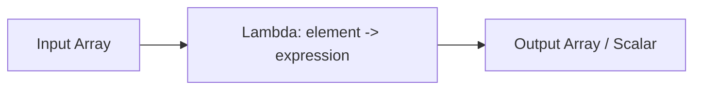

# :material-lambda: Filter

The `FILTER()` higher-order function returns a new array containing only the elements
that satisfy a given condition — the array equivalent of a SQL `WHERE` clause.

### :material-sitemap: Overview



## :material-pin: Syntax

```sql
FILTER(array, element -> condition)

-- With index access
FILTER(array, (element, index) -> condition)
```

### Parameters

| Parameter | Description |
|-----------|-------------|
| `array` | Input array to filter |
| `element` | Variable representing each element |
| `index` | *(Optional)* Zero-based position of the element |
| `condition` | Boolean expression; elements where this is `TRUE` are kept |

## :material-magnify: Behavior

1. Returns a new array containing only elements where the condition is `TRUE`.
2. Preserves the original order of elements.
3. Returns an empty array `[]` if no elements match.
4. Returns `NULL` if the input array is `NULL`.
5. When using the two-parameter form `(element, index)`, the index is zero-based.

## :material-flask-outline: Practical Examples

### :material-toy-brick: 1. Keep Even Numbers

```sql
SELECT FILTER(ARRAY(1, 2, 3, 4, 5), x -> x % 2 = 0) AS even_numbers;
-- Result: [2, 4]
```

### :material-toy-brick: 2. Remove NULL Values

```sql
SELECT FILTER(ARRAY(1, NULL, 3, NULL, 5), x -> x IS NOT NULL) AS no_nulls;
-- Result: [1, 3, 5]
```

### :material-toy-brick: 3. Filter by String Length

```sql
SELECT FILTER(
  ARRAY('apple', 'cat', 'banana', 'dog'),
  x -> LENGTH(x) > 3
) AS long_strings;
-- Result: ['apple', 'banana']
```

### :material-toy-brick: 4. Filter Structs by Field Value

```sql
SELECT FILTER(
  ARRAY(
    NAMED_STRUCT('name', 'Alice', 'age', 25),
    NAMED_STRUCT('name', 'Bob', 'age', 30)
  ),
  s -> s.age > 25
) AS senior_members;
-- Result: [{name: Bob, age: 30}]
```

### :material-toy-brick: 5. Keep Only Non-Empty Nested Arrays

```sql
SELECT FILTER(
  ARRAY(ARRAY(1, 2), ARRAY(), ARRAY(3, 4)),
  a -> SIZE(a) > 0
) AS non_empty;
-- Result: [[1, 2], [3, 4]]
```

### :material-toy-brick: 6. Use Index to Keep Every Other Element

```sql
SELECT FILTER(
  ARRAY('a', 'b', 'c', 'd', 'e'),
  (x, i) -> i % 2 = 0
) AS even_indexed;
-- Result: ['a', 'c', 'e']
```

### :material-toy-brick: 7. Unnamed Structs

```sql
SELECT FILTER(
  ARRAY(STRUCT('Alice', 25), STRUCT('Bob', 30)),
  s -> s.col2 > 25
) AS filtered;
-- Result: [{col1: Bob, col2: 30}]
```

## :material-factory: Real-World Applications

### IoT: Filter Sensor Readings Within Range

```sql
CREATE OR REPLACE TEMP VIEW sensor_data AS
SELECT * FROM VALUES
  ('D001', ARRAY(22.5, 85.0, 19.0, 5.0)),
  ('D002', ARRAY(45.0, 12.0, 90.0, 33.0))
AS sensor_data(device_id, temperature_readings);

SELECT device_id,
       FILTER(temperature_readings, x -> x >= 10 AND x <= 80) AS valid_readings
FROM sensor_data;
-- D001 → [22.5, 19.0], D002 → [45.0, 12.0, 33.0]
```

### E-commerce: High-Value Transactions

```sql
CREATE OR REPLACE TEMP VIEW user_purchases AS
SELECT * FROM VALUES
  ('user01', ARRAY(5000, 12000, 8000, 15000)),
  ('user02', ARRAY(3000, 20000, 7000, 11000))
AS user_purchases(user_id, transactions);

SELECT user_id,
       FILTER(transactions, x -> x > 10000) AS high_value_txns
FROM user_purchases;
-- user01 → [12000, 15000], user02 → [20000, 11000]
```

### Telecom: Identify Dropped Calls

```sql
CREATE OR REPLACE TEMP VIEW telecom_data AS
SELECT * FROM VALUES
  ('cust01', ARRAY(
    NAMED_STRUCT('duration', 0, 'status', 'dropped'),
    NAMED_STRUCT('duration', 5, 'status', 'completed'),
    NAMED_STRUCT('duration', 0, 'status', 'dropped')
  )),
  ('cust02', ARRAY(
    NAMED_STRUCT('duration', 10, 'status', 'completed'),
    NAMED_STRUCT('duration', 0, 'status', 'dropped')
  ))
AS telecom_data(customer_id, call_logs);

SELECT customer_id,
       FILTER(call_logs, x -> x.status = 'dropped') AS dropped_calls
FROM telecom_data;
```

### Healthcare: Critical Vitals Alerts

```sql
CREATE OR REPLACE TEMP VIEW patient_monitoring AS
SELECT * FROM VALUES
  ('pat01', ARRAY(
    NAMED_STRUCT('heart_rate', 130, 'bp_systolic', 190),
    NAMED_STRUCT('heart_rate', 85, 'bp_systolic', 120)
  )),
  ('pat02', ARRAY(
    NAMED_STRUCT('heart_rate', 125, 'bp_systolic', 160),
    NAMED_STRUCT('heart_rate', 70, 'bp_systolic', 110)
  ))
AS patient_monitoring(patient_id, vitals);

SELECT patient_id,
       FILTER(vitals, x -> x.heart_rate > 120 OR x.bp_systolic > 180) AS critical_alerts
FROM patient_monitoring;
-- pat01 → [{130, 190}], pat02 → [{125, 160}]
```

## :material-brain: When to Use

| Scenario | Why `FILTER`? |
|----------|--------------|
| Remove NULLs from an array | Cleaner than explode + where + collect_list |
| Keep elements matching a business rule | Preserves row structure, no GROUP BY needed |
| Data quality — remove outliers from arrays | Inline cleanup without extra joins |
| Index-based selection | Two-param form `(element, index)` gives positional control |
| Chain with other HOFs | `TRANSFORM(FILTER(...), ...)` for filter-then-transform pipelines |

> **Tip:** Combine `FILTER` with `SIZE` to count matching elements:
> `SIZE(FILTER(array, x -> condition))` returns the match count.
