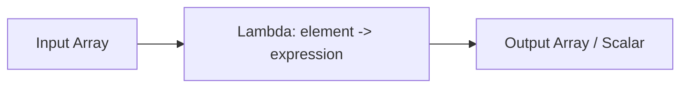

# :material-lambda: Higher-Order Functions

Higher-order functions (HOFs) accept **lambda expressions** as arguments, allowing you to apply
custom logic to each element of an array or map without exploding the data into rows.

### :material-sitemap: Overview



## 📌 Available Functions

| Function | Description | Returns |
|----------|-------------|---------|
| `TRANSFORM(array, func)` | Apply `func` to each element | Array of transformed elements |
| `FILTER(array, func)` | Keep elements where `func` returns true | Filtered array |
| `EXISTS(array, func)` | Check if any element matches `func` | Boolean |
| `AGGREGATE(array, start, merge, finish)` | Reduce array to a single value | Scalar value |
| `FORALL(array, func)` | Check if all elements match `func` | Boolean |
| `ZIP_WITH(array1, array2, func)` | Merge two arrays element-wise using `func` | Merged array |
| `MAP_FILTER(map, func)` | Filter map entries by key-value predicate | Filtered map |
| `TRANSFORM_KEYS(map, func)` | Transform map keys | Map with new keys |
| `TRANSFORM_VALUES(map, func)` | Transform map values | Map with new values |

## 🔍 Lambda Syntax

```sql
-- Single parameter
element -> expression

-- Two parameters (element + index, or key + value)
(x, i) -> expression
```

## 🧪 Practical Examples

```sql
-- TRANSFORM: double each element
SELECT TRANSFORM(ARRAY(1, 2, 3, 4), x -> x * 2);
-- Result: [2, 4, 6, 8]

-- FILTER: keep only even numbers
SELECT FILTER(ARRAY(1, 2, 3, 4, 5, 6), x -> x % 2 = 0);
-- Result: [2, 4, 6]

-- EXISTS: check for presence
SELECT EXISTS(ARRAY('spark', 'sql', 'hof'), x -> x = 'sql');
-- Result: true

-- AGGREGATE: sum all elements
SELECT AGGREGATE(ARRAY(1, 2, 3, 4), 0, (acc, x) -> acc + x);
-- Result: 10

-- MAP_FILTER: filter map entries
SELECT MAP_FILTER(MAP('a', 1, 'b', 2, 'c', 3), (k, v) -> v > 1);
-- Result: {b -> 2, c -> 3}
```

## 🧠 When to Use HOFs

| Use Case | Why Use HOFs? |
|----------|--------------|
| Transform array elements in place | Avoids `EXPLODE` + aggregation round-trip |
| Filter arrays by condition | Keeps data nested, preserves row structure |
| Validate array contents | `EXISTS` / `FORALL` for boolean checks |
| Reduce arrays to a scalar | `AGGREGATE` replaces manual loop logic |
| Process map key-value pairs | `MAP_FILTER`, `TRANSFORM_KEYS/VALUES` |
