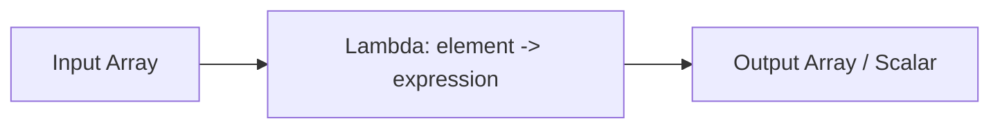

# :material-lambda: Map HOFs

Higher-order functions that operate on `MAP` types — filter entries, merge two maps,
and transform keys or values using lambda expressions.

### :material-sitemap: Overview



## :material-code-braces: MAP_FILTER

### 📌 Syntax

```sql
MAP_FILTER(map, (key, value) -> condition)
```

| Parameter | Description |
|-----------|-------------|
| `map` | Input `MAP<K, V>` |
| `(key, value)` | Lambda parameters for each map entry |
| `condition` | Boolean expression; entries where this is `TRUE` are kept |

### 🔍 Behavior

1. Returns a new map containing only entries where the condition is `TRUE`.
2. Returns an empty map if no entries match.
3. Returns `NULL` if the input map is `NULL`.

### 🧪 Practical Examples

```sql
-- Keep entries where the value length exceeds 1
SELECT MAP_FILTER(MAP(1, 'a', 2, 'bb', 3, 'ccc'), (k, v) -> LENGTH(v) > 1);
-- Result: {2 -> bb, 3 -> ccc}

-- Keep entries where the key is even
SELECT MAP_FILTER(MAP('a', 1, 'b', 2, 'c', 3), (k, v) -> v % 2 = 0);
-- Result: {b -> 2}
```

---

## :material-code-braces: MAP_ZIP_WITH

### 📌 Syntax

```sql
MAP_ZIP_WITH(map1, map2, (key, value1, value2) -> expression)
```

| Parameter | Description |
|-----------|-------------|
| `map1` | First `MAP<K, V1>` |
| `map2` | Second `MAP<K, V2>` |
| `(key, value1, value2)` | Lambda parameters: shared key and both values |
| `expression` | Logic to produce the merged value |

### 🔍 Behavior

1. Merges two maps by key — for each key present in **either** map, calls the lambda.
2. If a key exists in only one map, the other value is `NULL`.
3. The output map has the union of all keys from both inputs.
4. Returns `NULL` if either input map is `NULL`.

### 🧪 Practical Examples

```sql
-- Sum values from two maps by shared key
SELECT MAP_ZIP_WITH(
  MAP(1, 10, 2, 20),
  MAP(1, 1, 2, 2, 3, 30),
  (k, v1, v2) -> COALESCE(v1, 0) + COALESCE(v2, 0)
);
-- Result: {1 -> 11, 2 -> 22, 3 -> 30}

-- Merge config maps (second overrides first)
SELECT MAP_ZIP_WITH(
  MAP('timeout', '30', 'retries', '3'),
  MAP('timeout', '60', 'verbose', 'true'),
  (k, v1, v2) -> COALESCE(v2, v1)
);
-- Result: {timeout -> 60, retries -> 3, verbose -> true}
```

---

## :material-code-braces: TRANSFORM_KEYS

### 📌 Syntax

```sql
TRANSFORM_KEYS(map, (key, value) -> new_key)
```

### 🔍 Behavior

1. Returns a new map with each key replaced by the result of the lambda.
2. Values remain unchanged.
3. If the lambda produces duplicate keys, later entries overwrite earlier ones.

### 🧪 Practical Examples

```sql
-- Multiply keys by 10
SELECT TRANSFORM_KEYS(MAP(1, 'a', 2, 'b'), (k, v) -> k * 10);
-- Result: {10 -> a, 20 -> b}

-- Uppercase string keys
SELECT TRANSFORM_KEYS(MAP('name', 'Alice', 'city', 'NYC'), (k, v) -> UPPER(k));
-- Result: {NAME -> Alice, CITY -> NYC}
```

---

## :material-code-braces: TRANSFORM_VALUES

### 📌 Syntax

```sql
TRANSFORM_VALUES(map, (key, value) -> new_value)
```

### 🔍 Behavior

1. Returns a new map with each value replaced by the result of the lambda.
2. Keys remain unchanged.

### 🧪 Practical Examples

```sql
-- Uppercase all values
SELECT TRANSFORM_VALUES(MAP(1, 'a', 2, 'b'), (k, v) -> UPPER(v));
-- Result: {1 -> A, 2 -> B}

-- Compute discounted prices (key = product, value = price)
SELECT TRANSFORM_VALUES(
  MAP('widget', 100, 'gadget', 200),
  (product, price) -> price * 0.9
);
-- Result: {widget -> 90.0, gadget -> 180.0}
```

---

## 🏭 Real-World Applications

### Merge Feature Vectors

```sql
-- Combine two sparse feature maps, summing overlapping keys
SELECT MAP_ZIP_WITH(
  MAP('clicks', 5, 'views', 100),
  MAP('clicks', 3, 'shares', 10),
  (k, v1, v2) -> COALESCE(v1, 0) + COALESCE(v2, 0)
) AS merged_features;
-- Result: {clicks -> 8, views -> 100, shares -> 10}
```

### Normalize Config Key Naming

```sql
-- Standardize config keys to lowercase with underscores
SELECT TRANSFORM_KEYS(
  MAP('MaxRetries', '3', 'TimeoutMs', '5000'),
  (k, v) -> LOWER(k)
) AS normalized_config;
-- Result: {maxretries -> 3, timeoutms -> 5000}
```

### Mask Sensitive Map Values

```sql
SELECT TRANSFORM_VALUES(
  MAP('ssn', '123-45-6789', 'name', 'Alice'),
  (k, v) -> CASE WHEN k = 'ssn' THEN '***-**-****' ELSE v END
) AS masked;
-- Result: {ssn -> ***-**-****, name -> Alice}
```

## 🧠 When to Use

| Function | Use Case | Returns |
|----------|----------|---------|
| `MAP_FILTER` | Keep entries matching a predicate | `MAP<K,V>` |
| `MAP_ZIP_WITH` | Merge / diff two maps by key | `MAP<K,V3>` |
| `TRANSFORM_KEYS` | Rename, normalize, or hash map keys | `MAP<K2,V>` |
| `TRANSFORM_VALUES` | Compute, format, or mask map values | `MAP<K,V2>` |

> **Tip:** Chain these functions — e.g., `MAP_FILTER(TRANSFORM_VALUES(...), ...)` to first
> transform values and then filter the result in a single expression.
