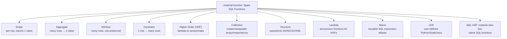
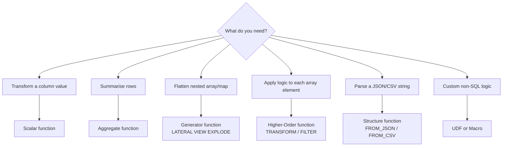

# :material-function: Functions

Spark SQL ships with hundreds of built-in functions covering everything from
string manipulation and date arithmetic to array processing and statistical
aggregation. No Python or Scala needed — all available in pure SQL.

---

## :material-sitemap: Function Taxonomy



---

## :material-compare: Function Categories

| Category | Scope | Reduces rows? | Examples |
|----------|-------|:-------------:|---------|
| **Scalar** | Single value → single value | No | `UPPER`, `ABS`, `DATE_ADD`, `CAST` |
| **Aggregate** | Group of rows → one value | Yes | `SUM`, `AVG`, `COLLECT_LIST` |
| **Window** | Partition of rows → per-row value | No | `ROW_NUMBER`, `LAG`, `SUM OVER` |
| **Generator** | One row → many rows | No (expands) | `EXPLODE`, `POSEXPLODE`, `INLINE`, `STACK` |
| **Higher-Order** | Array/Map + lambda → result | No | `TRANSFORM`, `FILTER`, `AGGREGATE`, `ZIP_WITH` |
| **Collection** | Scalar/array/map constructors | No | `ARRAY()`, `MAP()`, `NAMED_STRUCT()` |
| **Structure** | String ↔ semi-structured types | No | `FROM_JSON`, `TO_JSON`, `FROM_CSV` |
| **Lambda** | Inline function arg for HOFs | N/A | `x -> x * 2`, `(k, v) -> v > 1` |
| **Macro** | Reusable SQL snippets | No | `CREATE TEMPORARY MACRO double(x) x * 2` |
| **UDF** | Custom logic in Python/Scala/Java | No | `spark.udf.register(...)` |

---

## :material-lightning-bolt: Quick Decision Guide



---

## :material-flash: Common Functions Cheat Sheet

```sql
-- String
UPPER(s)  LOWER(s)  TRIM(s)  CONCAT(a, b)  SPLIT(s, pat)
SUBSTRING(s, pos, len)  REGEXP_REPLACE(s, pat, rep)  LENGTH(s)

-- Math
ABS(x)  ROUND(x, n)  CEIL(x)  FLOOR(x)  MOD(x, y)  POWER(x, n)
GREATEST(a,b,...)  LEAST(a,b,...)  RAND()  LOG(base, x)

-- Date / Time
CURRENT_DATE()  CURRENT_TIMESTAMP()  DATE_ADD(d, n)  DATEDIFF(a, b)
DATE_TRUNC('month', d)  DATE_FORMAT(d, fmt)  TO_DATE(s, fmt)

-- NULL handling
COALESCE(a, b, ...)  NULLIF(a, b)  NVL(a, default)  IFNULL(a, b)
IS NULL  IS NOT NULL  a <=> b  -- null-safe equals

-- Type conversion
CAST(x AS type)  TRY_CAST(x AS type)  TO_TIMESTAMP(s, fmt)

-- Array
ARRAY_CONTAINS(arr, val)  SIZE(arr)  SORT_ARRAY(arr)  ARRAY_DISTINCT(arr)
ARRAY_JOIN(arr, delim)  FLATTEN(arr)  SEQUENCE(start, stop, step)

-- Aggregate
COUNT(*) COUNT(col)  SUM(col)  AVG(col)  MIN(col)  MAX(col)
COLLECT_LIST(col)  COLLECT_SET(col)  PERCENTILE(col, p)

-- HOF
TRANSFORM(arr, x -> ...)  FILTER(arr, x -> ...)  EXISTS(arr, x -> ...)
AGGREGATE(arr, init, (acc, x) -> ...)  ZIP_WITH(a1, a2, (x, y) -> ...)
```

---

## :material-book-open-variant: In This Section

| Section | Contents |
|---------|----------|
| [Aggregate](aggregate/index.md) | `SUM`, `AVG`, `COUNT`, `COLLECT_LIST`, stats, string aggregation |
| [Scalar](scalar/index.md) | String, math, date, null, regex, encryption, conversion |
| [Collection](collection/index.md) | `ARRAY()`, `MAP()`, `NAMED_STRUCT()`, set operations |
| [Generator](generator/index.md) | `EXPLODE`, `POSEXPLODE`, `INLINE`, `STACK` |
| [Higher-Order](hof/index.md) | `TRANSFORM`, `FILTER`, `EXISTS`, `AGGREGATE`, `ZIP_WITH` |
| [Structure](structure/index.md) | `FROM_JSON`, `TO_JSON`, `FROM_CSV`, `XPATH` |
| [Lambda](lambda/index.md) | Lambda syntax, array HOFs, map HOFs, aggregate HOF, patterns |
| [Macro](macro/macro.md) | `CREATE TEMPORARY MACRO`, reusable SQL expressions |
| [UDF](udf/udf.md) | Python UDFs, Pandas UDFs, Scala UDFs, UDAFs |
