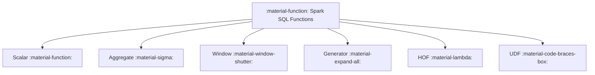

# :material-function: Functions

Spark SQL provides a rich set of built-in functions for data transformation and analysis.
This section covers aggregate, scalar, collection, generator, higher-order, structure,
lambda, macro, and user-defined functions.

### :material-sitemap: Overview



## :material-pin: Function Categories

| Category | Description | Examples |
|----------|-------------|----------|
| **Aggregate** | Perform calculations on sets of rows, returning a single result | `COUNT()`, `SUM()`, `AVG()`, `COLLECT_LIST()` |
| **Scalar** | Operate on individual values and return a single value per row | `UPPER()`, `ABS()`, `DATE_ADD()`, `CAST()` |
| **Collection** | Create and manipulate complex types (arrays, maps, structs) | `ARRAY()`, `MAP()`, `NAMED_STRUCT()` |
| **Generator** | Produce multiple output rows from a single input row | `EXPLODE()`, `POSEXPLODE()`, `INLINE()`, `STACK()` |
| **Higher-Order** | Accept lambda expressions to process array/map elements | `TRANSFORM()`, `FILTER()`, `EXISTS()`, `AGGREGATE()` |
| **Structure** | Parse and generate semi-structured data formats | `FROM_JSON()`, `TO_JSON()`, `FROM_CSV()`, `XPATH()` |
| **Lambda** | Anonymous functions used as arguments to higher-order functions | `x -> x * 2`, `(k, v) -> k` |
| **Macro** | Reusable SQL expressions defined with `CREATE TEMPORARY MACRO` | User-defined SQL macros |

## :material-magnify: How Functions Are Used

```sql
-- Aggregate: summarize groups
SELECT department, AVG(salary) FROM employees GROUP BY department;

-- Scalar: transform individual values
SELECT UPPER(name), ROUND(salary, 2) FROM employees;

-- Generator: expand nested data
SELECT id, name FROM employees LATERAL VIEW EXPLODE(skills) AS skill;

-- Higher-order: process arrays inline
SELECT TRANSFORM(scores, x -> x * 1.1) AS curved_scores FROM students;
```

## :material-brain: Choosing the Right Function Type

| You Want To... | Use |
|----------------|-----|
| Summarize data across rows | Aggregate functions |
| Transform a single column value | Scalar functions |
| Work with arrays, maps, or structs | Collection functions |
| Flatten nested data into rows | Generator functions |
| Apply logic to each element of a collection | Higher-order functions |
| Parse/produce JSON, CSV, or XML | Structure functions |
