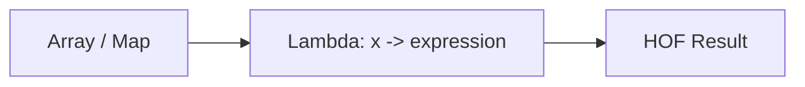

# :material-lambda: Lambda Expressions

Lambda expressions (also called anonymous functions) are inline functions passed as arguments
to higher-order functions (HOFs) in Spark SQL. They define the logic applied to each element
of an array or map.

### :material-sitemap: Overview



## :material-pin: Syntax

### Single Parameter

```sql
element -> expression
```

Used with functions that iterate over array elements:

```sql
SELECT TRANSFORM(ARRAY(1, 2, 3), x -> x * 2);
-- Result: [2, 4, 6]
```

### Two Parameters — Element + Index

```sql
(element, index) -> expression
```

Used when you need the zero-based position of each element:

```sql
SELECT TRANSFORM(ARRAY('a', 'b', 'c'), (x, i) -> CONCAT(CAST(i AS STRING), ':', x));
-- Result: ['0:a', '1:b', '2:c']
```

### Two Parameters — Key + Value (Maps)

```sql
(key, value) -> expression
```

Used with map HOFs where both key and value are available:

```sql
SELECT MAP_FILTER(MAP('a', 1, 'b', 2, 'c', 3), (k, v) -> v > 1);
-- Result: {b -> 2, c -> 3}
```

### Three Parameters — Key + Value1 + Value2

```sql
(key, val1, val2) -> expression
```

Used with `MAP_ZIP_WITH` to merge two maps:

```sql
SELECT MAP_ZIP_WITH(MAP('a', 1), MAP('a', 10), (k, v1, v2) -> COALESCE(v1, 0) + COALESCE(v2, 0));
-- Result: {a -> 11}
```

### Accumulator Pattern

```sql
(accumulator, element) -> new_accumulator
```

Used with `AGGREGATE` for reduction:

```sql
SELECT AGGREGATE(ARRAY(1, 2, 3, 4), 0, (acc, x) -> acc + x);
-- Result: 10
```

## :material-magnify: Behavior

1. Lambda expressions are **not standalone** — they can only appear as arguments to HOFs.
2. Parameter names are arbitrary (`x`, `elem`, `acc`, etc.) — choose descriptive names.
3. The **expression** can use any SQL expression: `CASE`, arithmetic, string functions, casts, etc.
4. Lambda parameters are **strongly typed** — inferred from the input array/map element type.
5. Lambdas have **no side effects** — they are pure expressions evaluated per element.
6. **Nested lambdas** are supported for nested data structures.

## :material-flask-outline: Practical Examples

### :material-toy-brick: 1. Filter + Transform Pipeline

```sql
-- Keep evens, then square them
SELECT TRANSFORM(
  FILTER(ARRAY(1, 2, 3, 4, 5, 6), x -> x % 2 = 0),
  x -> x * x
) AS even_squares;
-- Result: [4, 16, 36]
```

### :material-toy-brick: 2. Conditional Logic Inside Lambda

```sql
SELECT TRANSFORM(
  ARRAY(85, 42, 97, 55),
  score -> CASE
    WHEN score >= 90 THEN 'A'
    WHEN score >= 70 THEN 'B'
    WHEN score >= 50 THEN 'C'
    ELSE 'F'
  END
) AS grades;
-- Result: ['B', 'F', 'A', 'C']
```

### :material-toy-brick: 3. Nested Lambda — Nested Arrays

```sql
SELECT TRANSFORM(
  ARRAY(ARRAY(1, 2), ARRAY(3, 4, 5)),
  inner_arr -> TRANSFORM(inner_arr, x -> x * 10)
) AS scaled;
-- Result: [[10, 20], [30, 40, 50]]
```

### :material-toy-brick: 4. Struct Field Access in Lambda

```sql
SELECT FILTER(
  ARRAY(
    NAMED_STRUCT('name', 'Alice', 'age', 25),
    NAMED_STRUCT('name', 'Bob', 'age', 17),
    NAMED_STRUCT('name', 'Charlie', 'age', 30)
  ),
  person -> person.age >= 18
) AS adults;
-- Result: [{Alice, 25}, {Charlie, 30}]
```

### :material-toy-brick: 5. Accumulator with Finish Function

```sql
SELECT AGGREGATE(
  ARRAY(10, 20, 30, 40),
  NAMED_STRUCT('total', 0D, 'cnt', 0),
  (acc, x) -> NAMED_STRUCT('total', acc.total + x, 'cnt', acc.cnt + 1),
  acc -> acc.total / acc.cnt
) AS average;
-- Result: 25.0
```

### :material-toy-brick: 6. Index-Aware Filtering

```sql
-- Keep only elements at even indices
SELECT FILTER(
  ARRAY('a', 'b', 'c', 'd', 'e'),
  (x, i) -> i % 2 = 0
) AS even_idx;
-- Result: ['a', 'c', 'e']
```

### :material-toy-brick: 7. Map Value Transformation

```sql
SELECT TRANSFORM_VALUES(
  MAP('price', 100, 'tax', 8, 'shipping', 5),
  (k, v) -> CASE WHEN k = 'price' THEN v ELSE ROUND(v * 1.1, 0) END
) AS adjusted;
-- Result: {price -> 100, tax -> 9, shipping -> 6}
```

## :material-clipboard-list-outline: Lambda Forms by HOF

| HOF | Lambda Form | Purpose |
|-----|------------|---------|
| `TRANSFORM(arr, ...)` | `x -> expr` | Transform each element |
| `TRANSFORM(arr, ...)` | `(x, i) -> expr` | Transform with index |
| `FILTER(arr, ...)` | `x -> bool` | Keep matching elements |
| `FILTER(arr, ...)` | `(x, i) -> bool` | Filter with index |
| `EXISTS(arr, ...)` | `x -> bool` | Any element matches? |
| `FORALL(arr, ...)` | `x -> bool` | All elements match? |
| `AGGREGATE(arr, init, ...)` | `(acc, x) -> acc'` | Reduce to single value |
| `AGGREGATE(..., finish)` | `acc -> result` | Post-process accumulator |
| `ZIP_WITH(a1, a2, ...)` | `(x, y) -> expr` | Merge two arrays |
| `MAP_FILTER(map, ...)` | `(k, v) -> bool` | Filter map entries |
| `TRANSFORM_KEYS(map, ...)` | `(k, v) -> k'` | Rename map keys |
| `TRANSFORM_VALUES(map, ...)` | `(k, v) -> v'` | Transform map values |
| `MAP_ZIP_WITH(m1, m2, ...)` | `(k, v1, v2) -> v'` | Merge two maps |

## :material-brain: When to Use

| Scenario | Lambda Approach |
|----------|----------------|
| Apply formula to every element | `TRANSFORM(arr, x -> ...)` |
| Remove unwanted elements | `FILTER(arr, x -> ...)` |
| Check array contents | `EXISTS` / `FORALL` with boolean lambda |
| Sum / reduce array values | `AGGREGATE(arr, init, (acc, x) -> ...)` |
| Process map entries | `MAP_FILTER` / `TRANSFORM_KEYS` / `TRANSFORM_VALUES` |
| Merge parallel structures | `ZIP_WITH` / `MAP_ZIP_WITH` |

> **Tip:** Lambda parameter names are yours to choose — use descriptive names like `price`,
> `person`, or `acc` rather than `x` to make complex expressions self-documenting.
