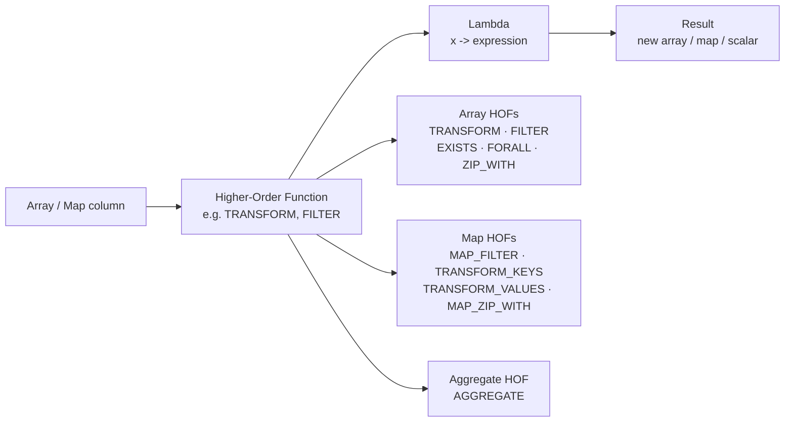

# :material-lambda: Lambda Expressions

**Lambda expressions** are inline anonymous functions passed as arguments to
**Higher-Order Functions (HOFs)** in Spark SQL. They define the per-element
logic applied to arrays and maps — no Python, Scala, or UDF registration needed.

---

## :material-sitemap: Overview



---

## :material-compare: Lambda at a Glance

| Form | Used with | Purpose |
|------|-----------|---------|
| `x -> expr` | `TRANSFORM`, `FILTER`, `EXISTS`, `FORALL` | Per-element expression |
| `(x, i) -> expr` | `TRANSFORM`, `FILTER` | Element + zero-based index |
| `(k, v) -> expr` | `MAP_FILTER`, `TRANSFORM_KEYS`, `TRANSFORM_VALUES` | Map key + value |
| `(acc, x) -> acc'` | `AGGREGATE` (merge) | Fold/reduce accumulator |
| `acc -> result` | `AGGREGATE` (finish) | Post-process accumulator |
| `(x, y) -> expr` | `ZIP_WITH` | Merge two arrays element-wise |
| `(k, v1, v2) -> expr` | `MAP_ZIP_WITH` | Merge two maps by key |

---

## :material-lightning-bolt: Quick Examples

```sql
-- Map: double every element
SELECT TRANSFORM(ARRAY(1, 2, 3), x -> x * 2);          -- [2, 4, 6]

-- Filter: keep values above threshold
SELECT FILTER(ARRAY(10, 55, 80, 30), x -> x > 50);     -- [55, 80]

-- Check: does any element pass?
SELECT EXISTS(ARRAY(1, 3, 5, 8), x -> x % 2 = 0);      -- true

-- Reduce: sum all elements
SELECT AGGREGATE(ARRAY(1, 2, 3, 4), 0, (acc, x) -> acc + x);  -- 10

-- Merge arrays pairwise
SELECT ZIP_WITH(ARRAY(1, 2, 3), ARRAY(10, 20, 30), (a, b) -> a + b);  -- [11, 22, 33]
```

---

## :material-book-open-variant: In This Section

| Page | Contents |
|------|----------|
| [Syntax](syntax.md) | All lambda forms, parameter rules, type inference, nesting |
| [Array HOFs](array_hof.md) | `TRANSFORM`, `FILTER`, `EXISTS`, `FORALL`, `ZIP_WITH` |
| [Map HOFs](map_hof.md) | `MAP_FILTER`, `TRANSFORM_KEYS`, `TRANSFORM_VALUES`, `MAP_ZIP_WITH` |
| [Aggregate HOF](aggregate_hof.md) | `AGGREGATE` — fold, average, running total, struct accumulator |
| [Patterns](patterns.md) | Pipelines, conditional logic, nested lambdas, performance tips |
