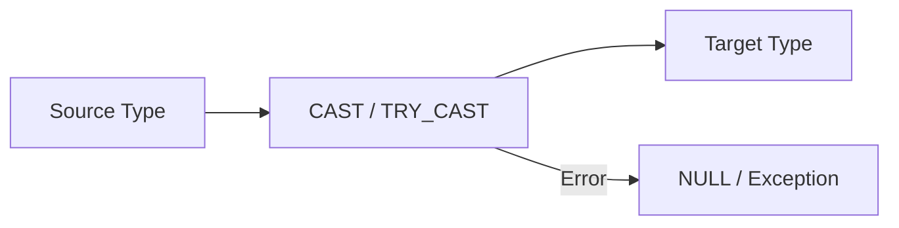

# :material-swap-horizontal: Conversion

| Function           | Description                                                 |
|--------------------|-------------------------------------------------------------|
| bigint(expr)       |  Casts the value `expr` to the target data type `bigint`.   |
| binary(expr)       |  Casts the value `expr` to the target data type `binary`.   |
| boolean(expr)      |  Casts the value `expr` to the target data type `boolean`.  |
| cast(expr AS type) |  Casts the value `expr` to the target data type `type`.     |
| date(expr)         |  Casts the value `expr` to the target data type `date`.     |
| decimal(expr)      |  Casts the value `expr` to the target data type `decimal`.  |
| double(expr)       |  Casts the value `expr` to the target data type `double`.   |
| float(expr)        | Casts the value `expr` to the target data type `float`.     |
| int(expr)          | Casts the value `expr` to the target data type `int`.       |
| smallint(expr)     |  Casts the value `expr` to the target data type `smallint`. |
| string(expr)       | Casts the value `expr` to the target data type `string`.    |
| timestamp(expr)    | Casts the value `expr` to the target data type `timestamp`. |
| tinyint(expr)      | Casts the value `expr` to the target data type `tinyint`.   |

### :material-sitemap: Overview



## :material-swap-horizontal: Expression to bigint

```sql
SELECT bigint('12345')
```

## :material-swap-horizontal: Expression to binary

```sql
SELECT hex(binary('abc'))
```

## :material-swap-horizontal: Expression to boolean

```sql
SELECT cast('2025-01-01' AS date)
```

## :material-swap-horizontal: Converts to DATE

```sql
SELECT date('2025-07-20')
```

## :material-swap-horizontal: Converts to DECIMAL(10, 0) unless specified

```sql
SELECT decimal('123.456')
```

## :material-swap-horizontal: Converts to FLOAT (float32)

```sql
SELECT float('123.456')
```

## :material-swap-horizontal: Converts to INT (32-bit integer)

```sql
SELECT int('42.99')
```

## :material-swap-horizontal: Converts to SMALLINT (16-bit integer)

```sql
SELECT smallint('12')
```

## :material-swap-horizontal: Converts to STRING

```sql
SELECT string(2025)
```

## :material-swap-horizontal: Converts to TIMESTAMP

```sql
SELECT timestamp('2024-01-01 12:34:56') 2024-01-01 12:34:56
```

## :material-swap-horizontal: Converts to TINYINT (8-bit integer)

```sql
SELECT tinyint('127')
```

## :material-swap-horizontal: cast and try_cast()

### cast

Invalid casts (e.g., 'abc' to int) will throw errors.

```sql
SELECT cast('2025-01-01' AS date)
```

### try_cast

Use try_cast() (if available in your Spark version) to avoid failure on bad input.

```sql

```

## :material-magnify: :material-swap-horizontal: Bonus: Chained Casting

```sql
SELECT
  CAST(CAST('123.45' AS double) AS int) AS double_to_int;
```
