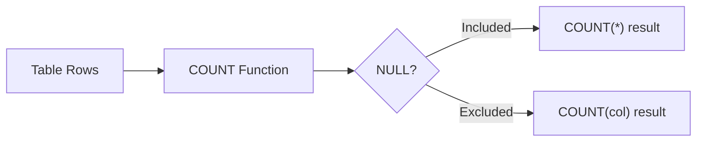

# :material-counter: Count

### :material-sitemap: Overview



## :material-circle-small: :material-counter: 1. COUNT(*) — Count All Rows

Counts every row, including rows with NULL values.

```sql

SELECT COUNT(*) AS total_rows
FROM your_table;
```

:material-check-circle-outline: Returns total row count, regardless of column values.

## :material-circle-small: :material-counter: 2. COUNT(column) — Count Non-Nulls Only

Counts only the non-null values in a specific column.

```sql
SELECT COUNT(salary) AS non_null_salaries
FROM your_table;
```

:material-check-circle-outline: Skips nulls. Useful when counting data completeness.

## :material-circle-small: :material-counter: 3. COUNT(DISTINCT column) — Count Unique Non-Nulls

Returns the count of distinct non-null values in a column.

```sql
SELECT COUNT(DISTINCT department) AS unique_departments
FROM your_table;
```

:material-check-circle-outline: Ignores nulls and returns count of unique values.

## :material-circle-small: :material-counter: 4. COUNT(DISTINCT col1, col2) — Count Unique Combinations

Counts distinct combinations of multiple columns.

```sql
SELECT COUNT(DISTINCT department, role) AS unique_pairs
FROM your_table;
```

:material-check-circle-outline: Each unique (department, role) pair is counted once.

## :material-circle-small: :material-counter: 5. Grouped Count — With GROUP BY

Counts rows grouped by column(s).

```sql
SELECT department, COUNT(*) AS count_by_department
FROM your_table
GROUP BY department;
```

:material-check-circle-outline: Shows row count per group.

## :material-circle-small: :material-counter: 6. Conditional Count — With CASE WHEN

### Case when

Custom count using condition logic.

```sql
SELECT
  COUNT(CASE WHEN salary > 50000 THEN 1 END) AS high_salary_count,
  COUNT(CASE WHEN department = 'HR' THEN 1 END) AS hr_count
FROM your_table;
```

:material-check-circle-outline: Great for counting specific conditions in one pass.

### count_if

```sql
count_if(expr)
```

It returns the number of TRUE values for the expression.

Examples:

```sql
SELECT count_if(col % 2 = 0) FROM VALUES (NULL), (0), (1), (2), (3) AS tab(col);
SELECT count_if(col IS NULL) FROM VALUES (NULL), (0), (1), (2), (3) AS tab(col);
```

## :material-circle-small: :material-counter: 7. Window Count — With OVER()

Counts rows in a partition using window functions.

```sql
SELECT name, department,
       COUNT(*) OVER (PARTITION BY department) AS dept_count
FROM your_table;
```

:material-check-circle-outline: Adds count as a new column without grouping the result.

## :material-circle-small: :material-counter: 8. Count + Filtering

```sql
SELECT COUNT(*) AS active_users
FROM users
WHERE is_active = TRUE;
```

:material-check-circle-outline: Simple conditional count using WHERE.

## :material-counter: count_min_sketch

```sql
count_min_sketch(col, eps, confidence, seed)
```

It Returns a count-min sketch of a column with the given esp, confidence and seed.

The result is an array of bytes, which can be deserialized to a CountMinSketch before usage.

Count-min sketch is a probabilistic data structure used for cardinality estimation using sub-linear space.

## :material-check-circle-outline: :material-counter: Summary Table

Count Type |Description |Includes NULLs?
---|---|---
COUNT(*) |Count all rows| :material-check-circle-outline: Yes
COUNT(column) |Count non-null values |:material-close-circle-outline: No
COUNT(DISTINCT column) |Count unique non-null values |:material-close-circle-outline: No
COUNT(DISTINCT col1, col2) |Count unique non-null combinations |:material-close-circle-outline: No
COUNT(CASE WHEN ...) |Count rows matching a condition |:material-close-circle-outline: No
COUNT(*) OVER (...) |Windowed count within partitions| :material-check-circle-outline: Yes
