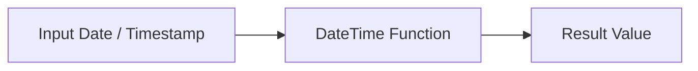

# :material-calendar-clock: Difference between dates

To subtract two dates in Spark SQL and get the difference (usually in days), you can use the datediff() function.

### :material-sitemap: Overview



## :material-calendar-clock: `datediff`

```sql
datediff(endDate, startDate)
```

It Returns the number of days from startDate to endDate.

```sql
SELECT datediff('2009-07-31', '2009-07-30'), datediff('2009-07-30', '2009-07-31');
```

## :material-calendar-clock: months_between

### Syntax

```sql
months_between(endDate, startDate [, roundOff])
```

`roundOff`: Optional boolean (default true) — if false, returns fractional months without rounding.

```sql
SELECT months_between('2025-07-21', '2025-01-15') AS diff_months;
```

## :material-calendar-clock: 3. timestampdiff()

Returns the difference between two timestamps in the specified unit (e.g., second, minute, hour, day).

```SQL
timestampdiff(unit, startTimestamp, endTimestamp)
```

`unit`: One of second, minute, hour, day, week, month, quarter, year.

```sql
SELECT timestampdiff(hour, TIMESTAMP '2025-07-20 12:00:00', TIMESTAMP '2025-07-21 15:30:00') AS diff_hours;
```
