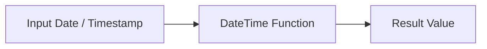

# :material-calendar-clock: Date parts

### :material-sitemap: Overview



## :material-calendar-clock: day

```sql
day(date)
```

Returns the day of month of the date/timestamp.

## :material-calendar-clock: dayofmonth

```SQL
dayofmonth(date)
```

Returns the day of month of the date/timestamp.

```sql
SELECT dayofmonth('2009-07-30');
```

## :material-calendar-clock: dayofweek

```sql
dayofweek(date)
```

It Returns the day of the week for date/timestamp (1 = Sunday, 2 = Monday, ..., 7 = Saturday).

```sql
SELECT dayofweek('2009-07-30');
```

## :material-calendar-clock: dayofyear

```sql
dayofyear(date)
```

It returns the day of year of the date/timestamp.

```sql
SELECT dayofyear('2016-04-09');
```
