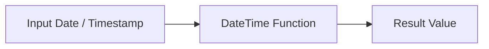

# 🧠 :material-calendar-clock: INTERVAL in Spark SQL

In Spark SQL, the INTERVAL keyword is used to add or subtract fixed amounts of time (like days, months, years, etc.) to/from dates or timestamps.

It allows for time arithmetic in a natural SQL-like syntax.

### :material-sitemap: Overview



## ✅ :material-calendar-clock: Basic Syntax

```sql
<date_or_timestamp> + INTERVAL <quantity> <unit>
<date_or_timestamp> - INTERVAL <quantity> <unit>
```

## 📌 :material-calendar-clock: Supported Units

Unit| Description
---|---
YEAR |Calendar years
MONTH |Calendar months
WEEK |7-day periods
DAY |Calendar days
HOUR| 60-minute hours
MINUTE| 60-second minutes
SECOND| Seconds (can be fractional)
MILLISECOND| Milliseconds (as of Spark 3.4+)

## 🧪 :material-calendar-clock: Examples

### 1. Add Days to a Timestamp

```sql
SELECT TIMESTAMP '2025-07-21 10:00:00' + INTERVAL 5 DAYS AS new_time;
```

### 2. Subtract 2 Months

```sql
SELECT DATE '2025-07-21' - INTERVAL 2 MONTHS AS new_date;
```

### 3. Add Multiple Intervals

```SQL
SELECT TIMESTAMP '2025-07-21 10:00:00'
       + INTERVAL 1 YEAR
       + INTERVAL 2 MONTHS
       + INTERVAL 10 DAYS
       + INTERVAL 3 HOURS AS future_time;
```

### 🧮 Use with Columns

```sql
SELECT
  event_time,
  event_time + INTERVAL 1 DAY AS next_day
FROM events;
```

### 🔁 Combine with date_trunc() or datediff()

```sql
-- Get the first day of the next month
SELECT date_trunc('month', current_date() + INTERVAL 1 MONTH) AS next_month_start;
```
