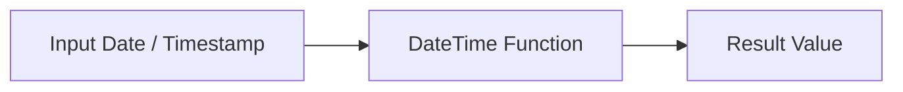

# :material-clock-outline: :material-calendar-clock: Time Zone in Spark SQL

In Spark SQL, time zone handling is crucial when working with TIMESTAMP data types, especially across systems with different time zone settings.

### :material-sitemap: Overview



## :material-wrench: :material-calendar-clock: 1. Session Time Zone Setting

```sql
SET spark.sql.session.timeZone = 'UTC';
```

This setting affects:

1. How string → timestamp conversions happen
2. How timestamps are displayed
3. Built-in time functions like current_timestamp()

## :material-tray-arrow-down: :material-calendar-clock: 2. Converting Between Time Zones

Use the function:

```sql
from_utc_timestamp(timestamp, timezone)
to_utc_timestamp(timestamp, timezone)
```

```sql
-- Convert UTC timestamp to IST
SELECT from_utc_timestamp('2025-07-21 12:00:00', 'Asia/Kolkata') AS india_time;
-- Convert local timestamp in IST to UTC
SELECT to_utc_timestamp('2025-07-21 17:30:00', 'Asia/Kolkata') AS utc_time;
```

## :material-clock-outline: :material-calendar-clock: 1. Supported Time Zones in Spark SQL / Databricks

Spark supports two formats for time zone settings:

1. Region‑based IDs like "America/Los_Angeles", "Asia/Kolkata", etc.
2. Fixed offsets like "+00:00", "-05:00", etc.

It does not support ambiguous short names (e.g. "PST", "EST").

```sql
-- Use region-based ID
SET TIME ZONE 'Asia/Kolkata';
-- Or fixed offset
SET TIME ZONE '+05:30';

-- Check current time zone
SELECT current_timezone();
```
