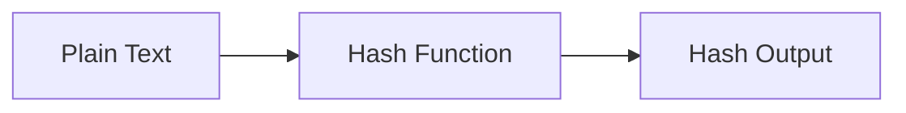

# :material-shield-lock: Encryption & Hashing

Spark SQL provides functions for **hashing**, **encoding**, and **masking** data. These are
commonly used for data integrity checks, anonymization, and security compliance.

### :material-sitemap: Overview



## 📌 :material-shield-lock: Functions Overview

| Function | Type | Output | Use Case |
|----------|------|--------|----------|
| `CRC32(expr)` | Checksum | 32-bit integer | Quick data integrity checks |
| `HEX(expr)` / `UNHEX(expr)` | Encoding | Hex string / bytes | Encode/decode binary data |
| `MD5(expr)` | Hash | 32-char hex string | Checksums (not cryptographically secure) |
| `SHA1(expr)` | Hash | 40-char hex string | 160-bit hash |
| `SHA2(expr, bits)` | Hash | Variable-length hex | Secure hashing (224/256/384/512-bit) |
| `MASK(expr)` | Masking | Masked string | PII anonymization |

## 🧪 :material-shield-lock: Quick Comparison

```sql
SELECT
  CRC32('Spark')          AS crc32_val,
  MD5('Spark')            AS md5_hash,
  SHA1('Spark')           AS sha1_hash,
  SHA2('Spark', 256)      AS sha256_hash,
  HEX('Spark')            AS hex_encoded,
  MASK('555-12-3456')     AS masked;
```

## 🧠 :material-shield-lock: Choosing the Right Function

| Need | Recommended |
|------|-------------|
| Fast checksum for data validation | `CRC32` |
| General-purpose hashing | `SHA2` with 256 bits |
| Legacy compatibility | `MD5` (avoid for security) |
| Binary data encoding | `HEX` / `UNHEX` |
| PII compliance / anonymization | `MASK` |
