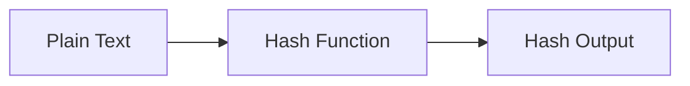

# :material-shield-lock: Encryption and Hash Functions

Spark SQL includes functions for encryption, hashing, and masking sensitive
values.

### :material-sitemap: Overview



---

## :material-pin: :material-shield-lock: Common Functions

| Function | Purpose |
|----------|---------|
| `MD5`, `SHA1`, `SHA2` | Hash values |
| `AES_ENCRYPT` | Encrypt with AES |
| `AES_DECRYPT` | Decrypt AES data |
| `BASE64` / `UNBASE64` | Encode / decode |
| `MASK` | Obfuscate sensitive fields |

---

## :material-flask-outline: :material-shield-lock: Example

```sql
SELECT SHA2(email, 256) AS email_hash FROM users;
```

---

## :material-brain: :material-shield-lock: When to Use

| Scenario | Recommendation |
|----------|----------------|
| Anonymize identifiers | Use hash functions |
| Protect PII | Use `MASK` |
| Secure payloads | Use AES encrypt/decrypt |
