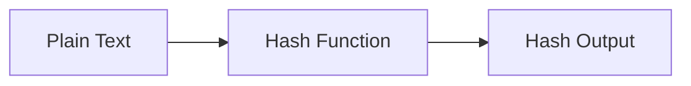

# :material-shield-lock: MASK

`MASK` obfuscates sensitive values by replacing characters with defaults.

### :material-sitemap: Overview



---

## :material-pin: :material-shield-lock: Syntax

```sql
MASK(str)
MASK(str, upper, lower, digit, other)
```

---

## :material-magnify: :material-shield-lock: Behavior Notes

1. Letters and digits are replaced by default mask characters.
2. You can customize replacement characters for upper, lower, digits, and other.

---

## :material-flask-outline: :material-shield-lock: Examples

```sql
SELECT MASK('John.Doe@example.com') AS masked;
```

```sql
SELECT MASK('ABC123', 'X', 'x', '0', '*') AS masked;
```

---

## :material-brain: :material-shield-lock: When to Use

| Scenario | Recommendation |
|----------|----------------|
| Mask PII | Use `MASK` |
| Consistent obfuscation | Customize mask chars |
